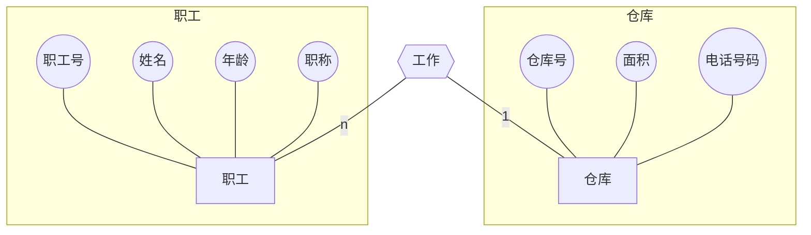

# 数据模型

**数据模型**：数据库管理系统用来表示实体及实体间联系的方法

## 数据模型的类型

**数据模型的类型**：按不同的应用层次划分数据模型

### 概念数据模型

**概念数据模型**：给出数据的概念化结构，常用的概念模型是*实体联系模型*(E-R)
- **实体(长方形)**：实体是概念世界中的基本单位，它们是客观存在且可以相互区别的事物。如：职工、图书、比赛等
- **实体的属性(椭圆形)**：描述实体的特性
- **联系(菱形)**：实体之间的对应关系

### 逻辑数据模型

**逻辑数据模型**

- 层次模型
	- 有且仅有一个结点无父结点，这个结点称为根结点
	- 其他结点有且仅有一个父结点。
- 网状模型
	- 允许一个以上的结点无父结点
	- 允许结点可以有多于一个的父结点。
- 关系模型：用二维表结构来表示实体以及实体之间联系的模型
### 物理数据模型

*物理数据模型*

## 联系的种类

- **一对一(one to one relationship，1:1)**：实体集A中的任一实体，在实体集B中最多有唯一实体和它对应
	- 反之，实体集B中的任一实体，在实体集A中最多有唯一实体和它对应
- **一对多（one to many relationship、1：n）**：实体集A中的任一实体，在实体集B中可以有多个实体与之对应
	- 反之对于实体集B中的每个实体，实体集A中只有一个实体与之对应
- **多对多（many to many relationship、1：1）**：实体集A中的任一实体，在实体集B中可以有多个实体与之对应
	- 反之对于实体集B中的每个实体，实体集A中可以有多个实体与之对应

>[!faq]+ 例题1（单选）：E-R方法是什么方法的简称（B）
> A.编码-联系 B.实体-联系 C.编码-关系 D.有效-运行

>[!faq]+ 例题2（单选）：一个团支部有多名团员，一个团员只属于一个团支部，那么团支部实体与团员实体之间的联系属于：B
> A.一对一B.一对多 C.多对一 D.多对多

