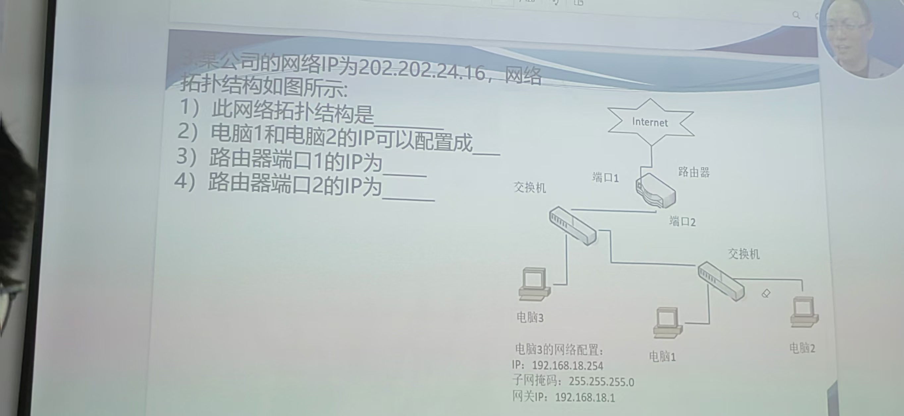

# Internet基础
## Internet的起源和发展
**Internet的起源**：Internet起源于1969年，美国国防部高级研究计划局开始建立一个命名为ARPANet的网络

### 我国现有四大主干网络
- **公用计算机互联网（ChinaNet)**
- **中国教育和科研计算机网（CERNet)**
- **中国科技信息网（CSTNet)**
- **国家公用经济信息通信网络(ChinaGBN)**

## internet的组成及常用术语

### Internet的组成
Internet 是通过分层结构：由物理网、协议、应用软件和信息这四层组成的。
#### 物理网
物理网是实现因特网通信的基础，它的作用类似于现实生活中的交通网络，像一个巨大的蜘蛛网覆盖着全球，而且仍在不断延伸和咖密。

#### 协议

在Internet上传输的信息至少遵循三个协议：网际协议、传输协议和应用程序协议
- 传输控制协议/网际协议(TCP/IP)：是基于 TCP 和 IP 这两个最初的协议之上的不同的通信协议的大的集合。
##### 网际协议

**网际协议(IP)**：负责将信息发送到指定的接收机；
- 网际协议(IP)：计算机之间的通信。IP 负责在因特网上将数据包发送到目的地。

##### 传输协议

**传输协议(TCP)**：负责管理被传送信息的完整性；
- 传输控制协议(TCP)：应用程序之间的通信。 TCP 负责在数据传送之前将它们分割为IP包，然后在它们到达的时候将它们重组。

##### 应用程序协议
**应用程序协议**：几乎和应用程序一样多，如SMTP、Telnet、FTP 和HTTP 等，每一个应用程序都有自己的协议，它负责将网络传输的信息转换成用户能够识别的信息。
- *超文本传输协议(HTTP)*：HTTP负责web服务器与web浏览器之间的通信。
- *安全的超文本传输协议(HTTPS)*：在HTTP的基础上通过传输加密和身份认证保证了传输过程的安全性。HTTPS在HTTP 的基础下加入SSL，调用SSL/TLS对网页进行加密，HTTPS的安全基础是SSL（安全套接层协议）
- *简单邮件传输协议(SMTP)*：用于发出邮件的协议
- *邮局协议(POP3)*：用于接收协议
- *文件传输协议(FTP)*：负责计算机之间任何类型的文件传输

#### 应用软件

**应用软件**：实际应用中，与Internet打交道。代表着要获取Internet提供的某种网络服务
- 信息：没有信息，网络就没有任何价值

>[!example]+ 例如：Internet Explorer、下载文件的工具迅雷、即时通信软件QQ、音乐播放软件网易云音乐
### Internet 的常用专业术语 

#### Internet 服务提供商
**Internet服务提供商(ISP)**：主要为用户提供拨号上网、WWW 浏览、FTP、收发E-mail、BBS、Telnet 等各种服务。

#### 点对点协议
**点对点协议(PPP)**：Modem与ISP 连接通信时所支持的协议。

#### 域名服务器
**域名服务器(DNS)**：用户间Internet任意站点的必由之路，也相当于指路牌。在配置Internet软件时，必须将ISP提供给自己的DNS的IP地址写正确。用于解析域名为IP地址

#### 博客

**博客(Blog、Weblog)**：源于"Web Log"（网络日志），是一种十分简易的傻瓜化个人信息发布方式

>[!faq]+ 例题1.Internet中计算机之间通信必须共同遵循的协议是（)（单选）
A.FTP B.SMTP C.UDP D.TCP/IP

>[!faq]+ 例题2.FTP协议属于（)（单选）
A．传输控制协议B．超文本传输协议 C．文件传输协议D．邮件传输协议

>[!faq]+ 例题3．在Internet上浏览网页时，浏览器和Web服务器之间传输网页使用的协议是（)（单选）
A.IP B.FTP C.HTTP D.Telnet

>[!faq]+ 例题4．下列负责将域名转化为IP地址的是（D)（单选）
A.HTTP B.WWW C.TCP/IP D.DNS

>[!faq]+ 例题5．浏览器访问安全性要求较高的网页时，HTTP会调用SSL/TLS对网页进行加密，地址栏里http变成
HTTPS（填空）

## Internet的IP地址及域名系统 
### IP地址

**网际地址(IP地址)**：在Internet 上为每台计算机指定的唯一的32位地址，具有固定、规范的格式，由32位二进制组成分成4段即4个字节，其中每8位构成一段，每段所能表示的十进制数的范围最大不超过255，段与段之间用"."隔开。通常点分十进制表示，IP地址以十进制形式表示，每8位为一组用一个十进制数表示，
- **IPv6地址**：IP地址16个字节128位，分为8段，每段两个字节。IP地址采用冒分十六进制形式表示，段与段之间用":"隔开
	- **零压缩法**：冒分十六进制表示，如果连续的一段或几段全为0，可以压缩为"::"，只能出现一次
>[!example]+ 举例
>- IPV4： 11001010.01110111.00000010.11000111是一个IP地址，对应十进制数为202.119.2.199
>- IPV6： xxxx:xxxx:xxxx:xxxx:xxxx:xxxx:xxxx:xxxx
>	- 零压缩法：0:0:0:0:0:0:0:16 → ::16

>[!warning]+ 警告：没有特别声明时，IP均指IPv4地址

### IP地址的分类

IP地址常用A、B、C三类，它们均由网络号和主机号两部分组成，规定每一组都不能用全0和全1。通常全0 表示网络本身的IP 地址，全1 表示网络广播的IP地址。为了区分类别，A、B、C三类的最高位分别为0、10、110

| 类型  | 第一段数字范围       | 包含主机台数     |
| --- | ------------- | ---------- |
| A   | $1\sim 126$   | $2^{24}-2$ |
| B   | $128\sim 191$ | $2^{16}-2$ |
| C   | $192\sim 223$ | $2^{8}-2$  |

#### A类网

**A 类IP地址**：用8位来标识网络号，24位标识主机号，最高位为"0"，所能表示的网络数范围为0~127，实际使用范围1.x.y.z ~ 126.x.y.z格式的IP 地址。通常用于大型网络

#### B类网

**B类IP地址**：用16位来标识网络号，16位标识主机号，最前面两位为"10"。网络号和主机号的数量大致相当，分别用两个8位来表示，第一个8位表示的数的范围为128~191。B类IP地址适用于中等规模的网络，每个网络所能容纳的计算机数为6万多台。如各地区的网络管理中心

#### C类IP地址

**C类IP地址**：用24位来标识网络号，8位标识主机号，最前面三位为"110"。网络号的数量要远大于主机号，如一个C类IP地址共可连接254台主机。C 类IP 地址的第一个8 位表示的数的范围为192~223。C类IP地址一般适用于校园网等小型网络

>[!faq]+ 例题1．下列表示C类IP地址范围的是（A)（单选）
> - A.192.0.0.0-223.255.255.255
> - B.128.0.0.0~191.255.255.255
> - C.0.0.0.0~127.255.255.255
> - D.0.0.0.0~255.255.255.255

>[!faq]+ 例题2．下列IP地址中，不能分配给主机的是（D)（单选）
> - A.105.132.255.255
> - B.122.157.23.255
> - C.178.123.145.255
> - D.201.201.101.255

>[!faq]+ 例题3．在标准IP地址138.168.64.10中，代表网络号的部分（B)（单选）
> - A.138
> - B.138.168
> - C.138.168.64
> - D.10

### 子网掩码

**子网掩码**：判断任意两台计算机的IP地址是否属于同一子网的根据
- 将两台计算机各自的IP地址与子网掩码进行逻辑与运算后，如果得出的结果是相同的，则说明这两台计算机是处于同一个子网的，可以进行直接通信

>[!example]+ 举例：与IP地址192.168.0.1，子网掩码255.255.255.0同网段主机的IP地址是（B)
> - A.192.168.0.0
> - B.192.168.0.2
> - C.192.168.1.0
> - D.192.168.1.2

#### 利用子网掩码划分网络
子网掩码划分网络：根据需要把一个网络划分成更小的子网，利用主机位的一位或几位将子网进一步划分，缩小主机的地址空间而获得一个范围较小的、实际的网络地址（子网地址），这样更便于网络管理
- 利用子网掩码划分网络的原因：一个单位IP地址获取的最小单位是C类（254个），有的单位拥有IP 地址却没有那么多的主机入网，造成IP 地址的浪费；有的单位不够用，形成IP地址紧缺
- 正常情况下子网掩码的地址为：网络位全为"1"，主机位全为"0"。因此有
	- A类地址网络的子网掩码地址为：255.0.0.0。
	- B类地址网络的子网掩码地址为：255.255.0.0.
	- C类地址网络的子网掩码地址为：255.255.255.0。

>[!example]+ 举例：IP地址为192.168.127.165，子网络掩码为255.255.255.224计算网络号和子网号

>[!faq]+ 例题1．子网掩码是用来判断任意两台计算机的IP地址是否属于同一子网的，根据正常情况下的子网掩码（)。（多选）
> - A．前2个字节为"1"
> - B．主机标识位全为"0"
> - C．网络标识位全为"1"
> - D．前2个字节为"0"

>[!faq]+ 例题2．某IP地址220.176.198.10，对应的子网掩码255.255.255.0，该网络最多允许（B）台主机。
>A.256 B.254 C.128 D.64

>[!faq]+ 例题某公司的网络IP为202.202.24.16，网络拓扑结构如图所示：
> - 
> - 1）此网络拓扑结构是 树状结构
> - 2）电脑1和电脑2的IP可以配置成 192.168.2 192.168.3
> - 3）路由器端口1的IP为 202.202.24.16
> - 4）路由器端口2的IP为 192.168.18.1

### Internet域名系统

**域名**：采用字符型来表示IP地址
- *域名和IP地址的关系*：域名对应一个IP地址，IP地址对应零个或多个域名
	- 域名与IP地址在网络中是唯一的
- *域名的结构*：域名是分层的，一个完整的域名由多级域名组成，每级域名之间用`.`分隔
	- 基本结构：`主机名.单位名.机构名.国家名`

>[!example]+ 举例：`www.tongji.edu.cn`

#### Internet顶级域名

- 国际顶级域名：组织模式：按组织管理的层次结构划分，由三个字母组成。
- 国家顶级域名：地理模式：按国别地理区域划分，由两个字母组成。

| 域名代码 | 意义     | 域名代码    | 意义    |
| ---- | ------ | ------- | ----- |
| com  | 商业组织   | gov     | 政府部门  |
| net  | 网络服务机构 | int     | 国际性组织 |
| edu  | 教育机构   | mil     | 军事部门  |
| org  | 非营利性组织 | 国家／地区代码 | 国家／地区 |

>[!faq]+ 例题1．下面关于域名系统错误的说法是（C)（单选）
> - A．域名只能对应一IP地址
> - B．域名服务器DNS用于实现域名地址与IP地址的转换
> - C．一般而言，网址与域名没有关系 
> - D．域名系统结构是层次型的

>[!faq]+ 例题2.Internet中采用域名地址，而一般不采用IP地址的原因是（A)（单选）
> - A.字符形式的域名较数字形式的IP地址更方便记忆
> - B.一台主机必须要有域名，否则在Internet中将无法识别
> - C.一个主机必须由域名和IP地址共同标识
> - D.IP地址不能唯一标识一台主机

>[!faq]+ 例题3．如果一个网址的末尾是`.edu.cn`，则表示该网站是（B)（单选）
> - A．商业组织
> - B．教育机构
> - C．非营利组织
> - D．政府部门

## Internet的接入方式 
### ADSL方式
**非对称数字用户环路(ADSL、 Asymmetrical Digital Subscriber Line)** ：是一种种能够通过普通电话线提供宽带数据业务的技术。
- ADSL因其下行速率较高、频带相对较宽、安装方便、不需交纳电话费等特点而深受用户喜爱。
- ADSL方案的最大特点是不需要改造信号传输线路，完全可以利用普通铜质电话线作为传输介质，配上专用的Modem 即可实现数据高速传输。
- ADSL 支持上行速率1 Mb/s，下行速率8 Mb/s，其有效传输距离在3 ~ 5 km范围以内。
- 在ADSL 接入方案中，每个用户都有单独的一条线路与ADSL 相连，其结构可看作是星形结构，数据传输带宽由每一个用户独享。

### FTTX+LAN方式

**FTTX+LAN技术**：是一种利用光纤加五类网络线方式实现宽带接入方案，实现千兆光纤到小区（大楼）中心交换机，中心交换机和楼道交换机以百兆光纤或五类网络线相连，楼道内采用综合布线，用户上网速率可达100Mbps，网络可扩展性强，投资规模小
- 不需要调制解调器和电话线，只需要网卡和网络连接，通过过集线器或交换机经路由器接入Internet
- FTTx+LAN方式采用星型网络拓扑，用户共享带宽
- 适用于住宅小区、智能大厦、现代写字楼等地点

### HFC方式

光纤同轴混合网(HFC)

### 光纤到户
光纤到户(FTTH)：是指将光网络单元（ONU）安装在用户家里，由上端设备光线路终端（OLT）通过光纤将信号传输到用户家中

### WLAN方式

无线局域网络(WLAN方式)

## Internet应用
### WWW服务

**万维网(WWW、World Wide Web、Web、3W)**：是逻辑上的网络，WWW服务是目前应用最广的一种基本互联网应用。
- 通过WWW服务，只要用鼠标进行本地操作，就可以到达世界上的任何地方。
- 由于WWW服务使用的是超文本链接，所以可以很方便的从一个信息页转换到另一个信息页。
- 它不仅能查看文字，还可以欣赏图片、音乐、动画。
- 最流行的WWW服务的程序就是微软的IE浏览器。浏览器与服务器之间传送信息的协议是HTTP协议。

### 统一资源定位器
统一资源定位器(URL)：是一个文件在因特网上标准的资源的地址(Address)。一个文件不论存储在哪个服务器上，都有一个URL地址。在WWW上，任何一个信息资源都有统一的并且在网上唯一的地址，这个地址就叫做URL。
- 格式：`协议://主机名:端口号/路径/文件名`
- 通信协议：可以是HTTP、FTP、Telnet、news(网络新闻组)、mailto(电子邮件)等；
- 主机名：主机IP地址或端口号
- 端口号：通常是默认的，WWW服务器使用的端口号是80，一般不需要给出。
- 文件路径/文件名：是网页在web服务器中的位置和文件名

>[!faq]+ 例题1．下列统一资源定位器中，正确的是（B)（单选）
> - A.ftp//ftp.abc.com\index.html
> - B.http://www.abc.com/index.html
> - C.http://www.abc.com\index.html
> - D.http//ftp.abc.com/index.html

>[!faq]+ 例题2．关于WWW服务，以下哪种说法是错误的（D)（单选）
> - A.WWW服务采用的主要传输协议是HTTP
> - B.WWW服务以超文本方式组织网络多媒体信息
> - C．用户访问Web服务器可以使用统一的图形用户界面
> - D．用户访问Web服务器不需要知道服务器的URL地址

>[!faq]+ 例题3．下列关于WWW服务的叙述正确的是（ABC)（多选）
> - A.WWW的中文译名为"万维网"
> - B.WWW服务器上以网页形式存放着文本、图片、音频、视频等多种信息及其链接
> - C.所有Internet用户可以浏览访问WWW服务器上的信息
> - D.数以万计的WWW服务器相互连接，形成树形结构

### 电子邮件服务 
**电子邮件服务（e-mail服务）**：是目前因特网上使用最频繁的服务之一，它为因特网用户之间发送和接收消息提供了一种快捷、廉价的现代化通信手段。
- **Internet的电子邮箱地址组成**：`用户名＠电子邮件服务器名`
	- 表示以用户名命名的邮箱是建立在符号`@`后面说明的电子邮件服务器上的，该服务器就是向用户提供电子邮政服务的"邮局"机。
- *简单邮件传输协议 (SMTP、Simple Mail Transfer Protocol)*：用于发送和中转电子邮件。它是一种应用层协议，用于在互联网上的邮件服务器之间发送、转发电子邮件。SMTP通常用于将电子邮件从发件人的邮件服务器传送到收件人的邮件服务器。
- *邮局协议版本3 (POP3、Post Office Protocol version 3)*：，是一种用于接收电子邮件的互联网标准协议。它允许用户从邮件服务器下载到本地计算机，并且通常用于离线邮件处理。
- *互联网邮件访问协议（IMAP）*：用于管理和访问存储在邮件服务器上的电子邮件。
- *多用途互联网邮件扩展 (MIME、Multipurpose Internet Mail Extensions)*：扩展了电子邮件标准，使其能够支持非ASCII文本和二进制文件附件，如音频、视频、图像以及各种字符集。MIME类型是描述文件类型的字符串，通常用于指示互联网上文件的内容类型

>[!example]+ 举例： zsb@163.com

### 文件传输

**文件传输协议(FTP)**：在不同的计算中与计算机之间进行文件交换的过程。是互联网上实现文件传输这一功能的重要手段，采用客户机/服务器模式
- **启动FTP应用程序**：用户在本地计算机上启动FTP客户端程序。
- **建立连接**：客户端程序与互联网上的FTP服务器建立连接。
- **文件传输**：通过FTP命令，用户可以将服务器上的文件下载到本地计算机，或将本地文件上传到服务器。
- **命名服务**：需要用户提供用户名和密码进行身份验证。
- **匿名服务**：匿名FTP服务器允许用户使用通用账号名"anonymous"登录，密码栏内输入电子邮件地址即可。

### 远程登录Telnet

Telnet 是互联网早期的一种服务，允许用户通过一台计算机登录到另一台远程计算机，并在远程计算机上运行程序或访问服务。
- **Telnet软件**：用户需要安装Telnet客户端软件，Windows操作系统内置了Telnet工具。
- **登录过程**：使用Telnet登录远程计算机时，会启动两个程序：一个是运行在本地计算机上的Telnet客户程序，另一个是运行在远程计算机上的Telnet服务器程序。
- **操作远程计算机**：登录成功后，用户可以像操作本地计算机一样直接操纵远程计算机。

#### 打开远程桌面方式
1. 开始--附件--远程桌面连接
2. 远程桌面是图形化的Telnet

### 搜索引擎
搜索引擎：是一个网站，专门为用户提供信息检索服务，使用特有的程序把因特网上的所有信息归类，以帮助人们在浩如烟海的信息海洋中搜寻自己所需要的信息
- 常用的搜索引擎有百度等。

### 虚拟现实
**虚拟现实（Virtual Reality)**：随着三维动画及虚拟现实的技术手段不断完善，在电脑世界里创造了越来越逼真的现实环境，形成了另一个时空观念。用户可以在这里交友、购物、玩游戏、旅游观光，从事现实的或虚拟的各项活动。

### 流媒体应用
**流媒体(Streaming Media）**：指在数据网络上按时间先后次序传输和播放的连续音／视频数据流以前人们在网络上看电影或听音乐时，必须先将整个影音文件下载并存储在本地计算机中，而流媒体在播放前并不下载整个文件，只将部分内容缓存，使流媒体数据流边传送边播放，这样就节省了下载等待时间和存储空间。
- 流媒体数据流具有三个特点：连续、实时性、时序性（其数据流具有严格的前后时序关系）。目前基于流媒体的应用非常多，发展非常快，其应用主要有视频点播（VOD)、视频广播、视频监视、视频会议、远程教学、交互式游戏等。
流媒体的传输方式，顺序流式传输实时流式传输