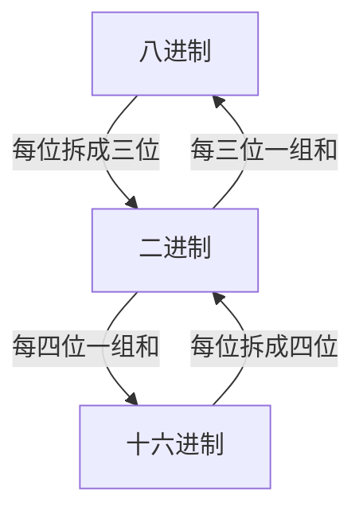

# 计算机信息表示
## 信息展示

信息展示：在计算机内部，使用二进制编码形式表示和处理
- 在输入输出时，使用十进制
- 在书写时，使用十六进制
 - 采用二进制表示的原因
	- 易于表示，技术实现简单(主要原因)
	- 运算规则简单
	- 适于逻辑运算
	- 可靠性高
- 采用十六进制的原因
	- 书写方便

## 数制及其转换

进位计数制(数制)：用进位的原则进行计数
- 数码：一组用来表示某种数制的符号，进制中数码最大为R-1
- 基数(基)：数制所使用的数码个数，用字母R表示，称为R进制
- 位权：数码在不同位置上的权值，位权$=R^n$
- 数值：数码与所在位置的位权乘积

- 按权展开式：将一个R进制的数，展开成数码与位权乘积和形式
	- 例如：$(abc.de)_R=aR^2+bR^1+cR^0+dR^{-1}+eR^{-2}$

>[!faq]+ 例题1. 下面有关二进制的说法错误的是(D) A. 二进制数只有0和1两个数码 B. 二进制甲方运算规则是缝儿进一 C. 无符号二进制证书各位上的权值从右向左分别是：1,2,4,... D. 二进制只有二位数组成

>[!faq]+ 例题2. 计算：19H+01H=1AH

>[!faq]+ 例题3计算：17O+11O=30O

>[!faq]+ 例题4计算：19H+12H=2BH

### 常用的进位计数制

- 十进制：逢十进一，借一当十，用字母D表示，一般不用字母表示
- 二进制：逢二进一，借一当二，用字母B表示
- 八进制：逢八进一，借一当八，用字母O或Q表示
- 十六进制：逢十六进一，借一当十六，用字母H表示

### 数制的转换

#### R进制转十进制

- 按权展开求和

>[!example]+ 举例：某进制下8+5=14，则该进制为9
>- 等式两边按权展开
>- $8R^{0}+5R^{0}=1R^{1}+4R^{0}$
>- $R=9$

>[!faq]+ 例题：某进制下$13\times 4=50$，则该进制为12
> - 等式按权展开
> - $(1R^1+3R^{0})\times 4^{0}=5R^{1}+0R^{0}$
> - $R=12$

#### 十进制转R进制

- 整数部分：不断除以R，倒取余数
- 小数部分：不断乘以R，顺取整数

>[!warning]+ 注意：不是所有十进制数都能用R进制准确表示

 >[!example]+ 举例：将十进制的数100.125转换为二进制
> 
> - $100 \mod 2=0$
> - $50 \mod 2=0$
> - $25 \mod 2=1$
> - $12 \mod 2=0$
> - $6 \mod 2=0$
> - $3 \mod 2=1$
> - $1 \mod 2=1$
> - 整数部分：$1100100B$
> - $0.125\times 2=0.25$
> - $0.25\times{2}=0.5$
> - $0.5\times2=1.0$
> - 小数部分：$0.001B$
> - 结果为：$1100100.001B$

>[!faq]+ 例题1. 将十进制数56转换成二进制为 **111000**

>[!faq]+ 例题 2. 下列说法错误的是 ABC A. 任何二进制都可以用十进制准确表示 B. 任何二进制小数都可以用十进制来准确表示 C. 任何十进制整数都可以用二进制来准确表示 D. 任何十进制小数都可以用二进制来准确表示

>[!faq]+ 例题3  所有十进制都可以准确转换为其他任意进制.(**√**)

> [!faq]+ 例题2. 二进制数1011.11的等值十进制为**11.75**

> [!faq]+ 例题3. 十进制数0.6875转换为二进制数为**0.1011**

#### 二进制、八进制和十六进制的转换

>[!faq]+ 例题 1. 已知$a=(111101)_2,b=(3C)_{16}, c=(64)_{10}$，则不等式成立的是B A. $a<b<c$  B. $b<a<c$ C. $b<c<a$ D. $c<b<a$

>[!faq]+ 例题2. 有一个数值152，与十六进制6A相等，那么该数值是十进制数

>[!faq]+ 例题3. 十六进制数3C7.D8转换为二进制数是B A. 1111010111.11101 B. 1111000111.11011 C. 111001111.11001 D. 111100111.110101

>[!faq]+ 例题4. 与十进制数291等值的十六进制数为 123

>[!faq]+ 例题5. 在某进制下，等式2+5=11成立，则6+4=14

## 二进制的运算规则

### 算数运算规则

#### 加法规则

| A	 | B	 | C	 |
| --- | --- | --- |
| 0	 | 0	 | 0	 |
| 0	 | 1	 | 1	 |
| 1	 | 0	 | 1	 |
| 1	 | 1	 | 10	|

#### 减法规则

| A	 | B	 | C	 |
| --- | --- | --- |
| 0	 | 0	 | 0	 |
| 0	 | 1	 | 1	 |
| 1	 | 0	 | 1	 |
| 1	 | 1	 | 10	|

#### 乘法规则

| A	 | B	 | C	 |
| --- | --- | --- |
| 0	 | 0	 | 0	 |
| 0	 | 1	 | 0	 |
| 1	 | 0	 | 0	 |
| 1	 | 1	 | 1	 |

#### 除法规则

| A	 | B	 | C	 |
| --- | --- | --- |
| 0	 | 1	 | 0	 |
| 1	 | 1	 | 1	 |

 >[!faq]+ 例题1. 二进制运算：$(1100)_{2}-(1010)_{2}=(10)_{2}$
  
 >[!faq]+ 例题2. 执行二进制运算$0101 0100+0101 0011=1010 0111$

### 逻辑运算规则

#### 非运算(NOT)

| A	 | B	 |
| --- | --- |
| 1	 | 0	 |
| 0	 | 1	 |

#### 与运算(AND)

| A	 | B	 | C	 |
| --- | --- | --- |
| 0	 | 0	 | 0	 |
| 1	 | 0	 | 0	 |
| 0	 | 1	 | 0	 |
| 1	 | 1	 | 1	 |

#### 或运算(OR)

| A	 | B	 | C	 |
| --- | --- | --- |
| 0	 | 0	 | 0	 |
| 1	 | 0	 | 1	 |
| 0	 | 1	 | 1	 |
| 1	 | 1	 | 1	 |

#### 异或运算(XOR)

| A	 | B	 | C	 |
| --- | --- | --- |
| 0	 | 0	 | 0	 |
| 0	 | 1	 | 1	 |
| 1	 | 0	 | 1	 |
| 1	 | 1	 | 0	 |

>[!faq]+ 例题1. 执行下列二进制逻辑乘法运算(逻辑与运算) $0101'1001\cap101'011=0000'0001$

>[!faq]+ 例题 2. 执行逻辑或运算$1010'1110\cup1011'0001=1011'1111$

> [!faq]+ 例题3. 已知二进制数$X=1100'1011,Y=1010'1101$，$\oplus$为异或运算符，$X\oplus Y\oplus Y=1100'1011$

## 信息的编码

### 计算机中数据的单位

#### 位
**位(比特，bit，b)**：*是计算机数据存储数据的最小单位*，一个二进制位只能表示0或1
- 比特1、比特0指表示两个状态
- 比特可以表示数值，也可表示图像等数据

#### 字节

**字节(Byte，B)**：规定1B=8bit，*是存储信息的基本单位*
- 内存和外存的容量都是以字节作为存储的单位
- 每个存储单元为**1**字节
- $1KB=2^{10}B$
- $1MB=2^{10}KB=2^{20}B$
- $1GB=2^{10}MB=2^{30}B$
- $1TB=2^{10}GB=2^{40}B$

#### 字
字(Word)：计算机处理数据时，CPU通过数据总线一次存取、加工和传送的数据位数
- 字是字节的整数倍
- 字长：一次能处理二进制数的位数
	- 字长通常是8的整倍位数

> [!例题]
>
> [!faq]+ 例题1. 下列描述中，正确的是**D. 1MB=1024x1024B** A. 1KB=1000B B. 1KB=1024x1024B C. 1MB=1024B D. 1MB=1024x1024B

> [!faq]+ 例题2. 一个字节(Byte)占 **8** 个二进制位

> [!faq]+ 例题3. 内存容量为8GB，其中B指的是 **字节**

> [!faq]+ 例题4. 有关字长，下面说法正确的是(**C**) A. 字长是指字节的长度 B. 字长是指输入的字符的二进制位数  C. 字长是指某计算机一次能处理的二进制位数 D. 字长是指某计算机可运算的最大数据位数
>

> [!faq]+ 例题5. 20G的硬盘容量约为(**C**) A. 20亿个字节 B. 20亿个二进制位 C. 200亿个字节  D. 200亿个二进制位

> [!faq]+ 例题6. 假设某台式计算机的内存容量为128MB，硬盘容量为10GB，硬盘的容量是内存容量的 **80** 倍

> [!faq]+ 例题7. CPU一次存储，加工和处理的数据位数称为 **字长**

### 数值的表示

- 符号位(数符)：通常规定一个数的最高位作为符号位
	- 0表示正
	- 1表示负
- 机器数(机器码)：采用二进制表示形式的连同**数符**一起数字化了的数据
- 真值：用正、负符号加绝对值来表示的实际数值
- 原码：将一个整数转换为二进制数，运算时需要单独处理
	- 计算复杂
- 反码：正数的反码与原码相同；负数的反码是原码中除符号位外每位取反
	- 计算复杂
	- 通常为补码的中间码
- 补码：正数的反码与原码相同；负数的补码是负数的反码+1

- 8位无符号二进制数
	- 表示范围：$0\sim255$；$0000'0000\sim1111'1111$
	- 表示个数：$256$个数
- N位无符号二进制数
	- 表示范围：$0\sim2^{N}-1$
	- 表示个数：$2^N$个数

> [!例题]
>
> 1. 若要用二进制数表示十进制数0-999，则至少需要**10**位
> 2. 一个字长为6位的无符号二进制数能表示十进制数的数值范围是 **0~63**
> 3. 如果在一个非零无符号二进制整数后面加2个0，则此书的值为原来的**2**倍
> 4. 如果删除一个非零无符号二进制偶数后面的2个0，则此数的值为原来的**1/4**倍
>
### 文字的字符表示

#### BCD交换码

BCD编码：用四位二进制数表示1位十进制数的编码方法
- 8421编码：简单的BCD码，每位十进制数按照数值转换为4位2进制数

#### ASCII交换码

美国标注信息交换代码编码(ASCII)：主要的字符编码方式，是一种西文的机内码
- 7位标准ASCII码：用一个字节(8bit)表示一个字符，规定最高位为0，表示128个不同字符
- 非图形字符(控制字符，不可打印字符)
	- 控制字符：0~31
	- 空格键：32
	- 删除键：127
- 普通字符(可打印)
	- 0：38
	- A：65
	- a：97
- 8位扩展ASCII码

#### EBCDIC交换码

- 扩展的二~十进制交换码(EBCDIC)：通常在大型机中使用

#### 汉字编码

编码的运行顺序：输入码-->交换码-->内码-->地址码-->字形码

##### 汉字输入码

汉字输入码(汉字外部码，外码)：汉字通过键盘输入到计算机中采用的代码
- 编码方式不唯一

###### 流水码

流水码：数字编码，编码唯一

- 区位码：区码1-94，位码1-94
- 电报码

###### 音码

音码：拼音编码，重码多
- 拼音

###### 形码

形码：偏旁编码，重码少
- 五笔

###### 音型结合码

音型结合码：拼音和字形结合编码
- 自然码

##### 汉字交换码

汉字交换码：由于汉字数量极多，一般用拦蓄的两个字节(16位)表示一个汉字
- 每个字节最高位是0
- 交换码=区位码+2020H
- 编码方式唯一

###### 国标码

国标码(GB2312-80)：是我国内地及新加坡等海外话语地区的汉字交换码

- 收录6763个汉字，682个符号，共7445个字符
	- 一级汉字3755个
	- 二级汉字3008个

###### 汉字扩展内码规范

汉字扩展内码规范(GBK18030)：兼容GB2312-80，同时收录了藏文、蒙古文、维吾尔文等主要的少数民族文字

- 共收录27484个汉字

##### 汉字机内码

汉字机内码：交换码两个字节的最高位分别改为1

- 机内码=交换码+$8080H$
- 编码方式唯一

##### 汉字字形码

汉字字形码：将汉字显示到屏幕上或打印到纸上所需要的图形数据

| 类型													 | 空间大小与显示的关系 | 清晰度与分辨率的关系 | 大小与笔画的关系 | 放大特点 |
| ------------------------------ | -------------------- | -------------------- | ---------------- | -------- |
| 点阵码(汉字点阵图，图像)			 | 点阵的数量/8				 | 有关								 | 无关						 | 失真		 |
| 矢量码(汉字轮廓特征，数学模型) | 无关								 | 无关								 | 有关						 | 不失真	 |

> [!例题]
>
> 1. 已知英文字母的m的ASCII的编码为6DH，那么71H为q

计算机中应文字符的最常用的编码是ASCII码
汉字的信息较缓慢 GB2312-80是理我国颁布的国家标准
计算机中采用1字节存储一个AS
当采用A编码是，在计算机中存储一个编码符号要占用1 个字节
在GB2312-80中，规定一个汉字图形符号的机内码都用2个字节表示
标准ASCII码用7为二进制表示一个字符的边，其不同的编码方案共有128个
若已知一个汉字的国标码是5E38，则其内码是 DEB8

- 以下说法错误的是
- 全椒字符和半角字符是同一字符的两种不同格式
- 与ASCII码存在冲突时国标吗不能直接在计算机中使用的

- 同一个汉字用矢量码表示，比用点阵吗表示，用的存储空间要小
- 存储1024个24x24点阵的汉字字形码需要的字节码数是72KB
- 现实或打印汉字时，系统使用的是汉字的字形码
- 汉字输入码可分为有重码和无重码两类，下列属于无重码类的是C
	- 全拼码
	- 自然码
	- 区位码
	- 简拼码
- 已知装字的 大 内码分别需要的字节数是2
- 下列说法正确的是 A
	- 同一个汉字的输入码的长度随着输入方式不同而不同
	- 一个汉字的机内码与他的国标码是相同的，且均匀为2字节
	- 不同汉字的机内码的长度是不同的
	- 统一汉字用不同的输入法是，其机内码是不同的
- 关于汉字编码，以下表述正确的是 A
	- 汉字又唯一的字形码
	- 汉字又唯一的内码
	- 汉字有唯一的输入码
	- 存储汉字至少需要2个字节是因为汉字数量多
	- 繁的字形码比简的字形码占用内存空间大，因为前者笔画多
	- 24
	- 245
	- 124
	- 12345
-
