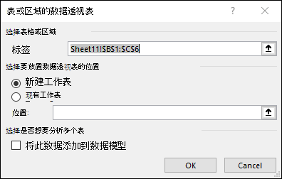

# 数据清单

## 数据清单

**数据清单(数据库)**：具有*二维表*特性的电子表格
- 数据清单的功能
	- 实现数据的排序、筛选、分类汇总、统计和查询等操作
	- 具有数据库的组织、管理和处理数据的功能
- 数据清单的特点
	1. *第一行*：列标题(字段名)，必须为*文本型*
	2. *每列*：数据类型相同
	3. *数据区域*：连续，不能有合并的单元格
	4. *和其它数据之间*：至少留一个空行或空列

## 数据排序

**数据排序**：对一列或多列中的数据文本、数值、日期和时间按升序或降序的方式进行排序
- 可以按自定义序列、格式(包括单元格颜色、字体颜色等)进行排序

| 数据类型 | 排序依据         |
| ---- | ------------ |
| 数字型  | 数值           |
| 文本型  | ASCII码值      |
| 逻辑值  | False < True |
| 空格   | 一直是最后        |

### 简单排序

**简单排序**：单关键字排序
1. 在要排序的列中选择一个单元格
2. 单击“`数据`”选项卡->`排序和筛选`​组->`升序`()/`降序`()命令
    
### 复杂多条件排序

**复杂多条件排序**：多关键字排序
1. 在要排序的区域中的任意位置选择一个单元格。
2. 打开`排序`对话框：`数据`选项卡->`排序和筛选`组->`排序`按钮
3. 设置排序条件：排序条件从上到下的*或*关系

#### `排序`对话框

| 内容           | 含义             | 内容             | 含义          |
| ------------ | -------------- | -------------- | ----------- |
| `添加条件`       | *添加*新的次要的排序条件  | `选项`           | 更多的设置       |
| `删除条件`       | *删除*选中的排序条件    | `排序依据`/`次要关键字` | 要进行排序的数据字段列 |
| `复制条件`       | *复制*一条选中的排序条件  | `排序依据`         | 选择排序的依据     |
| `上移(Ctrl+↑)` | 将选中的排序条件*上移*一行 | `次序`           | 选择排序的顺序     |
| `下移(Ctrl+↓)` | 将选中的排序条件*下移*一行 |                |             |

>[!attention]+ 注意1：被隐藏的行(列)不参与排序

>[!attention]+ 注意2：排序条件最多可以支持64个关键字

>[!tip]+ 提示：通过自定义序列进行排序
> - 在高级排序中，除了`升序`和`降序`，还可以进行`自定义排序`
> - 自定义排序：依据的是自定义列表

>[!faq]+ 例题：1.使用中文Excel排序时，所谓升序是指（BCD）（多选）
> - A.逻辑值TRUE放在FALSE前
> - B.字母按从A到Z得顺序排列
> - C.数字从最小负数到最大正数
> - D.日期和时间由最早到最近排列

>[!faq]+ 例题：2.Excel 2016中，使用升序、降序按钮做排序操作时，活动单元格应选定（C）（单选）
> - A.工作表的任何地方
> - B.数据清单的任何地方
> - C.排序依据数据列的任一单元格
> - D.数据清单标题行的任一单元格

## 筛选

**筛选**：暂时隐藏表格中的部分数据，以便专注于所需数据
- *筛选条件*：可以是数值或文本，单元格颜色、复杂条件实现
- *筛选结果*：可以直接复制、查找、编辑、设置格式、制作图表和打印

### 自动筛选

**自动筛选**：可以快速而又方便地查找和使用所需的数据

>[!warning]+ 注意：若多个字段都设置了筛选条件
> - *多个字段条件间*：只能是“与”的关系
> - *同一个字段内部*：可以是“与”和“或”关系

#### 自动筛选的步骤

1. 选数据清单中*任意一个*单元格
2. 进入自动筛选状态：单击`数据`选项卡->`排序和筛选`组->`筛选`命令()

#### 指定筛选条件

1. 打开筛选器选择列表：单击列标题中的筛选箭头()
2. 指定筛选条件
	- `数字筛选`()：对数据类型为*数值*的列进行筛选
	- `文本筛选`()：对数据类型为*文本*的列进行筛选
	- `自定义筛选`：可自行设定筛选条件
3. 选择比较方式：`大于`、`不大于`、`小于`....
4. 输入筛选条件

#### 取消筛选
- 通过筛选器取消筛选
	1. 选择是*筛选器图标*()的筛选箭头
	2. 选择 `从“xxx”中清楚筛选器`()
- 通过选项卡取消筛选
	1. 选择处于筛选状态中数据清单中任意一个单元格
	2. 单击`数据`选项卡->`排序和筛选`组->`清楚`()命令

#### 清除筛选

1. 选择*处于自动筛选状态*的数据清单中*任意一个*单元格
2. 清除所有筛选条件：单击`数据`选项卡->`排序和筛选`组->`筛选`命令()

>[!attention]+ 注意：设置多个字段的筛选条件
> - 多个字段的筛选条件之间是*与*的关系

### 高级筛选

**高级筛选**：通过构建复杂条件可以实现高级筛选

#### 构建复杂条件的原则

- **条件区要单独放置**：与数据清单间隔一个以上的空行或空列
- **条件区至少两行**
	- 第一行：是列标题，必须与数据清单中的列标题一致
	- *第二行以及以后*：是筛选条件
- **同一行中的条件**：表示“与(and)”，筛选满足所有条件的数据
- **不同的行中的条件**：表示“或(or)”，筛选满足其中一个条件的数据
- **计算条件**：可以没有列标题，也可以命名新的列标题，不能用原有标题

#### 高级筛选的步骤

1. 在*独立区域*创建一组筛选条件
2. 选择要进行筛选的数据区域中*任一*单元格
3. 打开`高级筛选`对话框：单击`数据`选项卡->`排序和筛选`组->`高级`按钮
4. 设定`列表区域`和`条件区域`
5. 单击`确定`按钮

>[!faq]+ 例题：1.在Excel 2016中，下列关于高级筛选的描述中，错误的是（CD）（多选）
>- A.高级筛选的条件区域至少有两行
>- B.高级筛选的条件区域必须包含字段名和筛选条件
>- C.高级筛选的条件区域中的字段名不需要与数据清单中的字段名完全一致
>- D.在高级筛选条件区域的设置中，同一行上的条件认为是“或”条件

>[!faq]+ 例题：4.以下对Excel 2016高级筛选功能的说法，正确的是（A）。（单选）
>- A.高级筛选通常需要在工作表中设置条件区域
>- B.利用`数据`选项卡`排序和筛选`组的“筛选”命令可进行高级筛选
>- C.高级筛选前必须对数据进行排序
>- D.高级筛选就是自定义筛选

## 分类汇总

**分类汇总**：先对数据清单进行分类，再按照选择的方式，统计每一类中选定的数据
- *分类汇总的结果*：可以按分组明细进行分级显示，以便于显示或隐藏每个分类汇总的明细行

### 插入分类汇总

1. 打开分类汇总对话框：`数据`选项卡->`分级显示`组->`分类汇总`命令
2. 设置相关选项

#### `分类汇总`对话框

| 选项      | 含义          | 选项            | 含义               |
| ------- | ----------- | ------------- | ---------------- |
| `分类字段`  | 用于进行分类的依据字段 | `替换当前分类汇总`    | 当前分类汇总结果是否覆盖旧结果  |
| `汇总方式`  | 设置运算统计的方式   | `每组数据分页`      | 每类数据会分到单独一页      |
| `选定汇总项` | 设置要进行运算的字段  | `汇总结果显示在数据下方` | 将结果放置于每类数据的上方或下方 |

### 复制分类汇总的结果

- 通过快捷键
	1. `Alt`+`;`
	2. 复制粘贴数据
- 通过 `定位条件` 对话框
	1. 打开定位条件对话框：`开始`选项卡->`编辑`组->`查找和选择`命令
	2. 选择`可见单元格`选项
	3. 复制粘贴数据

### 删除分类汇总

1. 选择处于分类汇总状态的数据清单
2. 打开`分类汇总`对话框
3. 单击`全部删除`按钮

## 合并计算

**合并计算**：功能可以汇总或者合并多个数据源区域中的数据

### 合并计算的数据源区域
- 同一工作表中的不同单元格区域，
- 同一工作簿中不同工作表中的数据
- 不同工作簿中的工作表数据。

### 按类别合并计算

1. 选中一个单元格，作为合并计算后结果的存放起始位置
2. 打开`合并计算`对话框：单击`数据`选项卡->`数据工具`组->`合并计算`命令
3. 设置对应选项

>[!tip]+ 提示：合并计算时，数据源不必都打开

#### `合并计算`对话框

| 选项       | 含义                                 | 选项     | 含义         |
| -------- | ---------------------------------- | ------ | ---------- |
| `函数`     | 对引用位置进行合并计算的函数                     | `标签位置` | 生成数据所包含的标签 |
| `引用位置`   | 用于设置要合并计算的位置 引用位置在首行(列)的字段名会对应 | `首行`   | 结果显示首行内容   |
| `所有引用位置` | 进行合并计算的所有位置                        | `最左列`  | 结果显示最左列    |

## 数据透视表

**数据透视表**：是一种可以从源数据列表中快速提取并汇总大量数据的式动态表格
- *数据透视表的作用*
	- 用于汇总、分析、浏览数据
		- 呈现汇总数据，以便从不同的角度查看数据
		- 对相似数据进行比较
	- 能将筛选、排序和分类汇总等操作依次完成
		- 生成汇总表格
	- 可以进行多个分类字段
- *数据透视表的要求*
	- 具有列标题
	- 不包含空行

### 创建一个推荐的数据透视表
1. 选择数据源区域任意单元格
2. 打开`选择数据源`对话框：`插入`选项卡->`表格`组->`推荐的数据透视表`选项
3. 打开`推荐的数据透视表`对话框：选择数据源->点击`确定`按钮
4. 选择一个推荐的数据透视表
### 创建一个自定义的数据透视表

1. 选择数据源区域任意单元格
2. 打开`创建数据透视表`对话框：`插入`选项卡->`表格`组->`数据透视表`选项
3. 打开`数据透视表字段`窗格：设置选项->点击`确认`
4. 设置要筛选、分类和汇总的数据

#### `创建数据透视表`对话框

#### `数据透视表字段`窗格

>[!attention]+ 注意
>- 数据透视表筛选分类字段：有上下顺序
>- 数据透视表会覆盖高级筛选中的数据

>[!tip]+ 提示：数据透视表中的时间日期分类
> - 打开快捷菜单：右键行标签
> - 单击`筛选`下拉列表->`日期筛选`按钮

## 获取外部数据

**获取外部数据**：将Access、文本文件、SQL Server、XML等多种数据格式转换到工作表中

### 导入外部数据的方式
- 单击`数据`选项卡->`获取外部数据`组->相应命令
	- `自Access`文件格式：`.mdb`,`.mde`,`.accdb`,`.accdb`
	- `自文本`文件格式：`.prn`,`.txt`,`.csv`

## 模拟分析

**模拟分析**：通过更改某个单元格中数值，来查看这些更改对工作表中引用该单元格的公式结果的影响的过程

### 使用模拟分析

1. 单击`数据`选项卡->`预测`组->`模拟分析`命令
2. 选择模拟分析的方式

### 方案管理器

- 最多支持32个变量

### 模拟运算表

- 单变量模拟运算表
- 双变量模拟运算表
### 单变量求解

**单变量求解**：针对希望获取的结果确定生成该结果的可能的输入值
- 用于推测出一个数据，使某个公式的结果到达某个定值
