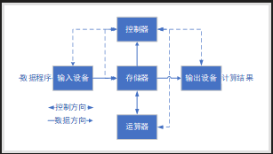
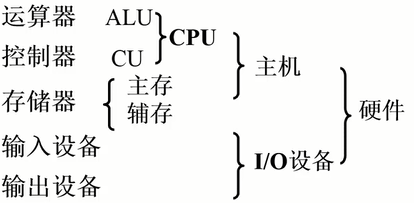
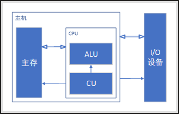
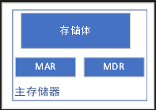
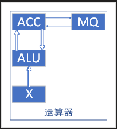
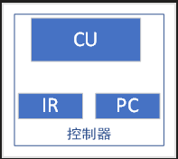
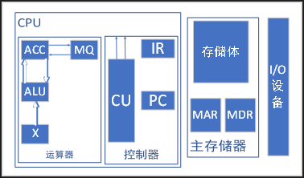
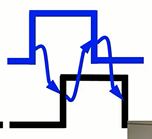
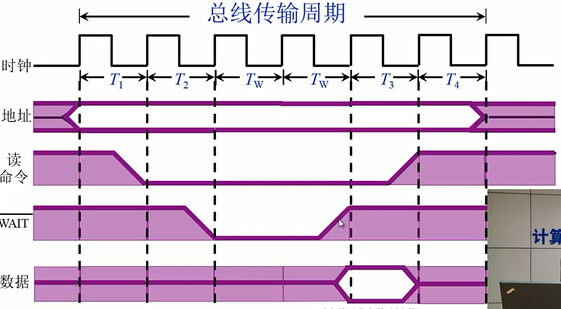

# 总线的判优控制

## 基本概念

主设备/模块：对总线有 控制权
从设备/模块：响应 从主设备发来的总线设备

## 总线判优控制

- 集中式 - 将控制模块同一种集中在主模块中
    - 链式查询
    - 计时器定时查询
    - 独立请求方式
- 分布式 - 将控制分散在各个接口上

## 链式查询方式

- BR：总线请求线
- BS：总线忙线
- BG：总线授权线
- 优点：结构简单，总线设备少，扩展性强，算法容易实现
- 缺点：对电路故障非常敏感，速度慢

流程
1. 当设备需要请求时，通过BR将信号传递到总线控制部件，提出总线占中请求
2. 总线控制部件通过BG链式查询需要激活的从设备
3. 如果从设备不需要总线占用，则判断下一个从部件
4. 如果从设备需要总线占用，则此设备获得总线使用权
5. 然后总线控制部件激活BS线表示总线占用忙

总线数 = BG+BR+BS+数据线+地址线

## 计数器定时查询

- 总线控制部件内存在一个计数器
- 总线数=BS+BR+$log_2{N_{IO}}$+数据线+地址线
- 优点：通过对计数器的设置，实现优先级灵活控制优先级
- 缺点：速度比较慢

流程
1. 从设备通过BR向总线控制部件提出占用请求
2. 总线控制部件从计数位置开始依次判断从部件是否需要使用总线
3. 如果不需要占用总线，则计数器加一
4. 如果需要占用，则从设备获取使用权
5. 总线控制部件通过BS发出总线忙信号，并与拥有使用权的从设备开始交换数据

## 独立请求方式

- 为每一个接口提供一个BG和BR线，总线控制部件内部存在一个排序器
- 总线数=2N+数据线+地址线

流程
- 从部件通过各自的BR线获取请求
- 通过排序器判断从部件能否获得使用权

# 总线通信控制

目的：解决通信双方 协调配合 问题

## 总线的传输周期

|申请分配阶段|主模块申请，总线仲裁决定|
|-|-|
|寻址阶段|主模块向从模块给出 地址 和 命令|
|传数阶段|主模块和从模块 交换数据|
|结束阶段|主模块 撤销有关信息|

## 同步通信

同步通信：由 统一时标 控制数据传输，在固定的时间点上给出对应操作
时钟：以固定频率释放信号

### 同步式数据输入

1. 在T1上升沿，主设备给出地址信号，告诉从模块主模块要操作的地址

2. 在T2上升沿，主设备给出读命令信号，告诉从模块主模块要进行读操作

3. 在T3上升沿，从模块给出数据

4. 在T4上升沿，主设备撤销读命令信号，从模块撤销数据传输

5. 在T5上升沿，主设备撤销地址信号

### 同步式数据输出

1. 在T1上升沿，主设备给出地址信号，告诉从模块主模块要操作的地址
2. 在T1下降沿，主设备给出数据
3. 在T2上升沿，主设备给出写命令信号，告诉从模块主模块要进行写操作
4. 在T3上升沿，执行写操作
5. 在T4上升沿，主设备撤销撤销数据，撤销写命令信号
6. 在T5上升沿，主设备撤销地址信号

特点
- 有定宽定距的时间控制数据传输的过程
- 在给定的时间点上要完成对应的操作
- 当主从设备存在速度差，则使用最慢的模块作为周期单位

应用：总线短，主从设备速度一致

## 异步通信

- 异步通信：采用 应答方式， 没有公共时钟标准
- 请求线：主设备向从设备发出请求信号
- 应答线：从设备向主设备发出应答信号

### 不互锁
1. 主设备发出请求信号
2. 从设备收到请求信号，发出应答信号

特点：主设备按固定时间撤销请求信号，从设备按固定时间撤销应答信号

### 半互锁

1. 主设备发出请求信号
2. 从设备收到请求信号，发出应答信号
3. 主设备收到应答信号，撤销请求信号

特点：主设备在收到应答信号后撤销请求信号，从设备按固定时间撤销应答信号

### 全互锁（三次握手）

1. 主设备发出请求信号

2. 从设备收到请求信号，发出应答信号

3. 主设备收到应答信号，撤销请求信号

4. 从设备失去请求信号，撤销应答引号

特点：主设备在收到应答信号后撤销请求信号，从设备失去请求信号后撤销应答信号

## 半同步通信
半同步通信：同步、异步相结合（在数据传输速度不一致的模块间）

同步
- 发送方 用系统 时钟前沿 发信号
- 接收方 用系统 时钟后沿 判断识别

异步
- 允许不同速度的模块和谐工作
- 增加一条等待响应信号$\overline{WEIT}$

### 输入数据流程

1. T1上升沿 主模块发出地址信号

2. T2上升沿 主模块发出命令信号，从模块未准备好数据时，$\overline{WEIT}$ 信号为低电平

3. TW 主模块检测$\overline{WEIT}$ 为低电平，等待一个T

4. TW 主模块检测$\overline{WEIT}$ 为低电平，等待一个T

5. TW ...

6. T3上升沿 从模块将$\overline{WEIT}$ 信号置为高电平，从模块开始提供数据，主模块停止等待，开始接收数据

7. T4上升沿 从模块撤销数据，主模块撤销命令

## 同步、异步、半同步通信的特点

### 一个总线传输周期

|主模块发出地址和命令信号|占用总线|
|-|-|
|从模块准备数据|不占用总线 总线空闲|
|从模块向主模块发送数据|占用总线|

总线有空闲，总线资源利用不充分

## 分离式通信
- 分离式通信：充分 挖掘 系统 总线每个瞬间 的潜力

一个总线传输周期
- 子周期1：主模块申请占用总线，使用完后即放弃总线使用权
- 子周期2：从模块申请占用总线，将各种信息送至总线

例：机械硬盘在定位数据时会产生

特点

- 各个模块有权申请占用总线
- 采用同步方式通信，不等对方回答
- 各个模块准备数据时，不占用总线
- 总线被占用时，无空闲

