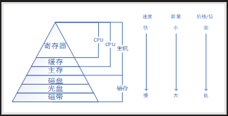

存储器可分为哪些类型
现代存储器的层次结构，为什么要分层？

# 存储器分类

以存储介质、存储位置、存储器的作用等方式进行分类

## 按存储介质分类

### 半导体存储器

介质：TTL、MOS
特点：信息容易丢失

### 磁表面存储器

介质：磁头、载磁体
特点：信息不易丢失

### 磁芯存储器（CoreMemory）

介质：硬磁材料、换装原件
特点：信息不易丢失

### 光盘存储器

介质：激光、磁光材料
特点：信息不易丢失

## 按存取方式分类

### 随机访问 - 存取时间与物理地址无关

- 随机存储器 ROM

- 只读存储器 RAM

### 串行访问 - 存取时间与物理地址有关

- 顺序存取存储器 磁带

- 直接存取存储器 磁盘

## 按在计算机中的作用分类

- 主存储器
- **RAM**：随机存取存储器
    - 静态RAM
    - 动态RAM
- **ROM**：只读存储器
    - MROM：掩膜只读存储器
    - PROM：可编程只读存储器
    - EPROM：可编程可擦除只读存储器
    - EEPROM：电可擦除可编程只读存储器
- **FlashMemory**：比主存速度慢，比辅助存储器快，可以当作主辅存储器间的缓存
- 高速缓冲存储器（Cache）：用静态RAM来做
- 辅助存储器：如磁盘、磁带、光盘

# 存储器的层次结构

## 存储器主要特性的关系

### 计算机存储体系图

### 存储体系

**存储体系**：把两种或两种以上构成的存储器，用软件、硬件、软硬件相结合的方式，连接为一个整体，从某一级的程序员来看，拥有高速度，大容量，低价格的特性，也即是透明的。

## 缓存-主存层次和主存-缓存层次

```mermaid
graph LR;
	A[CPU 10ns]
	B[缓存 20ns]
	C[主存 200ns]
	D[辅存 ms]
	A--->B--->C--->D
	D--->C--->B--->A
	A--->C
	C--->A
```

- 缓存-主存
目的：解决速度差异

- 主存-辅存
目的：解决存储容量

- 主存储器
地址：实地址/物理地址

- 虚拟存储器
地址：虚地址/逻辑地址

程序的局部性原理

