# 主存储器–概述

## 主存的基本组成

```mermaid
graph LR
	A[存储体]
	B[读写电路]
	C[MDR]
	D[控制电路]
	E[驱动器]
	F[译码器]
	G[MAR]
	
	subgraph sgA
		direction BT
		地址总线-..->G-->F-->E-->A
		G-->F-->E-->A
	end
	direction TB
	subgraph sgB
		direction TB
		subgraph sgB1
			direction TB
			A <--> B <--> C <-..-> 数据总线
			A <--> B <--> C
		end
		subgraph sgB2
			direction TB
			写--> D
			读--> D --> B
		end
	end

```

## 主存与CPU之间的联系

```mermaid
graph LR
    subgraph CPU
        direction TB
        A[MDR]
        B[MAR]
    end
    subgraph M[主存]
        C[主存]
    end
    A <==数据总线==> M
    B ==地址总线==> M
    CPU --读-->M
    CPU --写-->M


```

## 主存中存储单元地址的分配

假设 存储字长32位，每字节存一个地址
问 数据`12345678H`如何在主存储器中进行存储
设地址线`24`根 按***字节***寻址 $2^24=16MB
$若字长为`16`位 按***字***寻址 $8MW
$若字长为`32`位 按***字***寻址 $4MW$

### ***高位地址***为字地址

| 字地址 |  字  |  节  |  地  |  址  |
| ------ | --- | --- | --- | --- |
| 0      | 12  | 34  | 56  | 78  |
| 4      |     |     |     |     |
| 8      |     |     |     |     |

- 将高位字节 存放在低位地址

- 并将高位字节所在地址设置为字地址

- 大段、大尾方式

### **低位字节**地址为字地址

| 字地址 |  字  |  节  |  地  |  址  |
| ------ | --- | --- | --- | --- |
| 0      | 78  | 56  | 34  | 78  |
| 4      |     |     |     |     |
| 8      |     |     |     |     |

- 将低位存放在低地址

- 低位所在地址为字地址

- 小端、小尾方式

## 主存的技术指标

存储容量：主存存放二进制代码的总位数
存储速度
存取时间：存储器的访问时间
读出时间/写入时间
存取周期：连续两次独立的存储器操作（读写）所需的最小间隔时间
读周期/写周期

> 思考：存储周期长于存取时间的原因是由于存取周期会包括寻址时间
存储器的带宽 单位时间内可以操作的位数
单位：位/秒

# 半导体存储芯片简介

## 基本结构

```mermaid
graph LR
    subgraph sg[基本结构]
        A[译码驱动]
        B[存储矩阵]
        C[读写电路]
    end
    地址线 -->sg
    地址线 -->sg
    sg <--> 数据线
    sg <--> 数据线
    片选线-->sg
    读/写控制线 --> sg 

```

### 芯片容量的计算

$芯片容量(bit)=2^{地址线数}×数据线数$

| 地址线(单向) | 数据线（双向） | 芯片容量  |
| ----------- | ------------- | -------- |
| 10          | 4             | $1K×4b$  |
| 14          | 1             | $16K×1b$ |
| 13          | 8             | $8K×8b$  |

### 信号线

片选线：芯片选择线

- $\overline{CS}$：芯片选择信号，低电平有效

- $\overline{CE}$：芯片使能信号

读写控制线：控制芯片读写

- $\overline{WE}$：低电平写高电平读

- $\overline{OE}$：允许读 | $\overline{WE}$：允许写

### 片选线的作用

假如 用$16K×1b$的存储芯片组成$64Kx8b$的存储器
问 应该如何构成？

1. 将八个存储芯片组成一组

2. 用4组组成存储器

3. 当地址信号为65535=64K-1时，第4组的片选有效

4. 8个芯片同时读出一位，满足读取要求

## 译码驱动方式

### 线选法

问题：由于一条线对应一个地址，导致地址线数量过多，难以扩大芯片容量

### 重合法

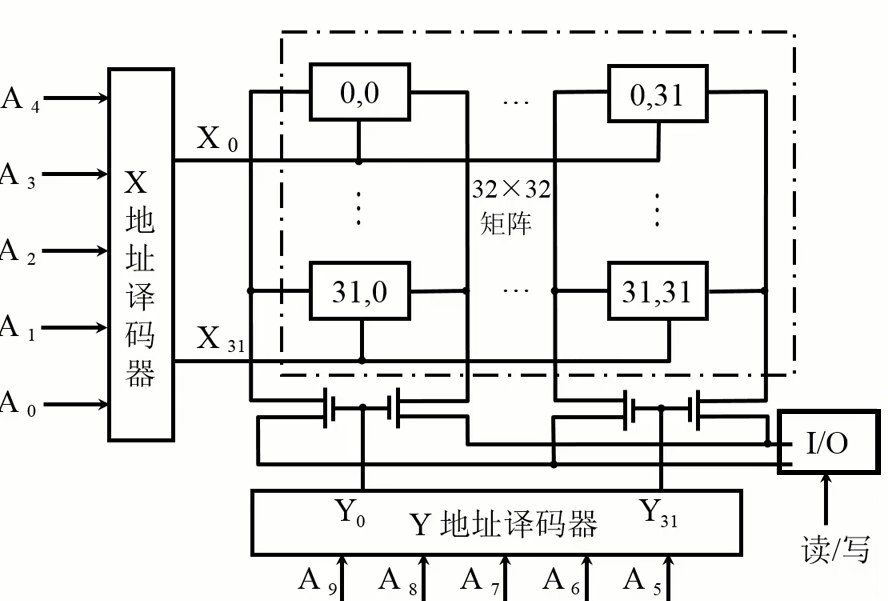

# 随机存取存储器（RAM）
## 静态RAM（SRAM）

保存原理
基本单元电路的构成
单元电路的读写
经典芯片结构
静态RAM芯片的读写

### 静态RAM基本电路

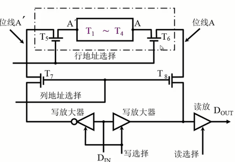

- $T_1\sim T_4$ 触发器，比如双稳态触发器

- $T_5、T_6$ 行开关

- $T_7、T_8$ 列开关

> 注意：虚线部分为存储单元，因此可以进行堆叠

#### 读操作

1. $行选择\to T_5、T_6 开$

2. $列选择\to T_7、T_8 开$

3. 读选择有效

4. $V_A\to T_6\to T_8\to读放\to D_{out}$

#### 写操作

1. $行选择\to T_5、T_6 开$

2. $列选择\to T_7、T_8 开$

3. 写选择有效

4. $（左）D_{IN}\to反向\to T_7\to T_5\to A`$

5. $（右）D_{IN}\to T_8\to T_6\to A$

### 静态RAM芯片举例

#### Intel2114外特性

- $\overline{WE}$ 是读写信号线

- $\overline{CS}$ 是片选信号线

- $A_0\sim A_9$ 是地址线，代表芯片有$2^10=1024=1K$ 存储单元

- $I/O_1 \sim I/O_4$ 是数据线，代表1个存储单元能保存4bit数据
芯片容量为$1K×4位$，因此可以将芯片划为64×64矩阵，共64行16列4组，每次4位输出

#### Intel2114RAM矩阵（64×64）矩阵图

#### Intel2114RAM矩阵（64×64）读

假如 读取`b000000 0000`地址

1. $\overline{WE}$ 信号高电平有效、$\overline{CS}$ 信号低电平有效

2. 行选择器选择第0行位置

3. 列选择器选择每组第0列位置，也就是第0、16、32、48列

4. 数据会从4个读写电路输出对应数据

#### Intel2114RAM矩阵（64×64）写

假如 写如`b000000 0000`地址

1. $\overline{WE}$ 信号低电平有效、$\overline{CS}$ 信号低电平有效

2. 行选择器选择第0行位置

3. 列选择器选择每组第0列位置，也就是第0、16、32、48列

4. 数据会从4个读写电路输入到对应位置

## 动态RAM（DRAM）

### 三管动态

#### 基本电路图

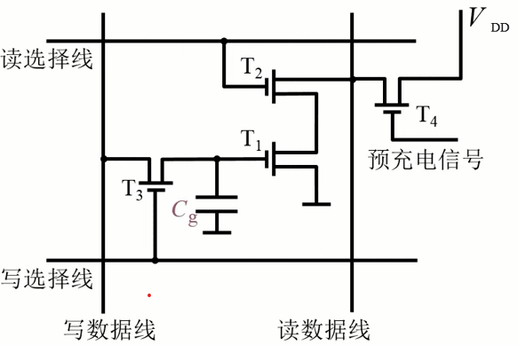

#### 工作原理

- 预充电有效

- $T_4开$

- 假如 读选择线有效

    - $T_2开$

    - 假如 $C_g$ 未充电，存储为0

        - $T_1$ 关

        - $V_{DD}\to T_4\to 读数据线$，读数据线为高电平

    - 假如 $C_g$ 充电，存储为1

        - $T_1$ 开

        - $V_DD\to T_4\to T_2\to T_1\to 地$，读数据线为低电平

- 假如 写选择线有效

    - $T_3$ 开

    - $写数据线\to C_g$

> 读出与原存信息相反
写入与输入信息相同

#### 三管动态RAM芯片（Intel 1103）

**刷新放大器**：为了**刷新电容**所保存的数据
**行地址译码器**：既**选择地址**也**控制读写**

### 单管动态

#### 基本电路图

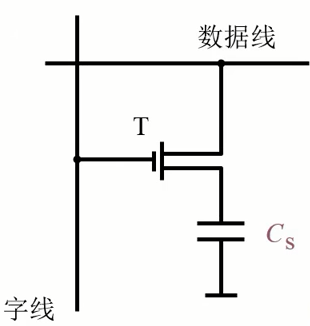

#### 工作原理

字线通过控制$T$是否导通选择对应数据
检测或控制数据线完成读写操作

#### 单管动态RAM4116（16K×1位）外特性

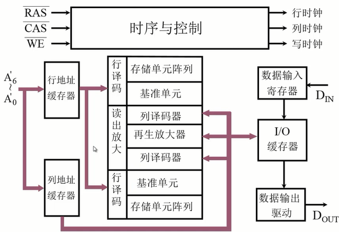

- 需要14根地址线，分两次输入

#### 单管动态RAM4116（16K×1位）

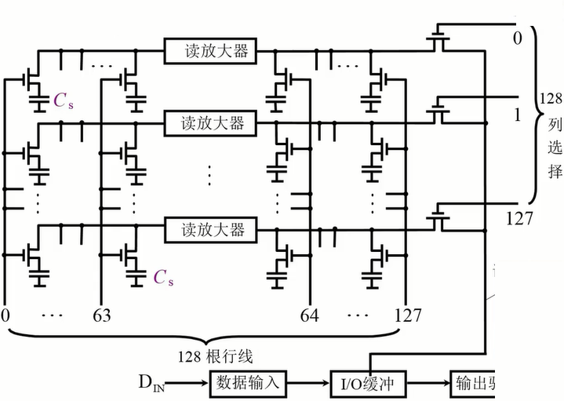

### 动态RAM刷新

原因：由于电容所保存的数据会随时间流失，因此需要不断进行刷新
刷新与行地址有关：每一次刷新操作，刷新的是一行的所有单元保存的数据。

- 这一行每一列单元所保存的数据放置到每一列读数据线上

- 经过读数据线和写数据线之间的刷新放大器，可以将数据恢复

#### 集中刷新

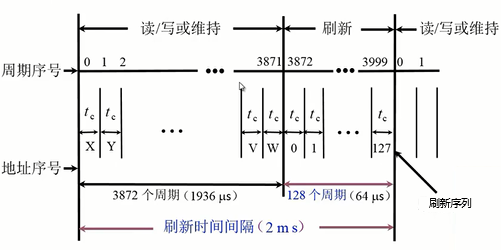

- 假设 存取周期位0.5μs，单元电容刷新为2ms（芯片内部所有电容需要在2ms中刷新）

- 2ms是$2ms\div0.5us=4000t$ 存储周期

- 其中刷新操作（死区）共需要$128tx0.5μs=64μs$

- 读写或维持操作可执行$4000t-128t=3872t=1936μs$

- $死时间率=128t\div4000×100\%=3.2\%$

#### 分散刷新

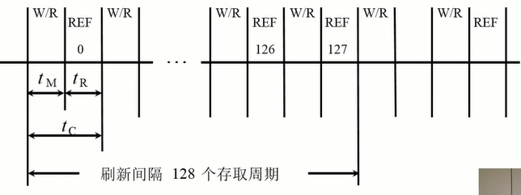

- 假设 存取周期为1μs，以128×128为例

- $t_M$：执行操作的周期

- $t_R$：按顺序刷新内存的周期

- $t_M+t_R=t_C$：一次存储周期

- 按照以上方法，在一个电容刷新内会产生过多次数的刷新

#### 异步刷新

- 假设 存取周期为0.5μs，以128×128为例

- 若每隔15.6μs刷新一行

- 每隔2ms刷新一次

## 静态RAM与动态RAM的比较

|比较方式|DRAM|SRAM|
|-|-|-|
|存储方式|电容|触发器|
|继承度|高|低|
|芯片引脚|少|多|
|功耗|小|大|
|价格|低|高|
|速度|慢|快|
|刷新|有|无|

将DRAM作为主存，以SRAM作为辅存

# 只读存储器（ROM）
## 早期的只读存储器：MROM（掩膜ROM）

- 行列选择线加查出有MOS管为1，无MOS管为0

- 在厂家就写好了内容

## 改进1：PROM（一次性ROM）

- 熔丝断为0，熔丝未断为1

- 用户可以自己写，一次性

## 改进2：EPROM（可擦写ROM）

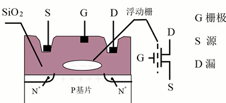

- D端加正电压，形成浮动栅，S与D不导通为0

- D端不加正电压，不形成浮动栅，S与D导通为1

- 紫外线全部擦洗

- 要能对信息进行擦除，可以多次写，便宜

## 改进3-EEPROM（电可擦写ROM）

- 电可擦写，特定设备

- 局部擦写

- 全部擦写

## 改进4-Flash Memory（闪速型存储器）

- 电可擦写（直接连接到计算机）

- 例如：U盘

- 比EEPROM快，部分具有RAM功能

# 存储器与CPU的链接
## 存储器容量的扩展

### 位扩展

目的：增加存储字长
例如：用2片1K×4位存储芯片构成1K×8位的存储器

- 10根地址线

- 8根数据线

- 1条读写信号线和1条片选线，同时与两个芯片连接

> 思考：2114芯片的地址线和数据线是否需要按序的与系统连接？

### 字扩展

目的：增加存储字的容量
例如：用2片1K×8位存储芯片组成2K×8位的存储器

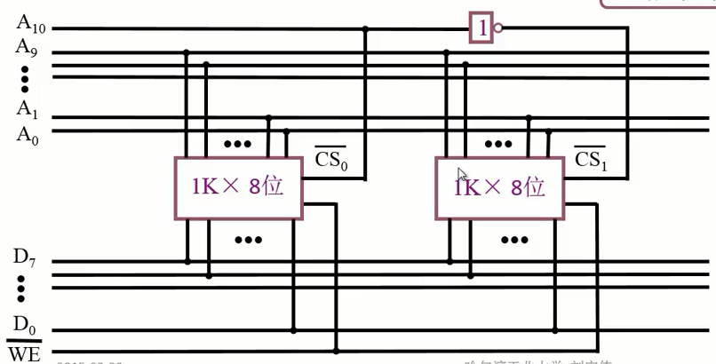

- 11根地址线

- 8根数据线

- 1条读写信号线

- 最后1根地址线通过一个非门拆分成2个片选线，分别与两个芯片连接

### 字、位扩展

例如：用8片1K×4位存储芯片组成4K×8位的存储器

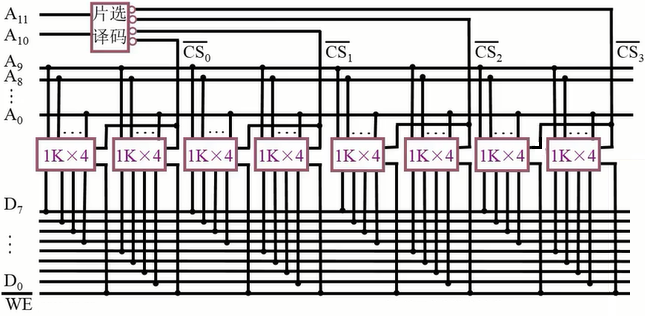

- 2个1K×4位存储芯片组成1个1K×8位存储芯片组，4组1K×8位存储芯片组组成4K×8位的存储器

- 12根地址线

- 8根数据线

## 存储器与CPU的连接

### 考虑内容

1. 地址线的连接

2. 数据线的连接

3. 读/写命令的连接

4. 片选线的连接

5. 合理选择存储芯片

6. 其他 时序、负载等

### 举例

设CPU共有16根地址线，8根数据线，并用MREQ(低电平有效)作访存控制信号，R/W作读写命令信号(高电平为读，,低电平为写)。现有下列存储芯片: ROM (2K×8位，4K×8位，8K×8位)，RAM (1K×4位，4K×8位,8K×8位)，及74138译码器和各种门电路(门电路自定)。~~$_H6000\sim _H67FF$~~为系统程序区，$_H6800\sim _H6BFF$为用户程序区。

- 74138译码器

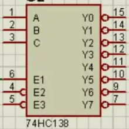

#### 映射对应的二进制地址码

- 系统程序地址

| $A15-A8$ | $A7-A0$  |
| -------- | -------- |
| 01100000 | 00000000 |
| 01100111 | 11111111 |

系统程序地址数量=$2^{11}=2K$

- 应用程序地址

| $A15-A8$ | $A7-A0$  |
| -------- | -------- |
| 01101000 | 00000000 |
| 01101011 | 11111111 |

应用程序地址数量=$2^{10}=1K$

#### 确定芯片类型

- 系统程序：$2K×8位$ ROM芯片×1

- 应用程序：$1K×4位$ RAM芯片×2

#### 分配地址线

- $A_{10}\sim A_0$接到$2K×8位$ROM的地址线

- $A_9\sim A_0$接到$1K×4位$RAM的地址线

- $A_{11}$ 接到138译码器的A端

- $A_{12}$ 接到138译码器的B端

- $A_{13}$ 接到138译码器的C端

- $A_{14}$ 接到138译码器$G_1$端

- $A_{15}$ 接到138译码器$G_{2A}$端

- $\overline{MREQ}$接到138译码器的$G_{2B}$端

> 根据地址范围，138译码器只会输出$Y_4$或$Y_5$

#### 片选信号

- 138译码器$Y_4$连接到$2K×8位$ ROM芯片上

- 138译码器$Y_5$与地址$A_10$进行与运算后，片选到$1K×4位$RAM芯片上

#### 数据线

- $2K×8位$ ROM芯片接到数据$D_7\sim D_0$

- 2片$1K×4位$RAM芯片分别接到$D_3\sim D_0$和$D_7\sim D_4$

#### 连接图

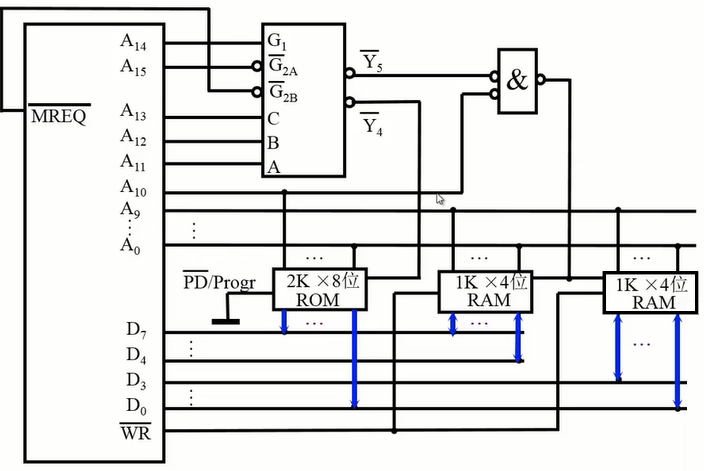

### 题

设CPU共有16根地址线，8根数据线

并用$\overline{MREQ}$(低电平有效)作访存控制信号

R/W作读写命令信号(高电平为读，,低电平为写)。

现有下列存储芯片: ROM (2K×8位，4K×8位，8K×8位)，RAM (1K×4位，4K×8位, 8K×8位)，及74138译码器和各种门电路(门电路自定)。4K系统区、8K用户程序区

#### 答案

|地址类型|系统地址|用户地址|
|-|-|-|
|地址范围|$_H0000\sim _H0FFF$|$_H1000\sim _H2FFF$|
|起始地址|0000 0000 0000 0000|0001 0000 0000 0000|
|结束地址|0000 1111 1111 1111|0010 1111 1111 1111|

#### 图

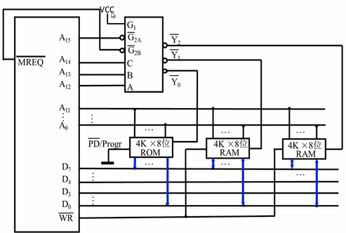

# 存储器的校验
由于环境当中的电磁干扰，可能对存储单元所存储的信息造成干涉，导致数据失效。

- 合法代码集合

    1. 普通存储 {000, 001, 010, 011, 100, 101, 110, 111} 检错0位、纠错0位

    2. 奇偶存储 {000, 011, 101, 110} 检错1位、纠错0位

    3. 三倍冗余 {000, 111}  检错1位、纠错1位

    4. 四倍冗余 {0000, 1111} 检错2位、纠错1位

    5. 五倍冗余 {00000, 11111} 检错2位、纠错2位

> 编码的检测能力和纠错能力与任意两组合法代码之间**二进制位**的**最少差异数**有关。

## 编码的最小距离

任意两组合法代码之间***二进制位***的***最少差异***

***编码的纠错检错能力与编码的最小距离有关***

$L-1=D+C(D≥C)$

- $L$：编码的最小距离

- $D$：检错的位数

- $C$：纠错的位数。 

## 汉明码的组成

### 汉明码

- 汉明码采用奇偶校验

- 汉明码采用分组校验

    > 分组校验：按照特定规则进行分组，并在规则内添加一位校验位

- 汉明码的分组是一种非划分方式（组和组之间存在交叉）

    - 校验位放置于$2^n$的位置

### 汉明码的组成

汉明码的三要素

- 汉明码的组成需添加：$2^k≥n+k+1$位检测

- 检测位的位置：$2^i(i=0, 1, 2, ...)$

- 检测位的取值：检测位的取值与该位所在的检测小组承担的奇偶校验任务有关。 

各检测为$C_i$所承担的检测小组

| 检测位   | 组编号   | 包含位置 |
| ----- | ----- | --------------------------------------------------------------------------------------- |
| $C_1$ | $g_1$ | $01_{0001}, 03_{0011}, 05_{0101}, 07_{0111}, 09_{1001}, 11_{1011}, 13_{1101}, 15_{1111}$|
|$C_2$|$g_2$|$02_{0010}, 03_{0011}, 06_{0110}, 07_{0111}, 10_{1010}, 11_{1011}, 14_{1110}, 15_{1111}$|
|$C_4$|$g_3$|$04_{0100}, 05_{0101}, 06_{0110}, 07_{0111}, 12_{1100}, 13_{1101}, 14_{1110}, 15_{1111}$|
|$C_8$|$g_4$|$08_{1000}, 09_{1001}, 10_{1010}, 11_{1011}, 12_{1100}, 13_{1101}, 14_{1110}, 15_{1111}$|

$g_i$小组独占$2^{i-1}$位

$g_i$和$g_j$小组共占第$2^{i-1}+2^{j-1}$位

$g_i$、$g_j$和$g_l$小组共占第$2^{i-1}+2^{j-1}+2^{l-1}$位

#### 例如

求0101按“偶校验”配置的汉明码

因为 n=4

根据 $2^k≥n+k+1$

得到 $k=3$

汉明码的排序如下

|二进制序号|1|2|3|4|5|6|7|
|-|-|-|-|-|-|-|-|
|名称|$C_1$|$C_2$|0|$C_4$|1|0|1|
|汉明码|0|1|0|0|1|0|1|

### 汉明码的纠错过程

形成新的检测位$P_i$，其位数与增添的检测位有关，如增添3位(k=3)，新的检测位为$P_4P_2P_1$。

假如 k=3，数据为0011，偶编码汉明码为1000011，错误数据90%为一个，$P_i$的取值为

- $P_1=1\oplus3\oplus5\oplus7=1\oplus0\oplus0\oplus1=0$

- $P_2=2\oplus3\oplus6\oplus7=0\oplus0\oplus1\oplus1=0$

- $P_4=4\oplus5\oplus6\oplus7=0\oplus0\oplus1\oplus1=0$

若结果都为0，数据无措，若结果为1，则数据在$P_4P_2P_1$的位置出错

> 汉明码编码的最小距离：$L=D(2)+C(0)+1=3$

# 提高访存速度的措施

- 采用高速器件

- 采用层次结构Cache-主存

- 调整主存结构

## 单体多次系统

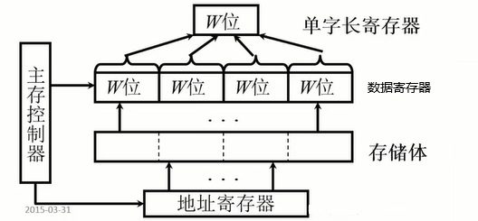

## 多体并行系统

### 高位交叉 顺序编址

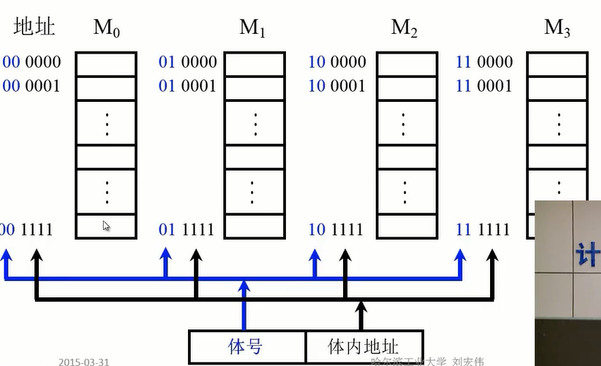

- 由于数据通常是顺序的，所以会导致一个工作其他看戏的情况发生

### 低位交叉 各个体轮流编址

- 在不改变存取周期的前提下，增加存储器的带宽

    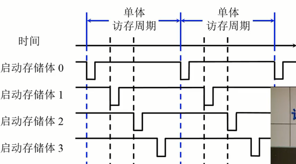

    假如 塞体四体低位交叉存储器，存储周期为$T$。总线传输周期为$\tau$，则实现流水线方式存取，应满足$T=4\tau$。

    连续读取4个字所需的时间为$T+(4-1)\tau$

    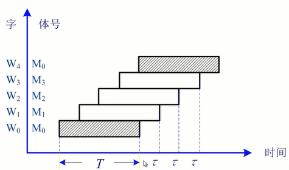

## 高性能存储芯片

### SDRAM（同步DRAM）

在系统时钟的控制下进行读出和写入

CPU无需等待。 

### RDRAM

由Rambus开发，主要解决存储器带宽问题。

### 带Cache的DRAM

在DRAM的芯片内集成了一个由SRAM组成的Cache，有利于猝发式读取。
