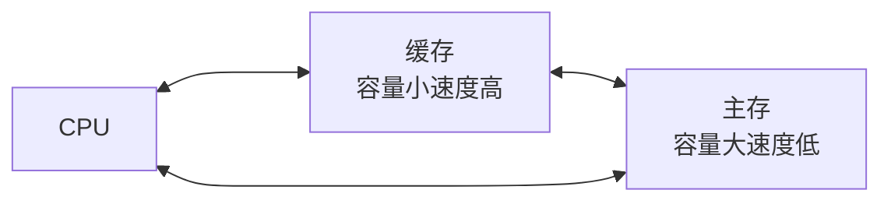
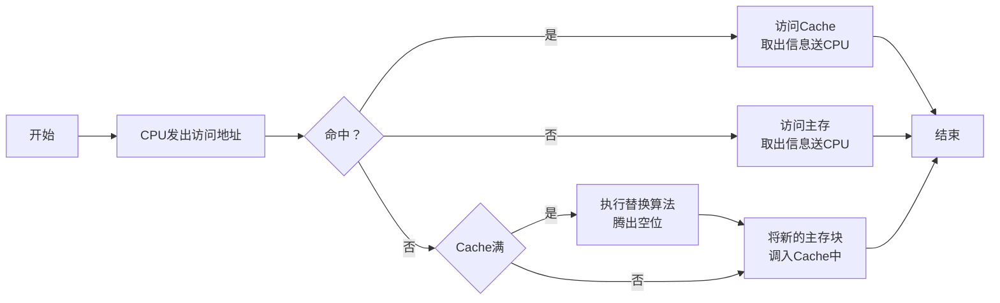

# 概述

## Cache的重要性

高速缓冲存储器用于避免CPU空等现象，CPU和主存（DRAM）的速度差异。

根据程序访问的局部性原理，Cache和主存的单位是块

程序访问的局部性原理

- 时间局部性：当前正在使用的指令和数据将来还会使用到

- 空间局部性：当前正在使用的指令和数据周围的数据肯能会用到

## Cache的工作原理

### 主存和缓存的编址

将主存和Cache分成大小相等的块，主存有M个块，Cache中有C个块，$M>>C$

如此，CPU给出的地址就可以分为两个部分，块号和块内偏移地址。

- 块号：缓存块和内存块是完全复制关系，因此转移的缓存块号与内存块号一致

- 块内地址：决定块的大小，内存块与Cache块大小相同，Cache块会有一个标记，用于判断块是否在Cache中。

### 命中与未命中

缓存共C块

主存有M块 $M>>C$

**命中**：主存块**调入**缓存，主存会与缓存会**建立**了对应关系

**标记记录**：与某缓存块建立了对应关系的**主存块号**。

**未命中**：主存块**未调入**缓存，主存块与缓存块**未建立**对应关系

### Cache的命中率

CPU欲访问的信息在Cache中的**比率**

**命中率**与Cache的**容量（正相关）**与**块长（负相关）**有关

块长：取一个存取周期内从主存调出的信息长度

|体系|交叉体数量|块长|
|-|-|-|
|CRAY_1|16体|16字|
|IBM 370/168|4体|4字|

### Cache-主存系统的效率

- 效率$e$与命中率有关
	- $e=\frac{访问Cache的时间}{平均访问时间}\times 100\%$
- 设Cache命中率为h，访问Cache的时间为$t_c$，访问主存的时间为$t_m$
	- 则$e=\frac{t_c}{h\times t_c + (1-h)\times t_m}\times 100\%$

> 注意：访问内存和访问Cache是在同时发生的

## Cache的基本结构

主存Cache地址映射变换机构：将主存块号转换为可能的Cache块号

Cache替换机构：当Cache已满时，用于控制是否将Cache块替换为主存块数据

## Cache的读写操作

### 读

### 写

Cache和主存的一致性

- 写直达法（Write-through）：写操作时数据既写入cache又写入主存，**写操作时间就是访问主存的时间**，Cache块退出时，不需要对主存执行写操作，更新策略比较容易实现。

- 写回法（Write-back）：写操作时只把数据写入cache而不写入主存，当cache数据被替换出去时才写回主存，**写操作时间就是访问cache的时间**，cache块退出时，被替换的库尔需要写回主存，增加了cache的复杂性。

## Cache的改进

增加Cache的级数

片载（片内）Cache

片外Cache

统一缓存和分立缓存

指令Cache 数据Cache

与指令执行的控制方式有关

|类型|指令Cache|数据Cache|
|-|-|-|
|Pentium|8K|8K|
|PowerPC620|32K|32K|

# Cache-主存的地址映射

## 直接映射

每个缓存块i可以和若干个主存块对应。

每个主存块j只能和一个缓存块对应。

特点

- 速度快、结构简单

- Cache的利用率低

## 全相联映射

主存任何块可以放置到Cache任何位置

特点

- 速度慢、结构复杂

- 标记较长

- 效率利用率高

## 组相联映射

$i=j \bmod Q$

**某一主存块j**按模**Q**映射到**缓存**的第**i组**中的**任何一块**

特点：平衡全相联和直接相连的特点

# 替换算法

- 先进先出（FIFO）算法

- 近期最少使用（LRU）算法

