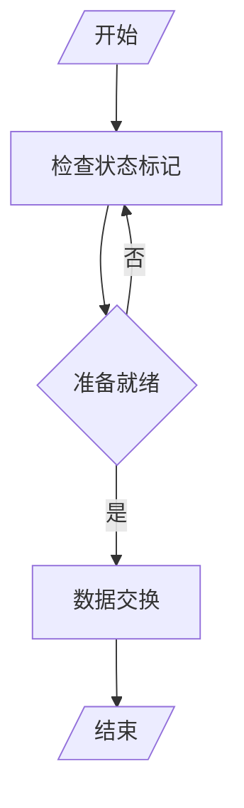
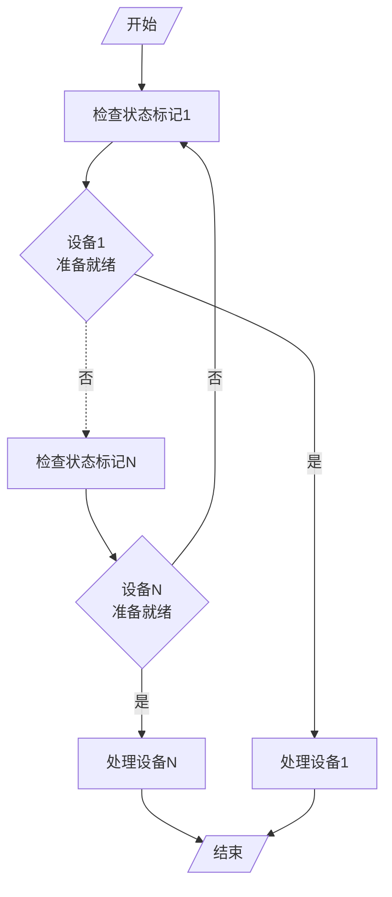
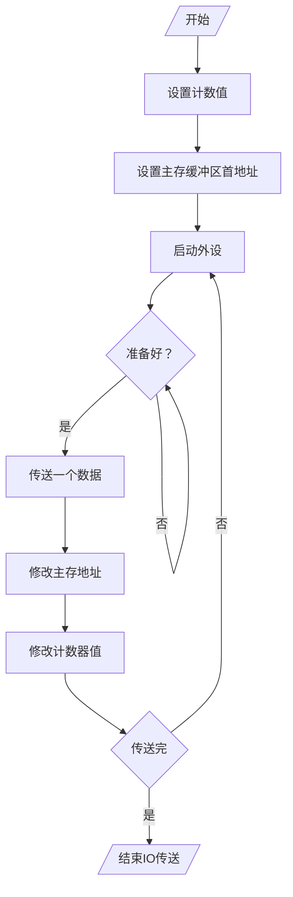

# 程序查询方式流程

## 查询流程

- 检查状态标记：测试指令

- 准备就绪：转移指令

- 数据交换：传送指令

## 程序流程

保存寄存器内容

# 程序查询方式接口电路

以输入为例

1. CPU通过地址线给出外部设备的地址

2. 设备选择电路与地址线上的地址进行比较

3. SEL（选择设备）信号与启动命令信号有效

4. 将标志D（设备准备标志）置为0

5. 将标志B（设备忙标志）置为1，并启动设备

6. 设备将准备好的数据保存到DBR（数据缓冲区）中

7. 设备工作结束，发出结束信号

8. 将标志B（设备忙标志）置为0

9. 将标志D（设备准备标志）置为1，向CPU发出准备就绪信号

> 在整个过程中，CPU在原地踏步对D为1进行查询
