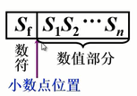
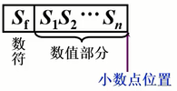
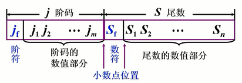
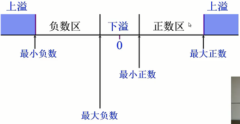

# 定点表示
定点表示：小数点按约定方式标出

$\left[S_f|S_1S_2...S_n\right]$
- $S_f$：数符
- $S_1\sim S_n$：数值部分
- 小数点：位于数符和数值中间

$\left[S_f|S_1S_2...S_n\right]$
- $S_f$：数符
- $S_1\sim S_n$：数值部分
- 小数点：位于数值后

| 定点机 |           小数定点机           |        整数定点机        |
| ------ | ---------------------------- | ---------------------- |
| 原码   | $-(1-2^{-n})\sim+(1-2^{-n})$ | $-(2^n-1)\sim+(2^n-1)$ |
| 补码   | $-1\sim+(1-2^{-n})$          | $-2 \sim+(2^n)-1$      |
| 反码   | $-(1-2^{-n})\sim+(1-2^{-n})$ | $-(2^n-1)\sim+(2^n-1)$ |

# 浮点表示
- 为什么要引入浮点数表示
    - 变成困难，程序员要调节小数点的位置
    - 数的表示范围小，为了表示两个大小相差很大的数据，需要很长的机器字长
    - 数据存储单元的利用率低
- 表示方式
    - 浮点数的一般形式$N=S \times r^j$
    - S：尾数，小数，可正可负
    - j：阶码，整数，可正可负
    - r：尾数的基值，通常取2、4、8、16等
    - 当r=2、N=11.0101时，$N=S \times r^j=0.110101\times2^{10}$，
    - 通常采用小数顶点式
## 浮点数的表示形式

$\left[j_f|j_1j_2...j_m|S_f|S_1S_2...S_n\right]$
- $j_fj_1\sim j_m$：阶码
- $s_fs_1\sim s_n$：尾数
- f：符号位
- m：反应浮点数的表示范围
- n：反应浮点数的精度
- $j_f$ 和m共同表示小数点的实际位置

> 思考：阶码决定了浮点数的最大值和最小值，尾数决定了浮点数的精度

## 浮点数的表示范围

- 最小负数：$-2^{2^m-1}\times(1-2^{-n})$
- 最大负数：$-2^{-(2^m-1)}\times2^{-n}$
- 最小正数：$2^{-(2^m-1)}\times2^{-n}$
- 最大正数：$2^{2^m-1}\times(1-2^{-n})$
- 上溢：阶码>最大阶码
- 下溢：阶码<最小阶码，按机器0处理
举例
设m=4，n=10
- 最小负数：$-2^{15}\times(1-2^{-10})$
- 最大负数：$-2^{15}\times(2^{-10})$
- 最小正数：$2^{15}\times(2^{-10})$
- 最大正数：$2^{15}\times(1-2^{-10})$

## 浮点数的规格化
### 规格化形式
目的：尽可能保证浮点数的精度，保证有效位数尽可能多
r=2 尾数最高位为1
r=4 尾数最高位2位不全为0
r=8 尾数最高位3位不全为0
基数不同，浮点数的规格化形式不同
### 规格化定义
$\frac{1}{r}\le|S|<1$
### 规格化判断
以r=2规格化形式

| 数值 |         S>0          |          S<0          |
| ---- | -------------------- | --------------------- |
| 真值 | $0.1x_2x_3\dots x_n$ | $-0.1x_2x_3\dots x_n$ |
| 原码 | $0.1x_2x_3\dots x_n$ | $1.1x_2x_3\dots x_n$  |
| 补码 | $0.1x_2x_3\dots x_n$ | $1.0x_2x_3\dots x_n$  |
| 反码 | $0.1x_2x_3\dots x_n$ | $1.0x_2x_3\dots x_n$  |

- 原码：不论整数、负数，第一位为1
- 补码：符号位和第一数位不同
补码特例
1. $S=-/frac{1}{2}=-0.100\dots 0$
$[S]_原=1.100\dots 0$
$[S]_补=1.100\dots 0$
$\therefore[-\frac{1}{2}]_补$不是规格化的数
2. $S=-1$
$[S]_补=1.000\dots0$
$[-1]_补$是规格化的数

### 规格化操作
左规：当$|S|\le\frac{1}{2}$时，***尾数左移一位，阶码减1，直到数符和第一数位不同位置***
右规：当$|S|>1$时，***尾数右移一位，阶码加1，直到数符和第一数位不同位置***

r=2
- 左规 尾数左移1位，阶码减1
- 右规 尾数右移1位，阶码加1
r=4
- 左规 尾数左移2位，阶码减1
- 右规 尾数右移2位，阶码加1
r=8
- 左规 尾数左移3位，阶码减1
- 右规 尾数右移3位，阶码加1
基值r越大，可表示的浮点数的范围越大
基数r越大，浮点数的精度越低

## 机器零
- 当浮点数的尾数为0时，不论其阶码为何值，按机器0处理
- 当浮点数阶码等于或小于他所表示的最小数时，不论尾数为何值，按机器零处理

# 举例
-58
32+16+8+0+2+0
f=1, n=4 m=10
原 1, 00 0011 1010
反 1, 11 1100 0101
补 1, 11 1100 0110

0, 0110; 1.11 1010 0000
0, 0110; 1.00 0101 1111
0, 0110; 1.00 0110 0000

1, 0110; 1.00 0110 0000

# IEEE 754标准
尾数为规格化表示
非0的有效位最高位为1（隐含）

|   类型   | 符号位S | 阶码 | 尾数 | 总位数 |
| -------- | ------- | ---- | ---- | ------ |
| 短实数   | 1       | 8    | 23   | 32     |
| 长实数   | 1       | 11   | 52   | 64     |
| 临时实数 | 1       | 15   | 64   | 80     |

