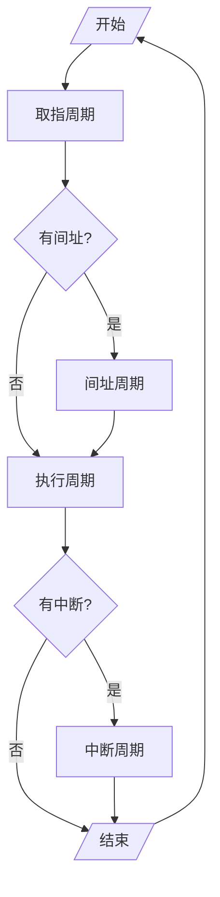

# 指令周期的基本概念

## 指令周期

- 指令周期：取出并执行一条指令所需的全部时间
- 完成一条指令
  - 取指周期：取指、分析
  - 执行周期：执行
- 

## 每条指令的指令周期不同

- 取值周期就是指令周期，例如`NOP`
- 取指周期与执行周期一样长，例如`ADD mem`
- 取指周期与执行周期不同，例如`MUL mem`

## [具有间接寻址](0203-计算机组成原理/07-指令系统/7.3%20寻址方式.md#间接寻址)的指令周期

## 具有中断周期的指令周期

## 指令周期的流程

## CPU工作周期的标志

CPU访存有四种性质

- *取*指令：取值周期
- *取*地址：间址周期
- *存取*操作结果：执行周期
- *存*程序断点：中断周期

控制当前状态

# 指令周期的数据流

## 取指周期数据流

- `PC->MAR->地址总线->M`
- `CU[r]->控制总线->M`
- `M->数据总线->MDR->IR`
- `CU[+1]->PC`

## 间址周期的数据流

- `MDR[A]->MAR->地址总线->M`
- `CU[r]-->控制总线->M`
- `M->数据总线->MDR`

## 执行周期的数据流

> 不同指令的执行周期数据流不同

## 中断周期的数据流

- 保存程序断点
  - `CU->MAR->dzzx->M`
  - `PC->MDR->sjzx->M`
  - `CU[w]->kzzx->M`
- [形成中断程序入口地址](0203-计算机组成原理/08-CPU的结构和功能/8.4%20中断系统.md)
  - `CU[中断程序入口地址]->PC`

