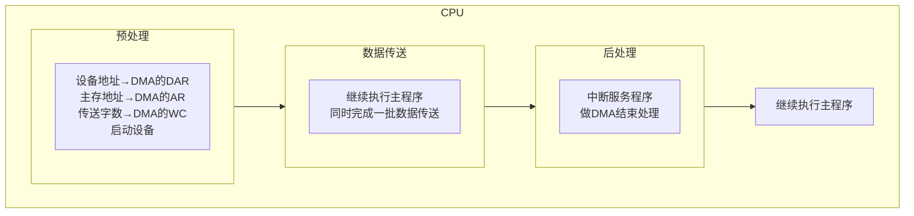
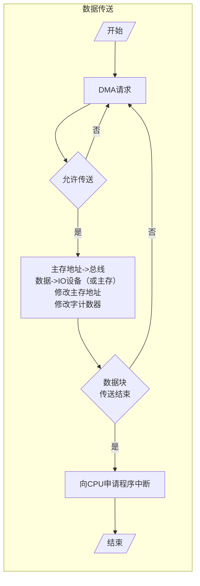

# DMA方式的特点

## DMA和程序中断数据通路

## DMA与主存交换数据方式

### 停止CPU访问主存

- 特点：控制简单，适合大量数据传输

- 问题：CPU处于不工作状态或保持状态

### 周期挪用（周期窃取）

周期：访存周期

DMA访问主存有三种可能

- CPU此时不访存

- CPU正在访存

- CPU与DMA同时请求访存（此时CPU将总线让给DMA）

### DMA与CPU交替访问

CPU工作周期

- $C_1$专供DMA访存

- $C_2$：专攻CPU访存

不需要申请建立和归还总线的使用全

# DMA接口的功能和组成

## DMA接口功能

- 向CPU申请DMA传送

- 处理总线控制权的转交

- 管理系统总线、控制数据传送

- 确定数据传送的首地址和长度，修正传送过程中的数据地址和长度

- DMA传送结束时，给出操作完成信号

## DMA接口组成

AR：地址寄存器，

WC：计数器，用于对数据进行计数

DAR：设备地址寄存器，用于设备地址选择

BR：数据缓冲器

DREQ：设备请求信号

DACK：设备控制信号

HRQ：总线请求信号

HLDA：总线应答信号

中断机构：数据传输完后，对后续工作进行处理

# DMA的工作过程

## DMA传送过程

预处理、数据传送、后处理

### 预处理

通过几条输入输出指令预置如下信息

- 通过DMA控制逻辑传送方向（入/出）

- 设备地址→DMA的DAR

- 主存地址→DMA的AR

- 传送字数→DMA的WC

### DMA传送过程示意

### 数据传送过程（输入）

1. 设备[数据] → BR

2. 设备[DREQ] → DMA控制逻辑

3. DMA控制逻辑[HRQ] → CPU

4. CPU[HLDA] → DMA控制逻辑

5. AR[地址] → 地址线 → 主存

6. DMA控制逻辑[DACK] → 设备

7. DMA控制逻辑[读写控制] → 主存，BR[数据] → 数据线 → 主存，AR+1，WC+1

8. WC溢出？→ WC[溢出信号] → 中断机构[中断请求] → CPU

### 数据传送过程（输出）

1. BR[数据] → 设备

2. 设备[DREQ] → DMA控制逻辑

3. DMA控制逻辑[HRQ] → CPU

4. CPU[HLDA] → DMA控制逻辑

5. AR[地址] → 地址线 → 主存

6. DMA控制逻辑[DACK] → 设备

7. 主存[数据] → 数据线 → BR，AR+1，WC+1

8. WC溢出？ → WC[溢出信号] → 中断机构[中断请求] → CPU

### 后处理

校验输入主存的数是否正确

是否继续使用DMA

测试传送过程是否正确。错则转诊断程序

由中断程序完成

## DMA接口与系统的连接方式

### 具有公共请求线的DMA请求

> 总线链式查询方式

### 独立的DMA请求

> 总选独立请求查询

## DMA与程序中断的比较

| |中断方式|DMA方式|
|-|-|-|
|数据传送|程序|硬件|
|响应时间|指令执行结束|存取周期结束|
|处理异常情况|能|不能|
|中断请求|传送数据|后处理|
|优先级|低|高|

> 思考：在一台主机中，可能出现多种类型的IO设备接口，用于处理速度不同的IO设备

# DMA接口的类型

## 选择型

在**物理上**连接**多个**设备

在**逻辑上**只允许链接**一个**设备

## 多路型

在**物理上**连接**多个**设备

在**逻辑上**允许链接多个**设备**同时工作

## 多路型DMA接口的工作原理

