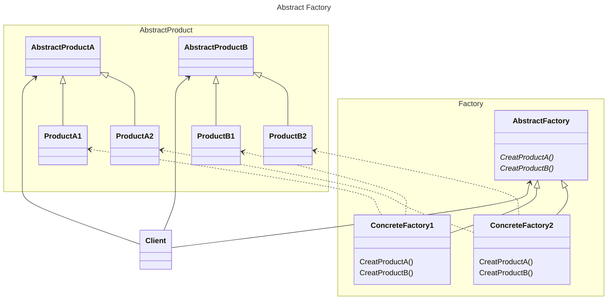

# 动机
在软件系统中，由于经常面临者一系列相互依赖的对象的创建工作；同时，由于需求的变化，往往存在更多系列对象的创建工作。
# 定义
将多个工厂方法放置在同一个抽象类中
# 类图



# 示例

```C++
//dbc接口
class IDBConnection {
public:
  virtual ~IDBConnection() = default;
};
class IDBCommand {
public:
  virtual ~IDBCommand() = default;
};
class IDataReader {
public:
  virtual ~IDataReader() = default;
};
//db工厂接口
class DBFactory {
public:
  virtual IDBConnection* createDBConnection() = 0;
  virtual IDBCommand* createDBCommand() = 0;
  virtual IDataReader* createDataReader() = 0;
  virtual ~DBFactory() = default;
};
//支持Mysql
class MysqlConnection : public IDBConnection {};
class MysqlCommand : public IDBCommand {};
class MysqlDataReader : public IDataReader {};
//mysql工厂
class MysqlDBFactory : public DBFactory {
public:
  IDBConnection* createDBConnection() override {
    return new MysqlConnection();
  }
  IDBCommand* createDBCommand() override {
    return new MysqlCommand();
  }
  IDataReader* createDataReader() override {
    return new MysqlDataReader();
  }
};
//支持Oracle
class OracleConnection : public IDBConnection {};
class OracleCommand : public IDBCommand {};
class OracleDataReader : public IDataReader {};
//Oracle工厂
class OracleDBFactory : public DBFactory {
public:
  IDBConnection* createDBConnection() override {
    return new MysqlConnection();
  }
  IDBCommand* createDBCommand() override {
    return new MysqlCommand();
  }
  IDataReader* createDataReader() override {
    return new MysqlDataReader();
  }
};
class EmployeeDAO {
  DBFactory* dbcFactory;
public:
  EmployeeDAO(DBFactory* dbcFactory) : dbcFactory(dbcFactory) {}
  std::vector<EmployeeDO> getEmployees() {
    IDBConnection* connection = dbcFactory->createDBConnection();
    connection->connnectionString("…");
    IDBCommand* command = dbcFactory->createDBCommand();
    command->commandText("");
    command->setConnection(connection);
    IDataReader* reader = dbcFactory->createDataReader();
    while (reader->read()) {}
  }
};
```
