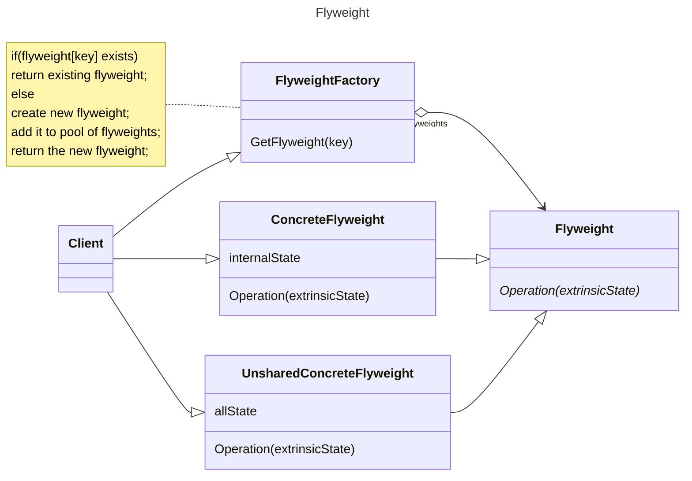

# 动机

采用纯粹的对象方案，问题在于大量细粒度的对象会很快地充斥在系统中，从而带来很高的运行时代价主要指内存需求方面的代价。

# 定义

运用共享技术有效的支持大量细粒度的对象。

# 类图



# 示例

```C++
class Font {
private:
  // unique object key
  std::string key;
  // object state
  // …
public:
  Font(const string&key) {
  //…
  }
};
class FontFactory {
private:
  std::map< string, Font*> fontPool;
public:
  Font* getFont(const std::string&key) {
    auto item = fontPool.find(key);
    if (item != footPool.end()) {
      return fontPool[key];
    }
    else {
      Font* font = new Font(key);
      fontPool[key] = font;
      return font;
    }
  }
  void clear() {
    //…
  }
}
```
