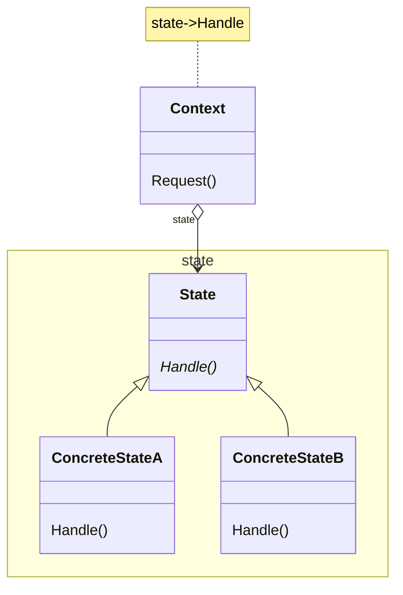

# 动机

在软件构建过程中，某些对象的状态如果改变，其行为也会随之而发生变化。比如文档处于只读状态，其支持的行为和读写状态支持的行为可能完全不同。

# 定义

允许一个对象在其内部状态改变时改变它的行为。从而使对象看起来似乎修改了其行为。

# 类图


# 示例

```C++
// 不使用模式
enum NetworkState {
 Network_Open,
 Network_Close,
 Network_Connect
};
class Network {
private:
 NetworkState state;
public:
 void operation1() {
  swith(state) {
  case Network_Open:
   //…
   state = Network_Close;
   break;
  case Network_Close:
   //…
   state = Network_Connect;
   break;
  case Network_Connect:
   //…
   state = Network_Open;
   break;
  }
 }
 void operation2() {
  swith(state) {
  case Network_Open:
   //…
   state = Network_Close;
   break;
  case Network_Close:
   //…
   state = Network_Connect;
   break;
  case Network_Connect:
   //…
   state = Network_Open;
   break;
  }
 }
};
/// 使用状态模式
class NetworkState {
public:
 NetworkState*pNext;
 virtual void Operation1() = 0;
 virtual void Operation2() = 0;
 virtual void Operation3() = 0;
 …
 virtual ~NetworkState() = 0;
};
class OpenState : public NetworkState {
//使用 单件模式 - Singleton
 static NetworkState* m_instance;
public:
 static NetworkState* getInstance() {
  if (m_instance == nullptr) {
   m_instance = new OpenState();
  }
  return m_instance;
 }
 virtual void Operation1() {
  //…
  pNext = CloseState::getInstance();
 }
 virtual void Operation2() {
  //…
  pNext = ConnectState::getInstance();
 }
 void Operation3() {
  //…
  pNext = OpenState::getInstance();
 }
};
class CloseState : public NetworkState{
 //…
};
class ConnectState: public NetworkState {
 //…
};
//扩展
class WateState: public NetworkState {
 //…
};
class Network {
private:
 NetworkState* m_pState;
public:
 Network(NetworkState* pState): m_pState(pState) {
 }
 void operation1() {
  //…
  m_pState->Operation1();
  m_pState = m_pState->pNext
             //…
 }
 void operation2() {
  //…
  m_pState->Operation2();
  m_pState = m_pState->pNext
             //…
 }
 void operation2() {
  //…
  m_pState->Operation3();
  m_pState = m_pState->pNext
             //…
 }
};
```
