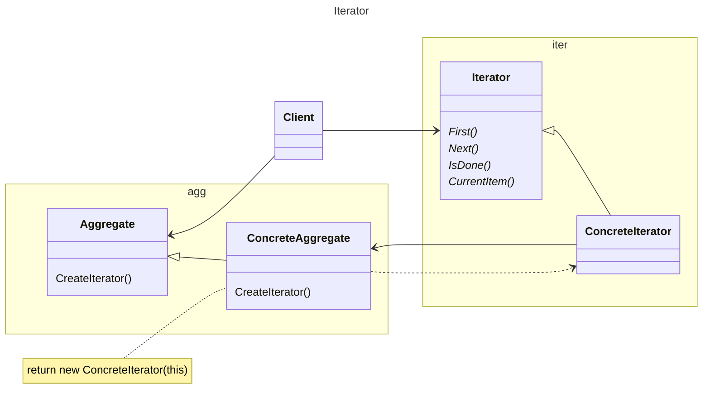

# 动机

在软件构建过程中，集合对象内部结构常常变化各异。但对于这些集合对象，我们希望在不暴露其内部结构的同时，可以让外部客户代码透明底访问其中包含的元素；同时这种“透明遍历”也为“同一种算法在多种集合对象上进行操作”提供了可能。

# 定义

提供一种方法顺序访问一个聚合对象中的各个元素，而又不暴露（稳定）该对象的内部表示

# 类图



# 示例

```C++
//面向对象的迭代器
template<typename T>
class Iterator {
public:
  virtual void first() = 0;
  virtual void next() = 0;
  virtual bool isDone()const = 0;
  virtual T& current() = 0;
};

// 容器
template<typename T>
class MyCollection {
public:
  Iteraotor< T> GetIterator() {
    //…
  }
};

// 容器迭代器
template<typename T>
class CollectionIterator: public Iterator< T> {
  MyCollection<T> m_mc;
public:
  CollectionIterator(const MyCollection< T> &c): m_mc(c) {}
  void first() {}
  void next() {}
  bool isDone()const {}
  T& current() {}
}；
//
```
