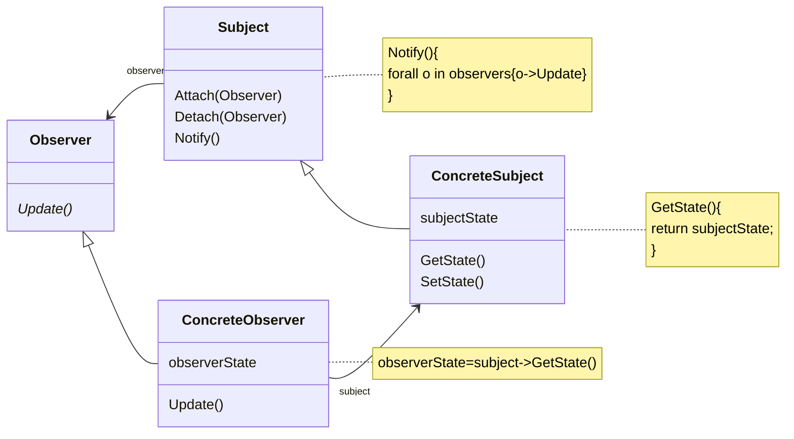

# 动机

在软件构建过程中，我们需要对某些对象建立一种“通知依赖关系”——一个对象（目标对象）的状态发发生改变，所有的依赖对象（观察者对象）都将得到通知。如果这样的依赖关系过于紧密，将使软件不能更好的抵御变化

# 定义

定义对象之间的一种一对多（变化）的依赖关系，以便当一个对象（subject）的状态发生改变时，所有的依赖于它的对象都得到通知并自动更新。

# 类图


# 示例

```c++
class IProgress {
public:
  virtual void DoProgress(float value) = 0;
  virtual ~IProgress() = default;
};
class FileSplitter {
  std::string m_strFilePath;
  int m_nFileNumber;
  //ProgressBar* m_progressBar;//通知空间
  std::list<IProgress*> m_iProgressList;//抽象的通知机制
public:
  FileSplitter(std::string strFilePath, int nFileNumber)
    : m_strFilePath(std::move(strFilePath)), m_nFileNumber(nFileNumber), m_iProgressList() {}
  void split() {
    //1.读取大文件
    //2.分批次向小文件中写入
    for (int i = 0; i < m_nFileNumber; ++i)  {
      //...
      float val = static_cast<float>(i + 1.0) / static_cast<float>(m_nFileNumber);
      onProgress(val);
    }
  }
  void addIProgress(IProgress* iProgress) {
    m_iProgressList.push_back(iProgress);
  };
  void removeIProgress(IProgress* iProgress)  {
    //m_iProgressList.erase(std::find(m_iProgressList.begin(), m_iProgressList.end(), iProgress));
    std::erase_if(m_iProgressList, &](const%20IProgress * i.md)-> bool { return i == iProgress; });
  };
protected:
  void onProgress(float val) {
    for (const auto& item : m_iProgressList) {
      item->DoProgress(val);
    }
  }
};

class ConsoleNotifier : public IProgress {
public:
  void DoProgress(float value) override { std::cout << "."; }
};

class MainForm : public Form, public IProgress {
  TextBox* m_pTxtFilePath;
  TextBox* m_pTxtFileNumber;
  ProgressBar* progressBar;
public:
  void button1Click()  {
    std::string filePath = m_pTxtFilePath->getText();
    int number = atoi(m_pTxtFileNumber->getText().c_str());
    FileSplitter splitter(filePath, number);
    splitter.addIProgress(this);
    IProgress* progress = new ConsoleNotifier{};
    splitter.addIProgress(progress);
    splitter.split();
    splitter.removeIProgress(this);
    splitter.removeIProgress(progress);
    delete progress;
  }
  void DoProgress(float value) override { progressBar->setValue(value); }
};
```
