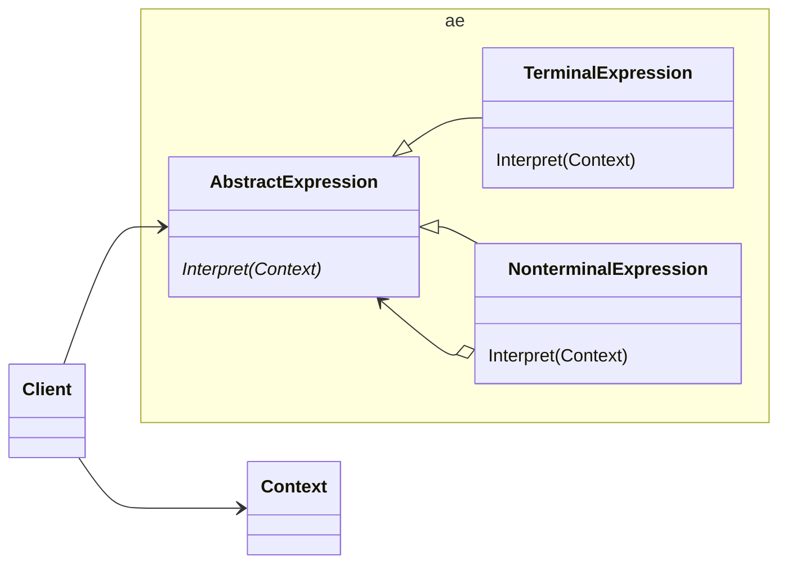
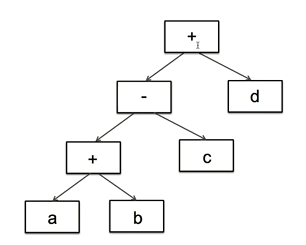

# 动机

在软件构建过程中，如果某一特定领域的问题比较复杂，类似的结构不断重复出现，如果使用普通的编程方式来实现，将面临非常频繁的变化。
注：可抽象出统一规则的语句，例如“计算：a + b - c*d”、“转换：一千三百五十六”，适合简单的规则，复杂规则还是用第三方的语法规则生成器。

# 定义

给定一个语言，定义它的文法的一种表示，并定义一种解释器，这个解释器使用该表示来解释语言中的句子。

# 类图


# 示例

```c++
#include <iostream>
#include <map>
#include <stack>
#include <string>
class Expression
{
public:
  virtual int interpreter(std::map<char, int>& var) = 0;
  virtual ~Expression() = default;
};
//变量表达式
class VarExpression : public Expression
{
  char m_cKey;
public:
  VarExpression(char cKey) : m_cKey(cKey) {}
protected:
  int interpreter(std::map<char, int>& var) override { return var[m_cKey]; }
};
//符号表达式
class SymbolExpression : public Expression
{
protected:
  Expression* m_pLeftChild;
  Expression* m_pRightChild;
public:
  SymbolExpression(Expression* pLeftChild, Expression* pRightChild)
    : m_pLeftChild(pLeftChild), m_pRightChild(pRightChild) {}
  ~SymbolExpression() override
  {
    delete m_pLeftChild;
    delete m_pRightChild;
  }
};
//加法运算
class AddExpression : public SymbolExpression
{
public:
  AddExpression(Expression* pLeftChild, Expression* pRightChild)
    : SymbolExpression(pLeftChild, pRightChild) {}
  int interpreter(std::map<char, int>& var) override
  {
    return m_pLeftChild->interpreter(var) + m_pRightChild->interpreter(var);
  }
};
//减法运算
class SubExpression : public SymbolExpression
{
public:
  SubExpression(Expression* pLeftChild, Expression* pRightChild) : SymbolExpression(pLeftChild, pRightChild) {}
  int interpreter(std::map<char, int>& var) override
  {
    return m_pLeftChild->interpreter(var) - m_pRightChild->interpreter(var);
  }
};
//解释器
Expression* analyse(const std::string& expStr)
{
  std::stack<Expression*> expStack;
  Expression* left = nullptr;
  Expression* right = nullptr;
  for (int i = 0; i < expStr.size(); i++)
  {
    switch (expStr[i])
    {
    case '+':
      left = expStack.top();
      right = new VarExpression(expStr[++i]);
      expStack.push(new AddExpression(left, right));
      break;
    case '-':
      left = expStack.top();
      right = new VarExpression(expStr[++i]);
      expStack.push(new SubExpression(left, right));
      break;
    default:
//变量表达式
      expStack.push(new VarExpression(expStr[i]));
    }
  }
  Expression* expression = expStack.top();
  return expression;
}
void release(Expression* expression) { delete expression; }

```
a+b+c+d可以抽象为


```C++
int main(int argc, char** argv)
{
  std::string expStr = "a+b+c+d";
  std::map<char, int> var{
    std::make_pair('a', 5),
    std::make_pair('b', 2),
    std::make_pair('c', 1),
    std::make_pair('d', 6),
  };
  Expression* expression = analyse(expStr);
  std::cout << expression->interpreter(var) << std::endl;
  release(expression);
  return 0;
}
```
