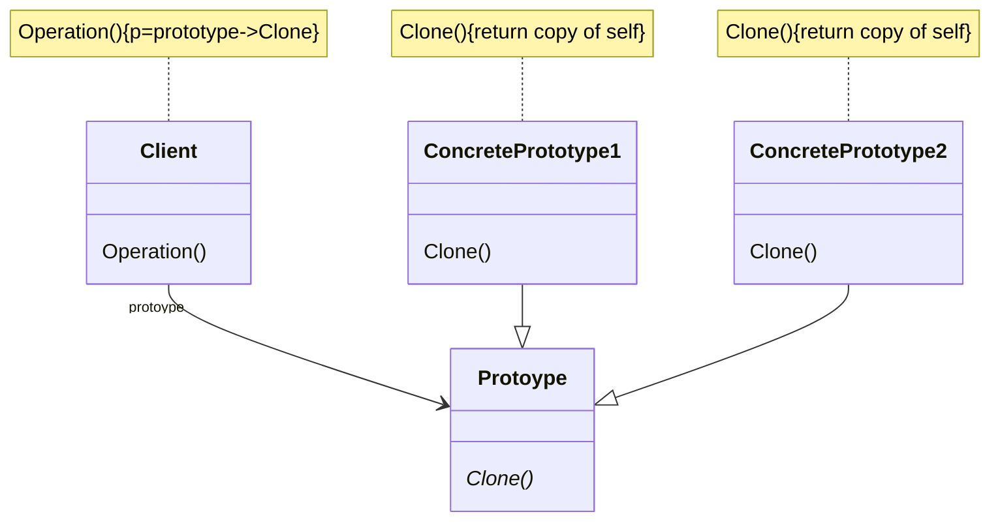

# 动机
在软件系统中，经常面临着“某些结构复杂的对象”的创建工作；由于需求的变化，这些对象经常面临着剧烈的变化，但是它们却拥有比较稳定的接口。
# 定义
使用原型示例指定创建对象的种类，然后通过拷贝这些原形来创建新的对象。
注：复制一个一样的对象，保证原数据不变，但是要在原数据的基础上进行读写操作。
# 类图



# 示例

```C++
//拆分器
class ISplitter {
public:
  virtual void split() = 0;
  virtual ~ISplitter() {}
  virtual ISplitter* clone() = 0;//通过克隆自己来创建对象
};
class BinaryFileSplitter : public ISplitter {
public:
  ISplitter* clone() override { return new BinaryFileSplitter{*this}; }
};
class TxtFileSplitter : public ISplitter {
  ISplitter* clone() override { return new TxtFileSplitter{*this}; }
};
class PictureFileSplitter : public ISplitter {
  ISplitter* clone() override { return new PictureFileSplitter{*this}; }
};
class VideoFileSplitter : public ISplitter {
  ISplitter* clone() override { return new VideoFileSplitter{*this}; }
};
class MainForm : public Form {
  ISplitter* prototype;
public:
  MainForm(ISplitter* prototype) : prototype(prototype) {}
  void button1Chick() {
    ISplitter* splitter = prototype->clone();
    splitter->split();
  }
};
```
