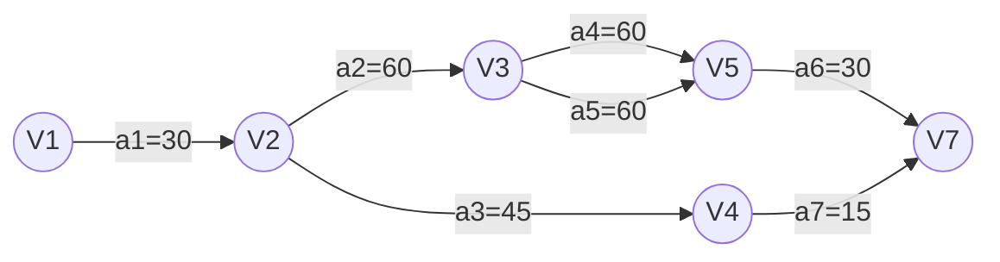

# 图的应用

## 关键路径

**关键路径**：把工程计划表示为**边表示活动的网络**，即**AOE网**，用定点表示*事件*，弧表示*活动*，弧的权重表示*活动持续时间*。
- **事件**：表示之前的活动已经完成，之后的活动可以开始
- **源点**：入度为0的顶点
- **汇点**：出度为0的顶点
- *路径长度*：路径上各个活动持续时间之和
- 关键路径变量的定义
	- $ve(vj)$：表示事件`vj`的最早发生时间
	- $vl(vj)$：表示事件`vj`的最迟发生时间
	- $e(i)$：表示活动`ai`的最早开始时间
	- $l(i)$：表示活动`ai`的最晚开始时间
	- $l(i)-e(i)$：表示完成活动 `ai`的时间余量
- 关键活动：关键路径上的活动
	- 即$l(i)==e(i)$的活动

### 求解关键路径
- 设活动 `ai`用弧 $<j,k>$表示
	- 其持续时间记录为$W_{j,k}$

- 从$ve(1)=0$开始向前递推
	- $ve(j)=\max_{i}\{ve(i)+W_{i,j}\},<i,j>\in T,2\leq j\leq n$
	- 其中$T$是所有以$j$为头的弧的集合
- 从$vl(n)=ve(n)$开始后递推
	- $ve(j)=\min_{j}\{ve(i)-W_{i,j}\},<i,j>\in S,1\leq i\leq n-1$
	- 其中$S$是所有以$i$为头的弧的集合
- 则有
	- $e(i)=ve(j)$
	- $l(i)=vl(k)-W_{j,k}$
- 则得到关键活动$l(i)-e(i)=0$

### 关键路径的讨论

- 若网中有几条关键路径，则需加快同时在几条关键路径上的关键活动。
- 如果一个活动处于所有的关键路径上，那么提高这个活动的速度，就能缩短整个工程的完成时间
- 处于所有的关键路径上的活动完成时间不能缩短太多
	- 否则会使原来的关键路径变成不是关键路径
	- 这时必须重新寻找关键路径

### 以举行宴会问题为例

| 活动代码 | 活动描述  | 历时  | 前置任务 |
| ---- | ----- | --- | ---- |
| a1   | 菜单制定  | 30  |      |
| a2   | 原材料采购 | 60  | a1   |
| a3   | 餐具准备  | 45  | a1   |
| a4   | 甜点准备  | 60  | a2   |
| a5   | 原料清晰  | 60  | a2   |
| a6   | 烹饪    | 30  | a4a5 |
| a7   | 桌椅布置  | 15  | a3   |
| a8   | 宴会开始  | 0   | a6a7 |

| 顶点  | $ve$ | $vl$ |
| --- | ---- | ---- |
| v1  | 0    | 0    |
| v2  | 30   | 30   |
| v3  | 90   | 90   |
| v4  | 75   | 165  |
| v5  | 150  | 150  |
| v7  | 180  | 180  |

| 活动代码 | $e$ | $l$ | $l-e$ |
| ---- | --- | --- | ----- |
| a1   | 0   | 0   | 0     |
| a2   | 30  | 30  | 0     |
| a3   | 30  | 120 | 90    |
| a4   | 90  | 90  | 0     |
| a5   | 90  | 90  | 0     |
| a6   | 150 | 150 | 0     |
| a7   | 75  | 145 | 70    |
| a8   |     |     |       |

- 路径为$a_{1}\to a_{2}\to a_{4}\to a_{6}$
	- 或$a_{1}\to a_{2}\to a_{5}\to a_{6}$

