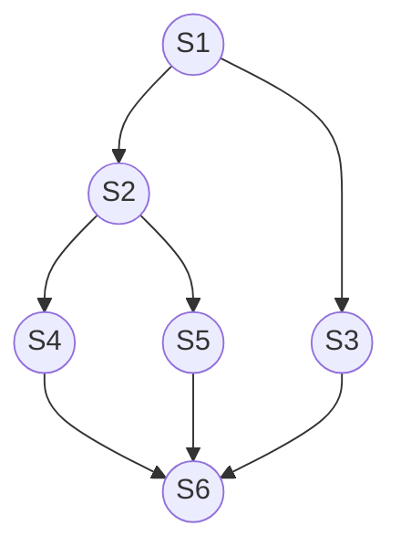

# 同步与互斥

进程具有异步性的特征

## 同步与互斥的基本概念

- **同步(直接制约关系)**：用于协调进程之间的相互制约关系或工作次序
- **临界资源**：一个时间段内只允许一个进程使用的资源
- **互斥(间接制约关系)**：同一时间内只允许一个进程访问临界资源，其余进程陷入等待

### 对临界资源的互斥访问

```c++
do{
	entry section;    //进入区
	critical section; //临界区
	exit section;     //退出区
	remainder section;//剩余区
}while(true);
```

- **进入区**：设置*正在访问临界资源的标志*
- **临界区(临界段)**：访问临界资源
- **退出区**：解除*正在访问临界资源的标志*
- *剩余区*：代表中的其余部分

### 访问临界区的原则

- *空闲让进*：临界区空闲时，可以允许一个请求进入临界区的进程立即进入临界区
- *忙则等待*：当已有进程进入临界区时，其他试图进入临界区的进程必须等待
- *有限等待*：对请求访问的进程，应保证能在有限时间内进入临界区（保证不会饥饿）
- *让权等待*：当进程不能进入临界区时，应立即释放处理机，防止进程忙等待

## 实现临界区互斥的基本方法

### 软件实现方式

#### 单标志法

**单标志法**：两个进程在访问完临界区后会把使用临界区的权限交给另一个进程，每个进程进入临界区的权限只能被另一个进程赋予
- 执行顺序
	1. 检查
	2. 访问
	3. 谦让
	4. 剩余
- 算法优点：同一时间最多只允许一个进程访问临界区
- 算法缺点
	- 违反*空闲让进*原则：当一个线程持不再进入临界区，其余进程无法进入临界区

```c++
int turn=0 // turn 表示当前允许进入临界区的进程号

void P0(){
	while(turn!=0);//1
	critical section;//2
	turn=1;//3
	remainder section;
}

void P1(){
	while(turn!=1);//4
	critical section;//5
	turn=0;//6
	remainder section;
}
```


#### 双标志先检查法

**双标志先检查法**：设置一个布尔型数组，数组中各个元素用来*标记各进程想进入临界区的意愿*
- 算法优点：不用交替进入，可以连续使用
- 算法缺点
	- 违背*忙则等待*原则：检查和上锁无法同时执行，线程可能同时进入临界区，1526

```c++
bool flag[2];//表示进入临界区意愿的数组

flag[0]=false;
flag[1]=false;//刚开始设置为两个进程都不想进入临界区

void P0(){
	while(flag[1]); //1
	flag[0]=true;//2
	critical section;//3
	flag[0]=false;//4
	remainder section;
}
void P1(){
	while(flag[0]);//5
	flag[1]=true;//6
	critical section;//7
	flag[1]=false;//8
	remainder section;
}
```

#### 双标志后检查法
**双标志先检查法**：在双标志先检查法的基础上，调整检查和上锁的顺序
- 算法优点：解决了*忙则等待*的问题
- 算法缺点
	- 违背*空闲让进*原则：152、156
	- 违背*有限等待*原则：152、156
```c++
bool flag[2];//表示进入临界区意愿的数组

flag[0]=false;
flag[1]=false;//刚开始设置为两个进程都不想进入临界区

void P0(){
	flag[0]=true;//1
	while(flag[1]); //2
	critical section;//3
	flag[0]=false;//4
	remainder section;
}

void P1(){
	flag[1]=true;//5
	while(flag[0]);//6
	critical section;//7
	flag[1]=false;//8
	remainder section;
}

```

#### Peterson算法

**Peterson算法**：结合双标志法和双标志法的思想，
- 算法优点
	- 遵循空闲等待
	- 遵循忙则等待
	- 遵循有限等待
- 算法缺点
	- 违背让权等待原则

```c++
bool flag[2];//表示进入临界区意愿的数组，初始值都是false
int turn =0;//turn 表示优先让哪个进程进入临界区


void P0(){
	flag[0] = true;
	turn = 1;
	while (flag[1] && turn==1);
	critical section;
	flag[0]= false;
	remainder section;
}

void P1(){
	flag[1]=true;//表示自己想进入临界区
	turn=0;//可以优先让对方进入临界区
	while (flag[0] && turn==0);//对方向进，且最后一次是自己谦让，循环等待
	critical section;
	flag[1]= false;//访问完临界区，表示自己已经不想访问临界区了
	remainder section;
}
```

### 硬件实现方式

#### 中断屏蔽方法

**中断屏蔽方法**：利用“开中断/关中断”实现
- 优点：简单高效
- 缺点
	- 不适用于多处理机：另一个处理机依旧可以访问临界区
	- 不适用于用户进程：开/关中断指令只能运行在内核态

```
关中断
临界区
开中断
```

#### `TestAndSet`指令

**`TestAndSet`指令(`TS`/`TestAndSetLock`/`TSL`)**：原语指令
- 算法优点
	- 实现简单
	- 适用于多处理机环境
- 算法缺点
	- 违背*让权等待*原则
```C
//硬件的逻辑实现
bool TestAndSet(bool*lock){
	bool old;
	old =*lock;
	*lock = true;
	return old;
}

//使用TSL指令
void P0(){
	while (TestAndSet(&lock));
	// 临界区代码
	lock=false;
	//剩余区代码
}
```


#### `Swap`指令

**`Swap`指令(`Exchange`/`XCHG`)**：原语指令
- 算法优点
	- 实现简单
	- 适用于多处理机环境
- 算法缺点
	- 违背*让权等待*原则

```c
//硬件的逻辑实现
void Swap(bool*a,bool*b){
	bool tmp=*a;
	*a=*b;
	*b=tmp;
}

//使用TSL指令
void P0(){
	bool old = true;
	while (old)
		Swap(&lock,&old);
	// 临界区代码
	lock=false;
	//剩余区代码
}
```

## 互斥锁

**互斥锁(mutex lock)**：一个进程在进入临界区时应获得锁；退出临界区时应释放锁
- 需忙等，进程时间片用完才下处理机，违反“让权等待”
- 优点
	- 上锁的时间短(等待代价低)：等待期间不用切换进程上下文，多处理器系统中，若
	- 常用于多处理器系统：一个核忙等，其他核照常工作，并快速释放临界区
- 不适用于单处理机系统：忙等的过程中不可能解锁

### 自旋锁

**自旋锁(spin lock)**：需要连续忙等的互斥锁
- 如`TSL`指令、swap指令、单标志法

```c
void acquire(){
	while(!available); //忙等待
	available = false; //获得锁
}

void release(){
	available = true; //释放锁
}

void P0(){
	acquire();
	//临界区
	release();
	//剩余区
}
```


## 信号量机制

**信号量(PV操作)**：通过一对原语操作一个表示系统中某种资源的数量的变量，实现了进程互斥和同步
- wait原语(P操作)：申请操作
- signal原语(V操作)：释放操作

### 整型信号

**整型信号**：用一个整型的变量作为信号量
- 与普通整型变量的区别：操作只有三种，初始化、P操作、V操作
- 算法缺点：违反让权等待原则

```c
int S= 1; //初始化整型信号量S，表示当前系统中可用的打印机资源数

//wait原语的逻辑实现
void wait(int S){
	while(S<=0);
	S=S-1;
}

//signal原语的逻辑实现
void signal(int S){
	S=S+1;
}

void P0(){
	wait(S);
	//使用资源
	signal(S);
}
```

### 记录型信号量

**记录型信号量**：用记录型数据结构表示的信号量
- block原语：使进程从运行态进入阻塞态，并挂到信号量S的等待队列中
- wakeup原语：唤醒等待队列中的一个进程，使该进程从阻塞态变为就绪态

```C
//记录型信号量的定义
typedef struct {
	int value; // 剩余资源数
	struct process*L;//等待队列
}semaphore;

// 记录型信号量的wait原语
void wait(semaphore S){
	S.value--;
	if(S.value<0){
		block(S.L);
	}
}

// 记录型信号量的signal原语
void signal(semaphore S){
	S.value++;
	if(S.value<=0){
		wakeup()
	}
}

void P0(){
	semaphore S;
	wait(S);
	//使用资源
	signal(S);
}
```

### 实践-信号量实现进程互斥

#### 实现进程互斥
```C++
/*信号量机制实现互斥*/
semaphore mutex=1; //初始化信号量

void P1() { 
	P(mutex);//使用临界资源前需要加锁
	//临界区代码段… 
	V(mutex);//使用临界资源后需要解锁
}

void P2() { 
	P(mutex);
	//临界区代码段… 
	V(mutex);
}
```

1. 分析并发进程的关键活动，划定临界区
2. 设置互斥信号量`mutex`，初值为*1*
3. 申请资源：在进入区`P(mutex)`
4. 释放资源：在退出区`V(mutex)`

>[!warning]+  注意
> - 信号量具有排队堵塞功能
> - 对不同的临界资源需要设置不同的互斥信号量。
> - P、V操作必须成对出现。
> 	- 缺少`P(mutex)`就不能保证临界资源的互斥访问
> 	- 缺少`V(mutex)`会导致资源永不被释放，等待进程永不被唤醒

#### 实现进程同步

*进程同步*：要让各并发进程按要求有序地推进

1. 分析什么地方需要实现“同步关系”，即必须保证“一前一后”执行的两个操作（或两句代码）
2. 设置同步信号量S，初始为*0*
3. 在“前操作”之后执行`V(S)`
4. 在“后操作”之前执行`P(S)`

```C++
/*信号量机制实现同步*/

semaphore S=0；//初始化同步信号量，初始值为0
void P1(){
	//代码1
	//代码2
	V(S);
	//代码3
}
void P2(){
	P(S) ;
	//代码4
	//代码5
	//代码6
}
```


#### 实现进程前驱关系



1. 要为每一对前驱关系各设置一个同步信号量
2. 在“前操作”之后对相应的同步信号量执行V操作
3. 在“后操作”之前对相应的同步信号量执行P操作

```
P1() {                   S1;   V(a); V(b); }  
P2() { P(a);             S2;   V(c); V(d); } 
P3() { P(b);             S3;   V(g); } 
P4() { P(c);             S4;   V(e); }
P5() { P(d);             S5;   V(f); }
P6() { P(e); P(f); P(g); S6; }
```

#### 生产者和消费者问题

系统中有一组生产者进程和一组消费者进程，生产者进程每次生产一个产品放入缓冲区，消费者进程每次从缓冲区中取出一个产品并使用。（注：这里的“产品”理解为某种数据）
- 生产者、消费者共享一个初始为空、大小为n的缓冲区
- 只有缓冲区没满时，生产者才能把产品放入缓冲区，否则必须等待
- 只有缓冲区不空时，消费者才能从中取出产品，否则必须等待
- 缓冲区是临界资源，各进程必须互斥地访问

```C
semaphore mutex=1;//互斥信号量，实现对缓冲区的互斥访问
semaphore empty=n;//同步信号量，表示空闲缓冲区的数量
semaphore full =0;//同步信号量，表示产品的数量，也即非空缓冲区的数量

void prodcer(){
	while(true){
		//生产一个产品；
		P(empty);
		P(mutex);
		//把产品放入缓冲区
		V(mutex);
		V(full);
	}
}

void consumer ()
	while(1){
		P(full)
		P(mutex);
		//从缓冲区取出一个产品
		V(mutex);
		V(empty);
		//使用产品
	}
}
```

>[!caution]+  注意：交换相邻的PV操作时的问题(思索问题)
> - P操作：***互斥P要在同步P之后***
> - V操作：可以交换

#### 多生产者和多消费者问题

- 桌子上有一只盘子，每次只能向其中放入一个水果
	- 爸爸专向盘子中放苹果
	- 妈妈专向盘子中放橘子
	- 儿子专等着吃盘子中的橘子
	- 女儿专等着吃盘子中的苹果
- 只有盘子空时，爸爸或妈妈才可向盘子中放一个水果。
- 仅当盘子中有自己需要的水果时，儿子或女儿可以从盘子中取出水果。

- 互斥关系：对缓冲区（盘子）的访问要互斥地进行
- 同步关系（一前一后）：
	- 父亲将苹果放入盘子后，女儿才能取苹果
	- 母亲将橘子放入盘子后，儿子才能取橘子
	- 只有盘子为空时，父亲或母亲才能放入水果

```C
semaphore mutex =1;//实现互斥访问盘子（缓冲区）
semaphore apple =0;//盘子中有几个苹果
semaphore orange=0;//盘子中有几个橘子
semaphore plate =1;//盘子中还可以放多少个水果

void dad(){  
    while(1){  
        // 准备一个苹果;  
        P(plate);  
        P(mutex);
        // 把苹果放入盘子;
        V(mutex);
        V(apple);
	}
}

void mom(){
    while(1){
        // 准备一个橘子;
        P(plate);
        P(mutex);
        // 把橘子放入盘子;
        V(mutex);
        V(orange);
	}
}

void daughter(){
    while(1){
        P(apple);
        P(mutex);
        // 从盘中取出苹果;
        V(mutex);
        V(plate);
        // 吃掉苹果;
	}
}

void son(){
    while(1){
        P(orange);
        P(mutex);
        // 从盘中取出橘子;
        V(mutex);
        V(plate);
        // 吃掉橘子;
	}
}

```
>[!warning]+  注意
> 如果缓冲区大小大于1，就必须专门设置一个互斥信号量mutex来保证互斥访问缓冲区


#### 吸烟者问题

- 假设一个系统有三个抽烟者进程和一个供应者进程
- 每个抽烟者不停地卷烟并抽掉它，但是要卷起并抽掉一支烟，抽烟者需要有三种材料：烟草、纸和胶水
	- 第一个拥有烟草
	- 第二个拥有纸
	- 第三个拥有胶水
	- 供应者进程无限地提供三种材料
- 供应者每次将两种材料放桌子上
	- 拥有剩下那种材料的抽烟者卷一根烟并抽掉它
	- 并给供应者进程一个信号告诉完成了
	- 供应者就会放另外两种材料再桌上
- 这个过程一直重复（让三个抽烟者轮流地抽烟）

- 互斥关系
	- 组合一：纸+胶水
	- 组合二：烟草+胶水
	- 组合三：烟草+纸
- 同步关系（从事件的角度来分析） ：
	- 桌上有组合一→第一个抽烟者取走东西
	- 桌上有组合二→第二个抽烟者取走东西
	- 桌上有组合三→第三个抽烟者取走东西
	- 发出完成信号 → 供应者将下一个组合放到桌上

```C++
semaphore offer1 =0;//桌上组合一的数量
semaphore offer2 =0;//桌上组合二的数量
semaphore offer3 =0;//桌上组合三的数量
int i=0; //用于实现"三个吸烟者轮流抽烟"

void provider(){
	while(true){
		switch(i){
			case 0:
				// 将组合一放桌上
				V(offer1);
			case 1:
				// 将组合二放桌上
				V(offer2);
			case 2:
				// 将组合三放桌上
				V(offer3);
		}
		i = (i+1)%3;
		P(finish);
	}
}

void smoker1(){
	while(true){
		P(offer1);
		// 从桌子上拿走组一
		V(finish);
	}
}

void smoker2(){
	while(true){
		P(offer2);
		// 从桌子上拿走组合二
		V(finish);
	}
}

void smoker3(){
	while(true){
		P(offer3);
		// 从桌子上拿走组合三
		V(finish);
	}
}
```

#### 读者和写者问题

有读者和写者两组并发进程，共享一个文件，当两个或两个以上的读进程同时访问共享数据时不会产生副作用，但若某个写进程和其他进程（读进程或写进程）同时访问共享数据时则可能导致数据不一致的错误
- 允许多个读者可以同时对文件执行读操作
- 只允许一个写者往文件中写信息
- 任一写者在完成写操作之前不允许其他读者或写者工作
- 写者执行写操作前，应让已有的读者和写者全部退出
- 互斥关系
	- 写进程-写进程
	- 写进程-读进程
- 不互斥：读进程-读进程
- 通过设置一个count变量记录当前正在访问共享文件的读者进程

```C++
semaphore rw = 1;//用于实现对共享文件的互斥访问
int count = 0;//记录当前有几个读进程在访问文件
semaphore mutex = 1;//用于保证对count变量的互斥访问
// semaphore w=1; //可以实现写优先
void writer(){
	while(true){
		//P(w);
		P(rw);//写之前“加锁”
		//写文件
		V(rw);//写完了“解锁”
		//V(w);
	}
}
// 读进程是优先的
void reader () {
	while(1){ 
		//P(w);
		P(mutex);//各读进程互斥访问count
		if(count==0)//由第一个读进程负责
			P(rw);//读之前“加锁”
		count++;//访问文件的读进程数+1
		V(mutex);
		// V(w);
		//读文件..
		P(mutex);//各读进程互斥访问count
		count--;//访问文件的读进程数—1
		if(count==0)//由最后一个读进程负责
			V(rw);//读完了“解锁” 
		V(mutex);
	}
}
```


#### 哲学家进餐问题

一张圆桌上坐着5名哲学家，每两个哲学家之间的桌上摆一根筷子，桌子的中间是一碗米饭。哲学家们倾注毕生的精力用于思考和进餐
- 哲学家在思考时，并不影响他人
- 只有当哲学家饥饿时，才试图拿起左、右两根筷子（一根一根地拿起）
	- 如果筷子已在他人手上，则需等待
	- 饥饿的哲学家只有同时拿起两根筷子才可以开始进餐
- 当进餐完毕后，放下筷子继续思考

1. 关系分析
	- 系统中有5个哲学家进程，5位哲学家与左右邻居对其中间筷子的访问是互斥关系。
2. 整理思路
	- 这个问题中只有互斥关系，但与之前遇到的问题不同的事
	- 每个哲学家进程需要同时持有两个临界资源才能开始吃饭
	- 如何避免临界资源分配不当造成的死锁现象，是哲学家问题的精髓
3. 信号量设置
	- 定义互斥信号量数组`chopstick[5]={1，1，1，1，1}`用于实现对5个筷子的互斥访问
	- 并对哲学家按0-4编号
		- 哲学家i左边的筷子编号为i
		- 右边的筷子编号为`(i+1)%5`
4. 避免死锁的方法
	- 最多允许四个哲学家同时进餐
	- 奇数号哲学家先拿左边的，偶数号哲学家先拿右手边的
	- 仅在两个筷子都存在时才能拿起筷子
```C
semaphore chopstick[5]={1，1，1，1，1};
semaphore mutex =1;//互斥的拿取筷子

void Pi(){
	while(true){
		P(mutex);
		P(chopstick[i]);
		P(chopstick[(i+1)%5]);
		V(mutex);
		// 吃饭
		V(chopstick[i]);
		V(chopstick[(i+1)%5]);
		// 思考
	}
}
```

## 管程

### 管程的结构

1. 局部于管程的*共享数据结构*说明
2. 对该数据结构进行操作的*一组过程*
3. 对局部于管程的共享数据设置初始值的语句
4. 管程有一个名字

### 管程的特征

1. 局部于管程的数据只能被局部于管程的过程所访问
2. 一个进程只有通过调用管程内的过程才能进入管程访问共享数据
3. **每次仅允许一个进程在管程内执行某个内部过程**

### 利用管程解决生产者消费者问题

```C++
monitor Producerconsumer
	condition full,empty;//条件变量用来实现同步（排队） 
	int count=0;//缓冲区中的产品数
	
	void insert(Item item){//把产品item放入缓冲区 
		if (count = N)
			wait (full);
		count++;
		insert_item(item);
		if (count == 1)
			signal(empty);
	}
	
	Item remove(){//从缓冲区中取出一个产品
		if (count == 0)
			wait (empty); count--;
		if (count =N-1) 
			signal(full);
		return remove_item(); 1
	}
end monitor;

void producer(){
	while(true){
		item = 生产一个产品;
		Producerconsumer.insert(item);
	}
}

void producer(){
	while(true){
		item = Producerconsumer.remove();
		//消费产品item
	}
}
```
每次仅允许一个进程在管程内执行某个内部过程
- 例1：两个生产者进程并发执行，依次调用了insert 过程.
- 例2：两个消费者进程先执行，生产者进程后执行.
