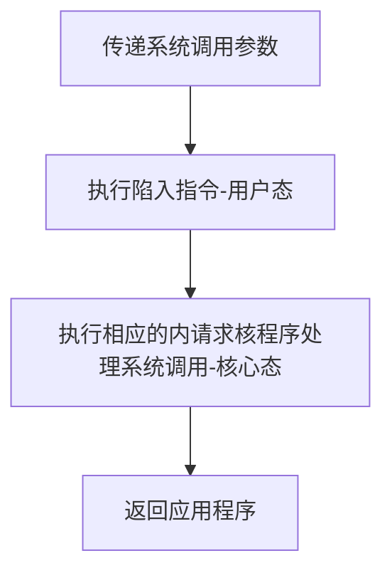

# 操作系统的运行环境

## 处理器运行模式

### 内核程序与应用程序

- 应用程序：普通程序员写的程序
- 内核程序：实现操作系统的程序
- 操作系统内核(内核Kernel)：很多内核程序
  - 是操作系统最重要最核心的部分
  - 是*最接近硬件的部分*
  - 操作系统的功能未必都在内核中
    - 图像用户界面功能GUI

### 特权指令与非特权指令

- 特权指令：只允许内核使用的指令
  - 内存清零指令
- 非特权指令
  - 应用程序只能运行非特权指令
  - 加法指令
  - 减法指令

### 内核态与用户态

- CPU运行时有两种状态：内核态与用户态
  - CPU通过*程序状态寄存器(PSW)*，判断当前的程序状态
    - 1：内核态
    - 0：用户态
- 内核态(核心态、管态)：说明此时运行的是内核态，可以执行特权指令
- 用户态(目态)：说明此时运行的是用户态，只能运行非特权指令

### 操作系统的变态

#### 内核态->用户态

- 当启动某个应用程序时
  - 执行一条特权指令把PSW的标志设置为用户态(内核程序让出CPU使用权)
  - 当在用户态运行特权指令时
  - 会引发一次中断信号

#### 用户态->内核态

- 中断信号会停止当前运行的应用程序
  - 然后转换为内核态(内核程序强行夺取CPU使用权)
  - 运行处理中断信号的内核程序程序
  - 处理完成后重新转换为用户态

## 中断和异常

### 中断的作用

- 中断：让操作系统*内核夺回CPU使用权*的唯一途径
  - 如果没有中断机制，那么一旦应用程序在CPU运行，CPU就会一直运行这个程序

### 中断的类型

#### 内中断

内中断(异常、例外)：与当前执行的指令*有关*。中断信号来源于CPU*内部*

- 故障(fault)：由错误故障引起的，可能被内核程序修复
  - 内核程序修复故障后会把CPU使用权还给应用程序
- 陷入(trap)：由陷入指令引发的异常，是程序故意引发的
  - 陷入指令(trap、访管)：用于请求操作系统的服务
- 终止(abort)：由致命错误引起，内核程序无法修复该错误
  - 内核程序一般不会将CPU使用权还给引发终止的应用程序，而是终止该应用程序

#### 外中断

外中断(中断)：与当前执行的指令*无关*。中断信号来源于CPU*外部*

- 时钟中断：由时钟部件发来的中断信号。
- I/O中断：由输入/输出设备发来的中断信号

### 中断机制的基本原理

#### 检查中断信号

不同的中断信号，需要不同的中断处理程序来处理

- 内中断信号：CPU在执行指令时会检查是否有异常发生
- 外中断信号：每个指令周期末尾，CPU都会检查是否有外中断信号需要处理

#### 查询中断处理程序

- 中断向量表：用于查询中断处理程序存放的位置
  - 中断处理程序：内核程序，要运行在内核态

| 中断信号类型 | 中断处理程序指针 |
| ------------ | ---------------- |
| 0            | 0 中断处理程序   |
| 1            | 1 中断处理程序   |
| 2            | 2 中断处理程序   |
| 3            | ……               |

## 系统调用

### 系统调用的定义与性质

- 系统调用：操作系统提供应用程序(程序员/编程人员)使用的接口
  - 一种可供应用程序要用的特殊函数
  - 用于请求获得操作系统内核的服务
  - 应用程序通过系统调用请求操作系统的服务
- *与共享资源有关的操作，必须通过系统调用的方式向操作系统内核提出服务请求*
    - 存储分配
    - I/0操作
    - 文件管理
- 系统调用的目的：保证系统的稳定性和安全性，防止用户进行非法操作

### 系统调用与库函数的区别

| 类型         | 描述                                                                                         |
| ------------ | -------------------------------------------------------------------------------------------- |
| 普通应用程序 | 可以直接进行系统调用可以直接进行系统调用，也可以使用库函数有的库函数设计系统调用，有的不涉及 |
| 编程语言     | 向上提供库函数。有时会将系统调用封装成库函数，以隐藏系统调用的一些细节，使程序员编程更加方便 |
| 操作系统     | 向上提供系统调用，使得上层程序能请求内核的服务                                               |
| 裸机         |                                                                                              |

### 系统调用按功能分类

- 设备管理：完成设备的请求/释放/启动等功能
- 文件管理：完成文件的读/写/创建/删除等功能
- 进程控制：完成进程的创建/撤销/阻塞/唤醒等功能
- 进程通信：完成进程之间的消息传递/信号传递等功能
- 内存管理：完成内存的分配/回收等功能

### 系统调用的过程

>[!warning] 注意
> 1. *陷入指令*是在*用户态*执行的，执行陷入指令之后立即引发一个*内中断*，使CPU*进入核心态*
> 2. *发出系统调用请求*是在*用户态*，而*对系统调用的相应处理*在*核心态*下进行