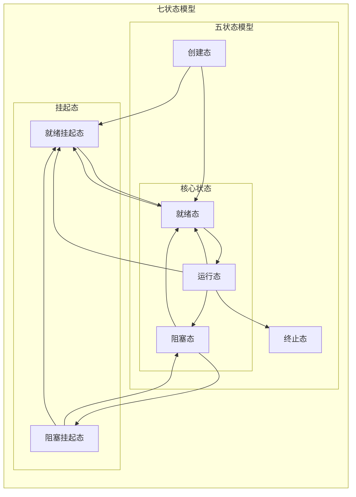
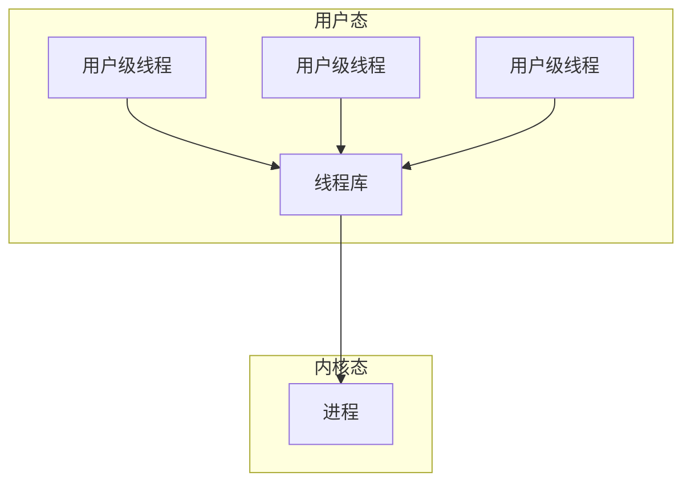
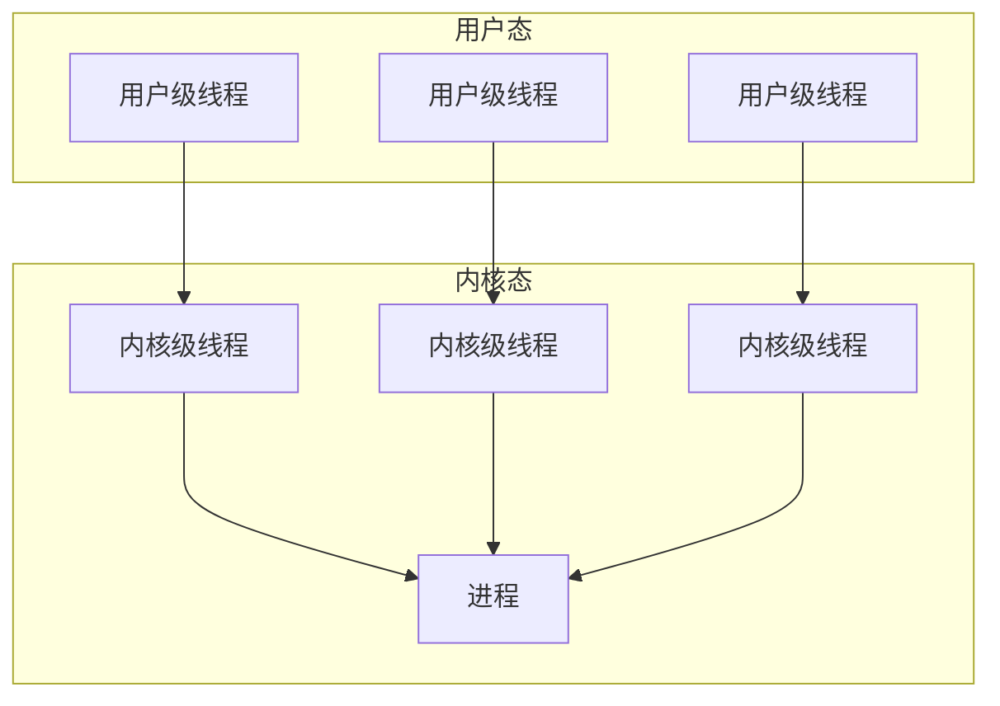
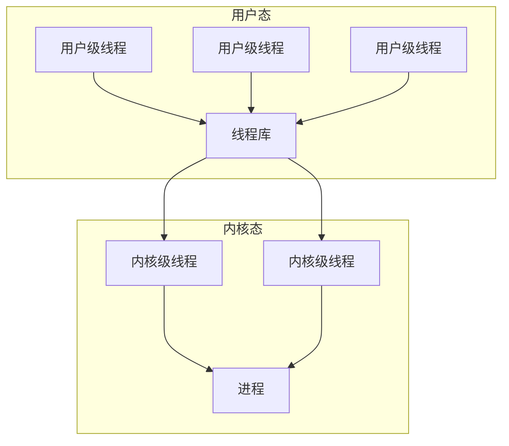
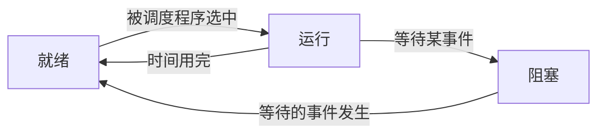

# 进程与线程

## 进程的概念与特征

- 程序：是静态的，是存放在磁盘里的可执行文件
- 进程：是动态的

### 进程的概念

进程：是系统进行*资源分配*和*调度*的独立单位

- 是[进程实体](#进程实体)的*运行过程*
- 是正在执行程序的实例。
- 是程序及其数据从磁盘加载到内存后，在CPU上的执行过程
- 是具有独立功能的程序在一个数据集合上运行的过程

#### 进程的作用

- 描述和控制程序的并发执行
  - 实现操作系统的并发性和共享性
- 在多道程序环境下并发执行多个程序
  - 保证程序运行的封闭性
  - 解决间断性不可再现性的特征

#### 进程控制块

进程控制块(PCB， Process Control Block)：描述进程的基本情况和运行状态，进而控制和管理进程

- 为每个并发执行的程序配置一个独立的数据结构
- 用于描述进程的基本情况和运行状态
- 是进程存在的唯一标志

#### 进程实体

进程实体(进程映像)：由*程序段*、相关*数据段*、和*PCB*三个部分构成

- 是静态的
- 用于反应进程在某一时刻的状态

### 进程的特征

#### 动态性

动态性：进程是程序的一次执行过程，是动态地产生、变化和消亡的

- 是进程最基本的特征

#### 并发性

并发性：内存中有多个进程实体，各进程可并发执行

#### 独立性

独立性：进程是能独立运行

- 独立获得资源
- 独立接受调度的基本单位

#### 异步性

异步性：各进程按各自独立的、不可预知的速度向前推进

- 进程同步机制：操作系统用于解决异步问题

#### 结构性

结构性：每个进程都会配置一个PCB

- 结构上看，进程由程序段、数据段、PCB组成

## 进程的组成

### 进程控制块的结构

- 进程描述信息：用于操作系统区分进程
  - 进程ID(PID/Process ID)：进程的*唯一*ID，用于进程管理器区分进程
  - 所属用户ID(UID)
- 资源分配清单：用于实现操作系统对资源的管理
  - 正在使用哪些内存区域
  - 正在调用的I/O设备
  - 正在使用的文件
- 进程控制和管理信息：用于实现操作系统对进程的控制、调度
  - CPU使用时间
  - 磁盘
  - 网络流量
  - 当前进程的状态：就绪态/阻塞态/运行态
- 处理机相关信息：用于实现进程切换
  - 通用寄存器值
  - 地址寄存器值
  - 控制寄存器值
  - 标志寄存器值
  - 状态字：表示进程的当前状态

### 程序段

程序段：指令序列程序的代码

### 数据段

数据段：运行过程中产生的各种数据

- 如：程序中定义的变量

## 进程的状态与转换

### 进程的状态

- **运行态->阻塞态**：是进程自身作出的*主动行为*
- **阻塞态->就绪态**：不是进程自身能控制的，是一种*被动行为*
- **基本状态**：运行态、阻塞态、就绪态

> [!warning] 注意
>
> - 不能由阻塞态->运行态
> - 不能由就绪态->阻塞态
> - 因为进入阻塞态是进程的主动请求，必然需要进程在运行时才能发出这种请求

#### 创建态

**创建态(新建态/New)**：进程正在被创建，操作系统为进程分配资源，初始化PCB

#### 就绪态

**就绪态(Ready)**：进程获得了除CPU外的一切所需资源，一旦获得CPU，便可立即运行

#### 运行态

**运行态(Running)**：进程正在CPU上运行

#### 阻塞态

**阻塞态(等待态/Waiting/Blocked)**：进程正在等待某一事件而暂停运行，即使CPU空闲，该进程也不能运行

- 例如：等待某个资源可用（不包括CPU）、等待I/O完成

#### 终止态

**终止态(结束态/Terminated)**：进程正从系统中消失

- 例如：进程正常结束或其他原因退出运行
- 进程需要结束运行时，系统首先将该进程置为终止态
  - 然后进一步处理资源释放和回收等工作

#### 挂起态
**挂起状态(挂起态/suspend)**：暂时调到外存等待的进程状态为
- 就绪挂起
- 阻塞挂起

>[!warning] 注意：挂起和阻塞状态的区别
>- *挂起态*：是将进程映像调到*外存*去了
>- *阻塞态*：进程映像还在*内存*中

## 进程的组织

### 链式方式

- **执行指针**：指向当前处于运行态的进程
  - 单CPU计算机中，同一时刻只会有一个进程处于运行态
- **就绪队列**：指向当前处于就绪态的进程
  - 通常会把优先级高的进程放在队头
- **阻塞队列指针**：指向当前处于堵塞态的进程
  - 可根据阻塞原因的不同，设置多个阻塞队列

### 索引方式

**索引方式**：根据进程状态不同，建立对应的索引表，通过索引指针组织PCB

## 进程控制

**进程控制**：对系统中的所有进程实施有效的管理
- *进程控制具有的功能*：
  - 具有创建新进程
  - 撤销已有进程
  - 实现进程状态转换
- **父进程与子进程**：允许一个进程创建另一个进程，此时创建者称为父进程，被创建的进程称为子进程
- *进程之间的关系*：树形结构

### 原语

**原语**：进程控制用的程序段
- *原语具有原子性*：是一个不可分割的基本单位，执行期间不允许中断
- *原语具有原子性的原因*：在进程控制时，如果发生中断，会导致系统中某些信息的异常
- *原语实现原子性的方式*：通过两个特权指令实现原语的原子性
  - *关中断指令*：CPU不在例行检查中断信号
  - *开中断指令*：CPU恢复例行检查中断信号

### 进程创建

*进程创建*：在创建进程时，操作系统会使用*创建原语*

- 创建原语的操作：创建态-->就绪态
  1. 申请空白PCB
  2. 为新进程分配所需资源
  3. 初始化PCB
  4. 将PCB插入就绪队列
- 引起进程创建的事件
  - 用户登录：分时系统中,用户登录成功,系统会建立为其建立一个新的进程
  - 作业调度：多道批处理系统中,有新的作业放入内存时,会为其建立一个新的进程
  - 提供服务：用户向操作系统提出某些请求时,会新建一个进程处理该请求
  - 应用请求：由用户进程主动请求创建一个子进程

### 进程终止
*进程终止*：在终止进程时，会使用*撤销原语*

- 撤销原语的操作：运行态/阻塞态/就绪态-->终止态
  1. 从PCB集合中找到终止进程的PCB
  2. 若进程正在运行，立即剥夺CPU，将CPU分配给其他进程
  3. 终止其所有子进程
  4. 将该进程拥有的所有资源归还给父进程或操作系统
  5. 删除PCB
- 引起撤销原语的事件
  - 正常结束
  - 异常结束
  - 外界干预

### 进程堵塞
进程堵塞：在堵塞进程时，会使用堵塞原语
- 堵塞原语的操作：运行态-->阻塞态
  1. 找到要阻塞的进程对应的PCB
  2. *保护进程运行现场*，将PCB状态信息设置为“阻塞态”，暂时停止进程运行
  3. 将PCB插入相应事件的等待队列
- 引起进程堵塞的原因
  - 需要等待系统分配某种资源
  - 需要等待相互合作的其他进程完成工作

### 进程唤醒

进程唤醒：在唤醒进程时，会使用唤醒原语
- 唤醒原语的操作：阻塞态-->就绪态
  1. 在事件等待队列中找到PCB
  2. 将PCB从等待队列移除，设置进程为就绪态
  3. 将PCB插入就绪队列，等待被调度
- 引起进程唤醒的原因：等待的事件发生

### 进程切换
进程切换：在切换进程时，会使用*切换原语*

- 切换原语的操作：运行态-->就绪态 就绪态-->运行态
  1. 将*运行环境信息*存入PCB
  2. PCB移入相应队列
  3. 选择另一个进程执行，并更新其PCB
  4. 根据PCB*恢复新进程所需的运行环境*
- 引起进程切换的原因
  - 当前进程时间片到
  - 有更高优先级的进程到达
  - 当前进程主动阻塞
  - 当前进程终止

### 进程运行环境

进程运行环境(进程上下文/Context)：程序在运行时，各种寄存器的状态和存储的数据
- 需要保存和恢复运行环境原因：另一个进程也会使用各种寄存器
- *保存和恢复运行环境的方式*：将当前*必要的寄存器*中的数据*保存到PCB中*，用于再次运行时，恢复运行环境

## 进程通信

进程通信(Inter-Process Communication/IPC)：是指进程之间的信息交换
- 需要操作系统支持：*各个进程*拥有的*内存地址空间相互独立*，进程运行期间一般不能访问其他进程的空间，必须通过特殊的系统调用实现
- PV操作：是低级通信方式
- 高级通信方式：是指以较高的效率传输大量数据的通信方式

### 共享存储

共享存储：在通信的进程之间存在一块可直接访问的共享空间，通过对这片共享空间进行写/读操作实现进程之间的信息交换
- 共享存储的方式：使用同步互斥工具（P操作、V操作）
  - 操作系统：提供可共享使用的存储空间、同步*互斥*工具(具体方式详见第三章)
  - 用户：安排数据交换由读/写指令完成
- 共享存储的种类
  - 基于数据结构的共享：是低级方式的共享，类似于特殊的全局变量
    - 特点：速度慢、限制多
  - 基于存储区的共享：是高级方式的共享，在内存中划出一块共享存储区，数据的形式、存放位置都由通信进程控制
    - 特点：灵活性强速度很快

> [!warning] 注意
> - 进程的空间是对的，进程内的线程是自然共享进程空间的

### 消息传递

消息传递：以格式化的消息(Message)为单位交换数据
- 格式化的消息：包含消息头和消息体
  - 消息头：发送进程ID、接受进程ID、消息长度等信息
  - 消息体：具体通信的数据
- 消息传递的方式：通过操作系统提供的原语进行通信(发送消息/接收消息)
- 消息传递的种类
  - 直接通信
    - 发送进程直接将消息发送给接收进程
    - 消息挂在接收进程的消息缓冲队列
    - 接受进程从消息缓冲队列中取得消息
  - 间接通信方式(信箱通信方式)
    - 发送进程将消息发送到某个中间实体(信箱)
    - 接收进程从中间实体取得消息

### 管道通信

管道通信：通过pipe文件传输数据，数据在管道中是先进先出的，采用半双工通信
- 管道通信的方式：各个进程访问管道互斥
  - 管道未空：写进程将阻塞，直到读进程将管道中的数据取走，即可唤醒写进程
  - 管道未满：读进程将阻塞，直到写进程往管道中写入数据，即可唤醒读进程
- pipe文件：特殊的共享文件：是在内存中开辟一个大小固定的缓冲区
- 半双工通信：某一时间段内只能实现单向的传输
- 全双工通信：设置两个管道，实现双向通信
- 管道通信的问题：数据一旦被读出，就彻底消失。当多个进程读同一个管道时，数据可能会产生错乱
  - 方式一：一个管道允许多个写进程，一个读进程
  - 方式二：允许有多个写进程，多个读进程，但系统会让各个读进程轮流从管道中读数据

## 线程与多线程模型

线程：由线程ID、程序计数器、寄存器集合和堆栈组成
- 是轻量级进程
- 是一个基本的CPU执行单元
- 是程序执行流的最小单元

### 线程的特点

- 各线程间也能并发，提高操作系统的并发性能
- 减小程序在并发执行时所付出的时空开销：不需要切换进程环境

#### 调度

- 进程：是资源分配的基本单位，每次调度要切换上下文
- 线程：是调度的基本单位

> [!warning] 注意
> - 同一进程：线程的切换不会引起进程切换
> - 不同进程：线程的切换会引起进程切换

#### 并发性

- 进程：可以并发执行
- 同进程中线程：可并发执行
- 不同进程中的线程：可并发执行

#### 拥有资源

- 进程：是系统中拥有资源的基本单位
- 线程：仅有一点必不可少、能保证独立运行的资源
  - 线程可访问同进程的系统资源：属于同一进程的所有线程都具有相同的地址空间

#### 独立性
- 进程：拥有独立的地址空间和资源
  - 进程中的线程对其他进程不可见
- 线程：共享进程的地址空间和资源

#### 系统开销
- 进程的创建或撤销：系统都需要分配或回收进程控制块PCB及其他资源
  - 如内存空间、I/O设备等
- 进程的切换：涉及进程上下文的切换
- 线程的创建和撤销：系统只需要分配必要的运行资源
- 线程的切换：只需保存和设置少量寄存器内容
- 线程的同步与通信：同一进程内的多个线程共享进程的地址空间

#### 多处理器

- 单线程进程：进程只能运行在一个CPU上
- 多线程进程：进程中的线程可分配多个CPU执行

### 线程的实现方式

#### 用户级线程

用户级线程(User-Level Thread/ULT)：从用户视角能看到的线程
- 线程管理：由应用程序在用户空间内(用户态)完成
##### 用户级线程优点
  - 线程切换：不需要转换到内核空间，节省了模式切换的开销
  - 调度算法可以是进程专用的：不同的进程可根据自身的需要，对线程选择不同的调度算法
  - 实现与操作系统平台无关：对线程管理的代码是属于用户程序的一部分
##### 用户级线程缺点
  - 系统调用的阻塞：当一个用户级线程被阻塞后，整个进程都会被阻塞
  - 不能发挥多CPU的有势：多个线程不可在多核处理机上并行运行

#### 内核级线程

内核级线程(内核支持的线程/Kernel-Level Thread/KLT)：是在内核的支持下运行的
- 线程管理：由在内核态实现，根据每个线程设置的线程控制块(TCB)，感知线程和控制
##### 内核级线程的优点
  - 能发挥多CPU的优势：内核能同时调度同一进程中的多个线程并行执行
  - 可以调度被阻塞的线程：让其他线程占用CPU
  - 线程切换比较快、开销小：内核支持线程具有很小的数据结构和堆栈
  - 提高系统的执行速度和效率：内核本身可采用多线程技术
##### 内核级线程的缺点
  - 线程切换系统开销较大：进程的线程在用户态运行，线程调度和管理是在内核实现，线程切换需要从用户态转到核心态

### 多线程模型

多线程模型：在支持内核级线程的系统中，用户级线程与内核级线程的映射关系

> [!tip] 提示
> - 用户级线程：是“代码逻辑”的载体
> - 内核级线程：是“运行机会”的载体

> [!warning] 注意
> - **只有*内核级线程*才是处理机*分配的单位***：操作系统只“看得见”内核级线程

#### 一对一模型

**一对一模型**：*一个用户*级线程映射到*一个内核*级线程
- 每个用户进程有与*用户*级线程*相同数量*的*内核*级线程

##### 一对一模型的优点

- **并发能力较强**：当一个线程被阻塞后，允许调度另一个线程运行

##### 一对一模型的缺点

- **开销较大**：每创建一个用户线程，相应地就需要创建一个内核线程

#### 多对一模型

**多对一模型**：多个用户级线程映射到一个内核级线程
- 且一个进程只被分配一个内核级线程

##### 多对一模型的优点
- **线程管理的系统开销小，效率高**：用户级线程的切换在用户空间即可完成，不需要切换到核心态

##### 多对一模型的缺点
- **并发度不高**：当一个用户级线程被阻塞后，整个进程都会被阻塞，并发度不高
  - 多个线程不可在多核处理机上并行运行

#### 多对多模型

**多对多模型**：n用户及线程映射到m个内核级线程($n\geq m$)
- 每个用户进程对应m个内核级线程
- 克服了多对一模型并发度不高的缺点（一个阻塞全体阻塞）
- 克服了一对一模型中一个用户进程占用太多内核级线程，开销太大的缺点

### 线程的状态与转换

#### 状态与转换

#### 组织与控制

线程表：多个线程控制块组成的表
- 用于组织线程

##### 线程控制块
线程控制块(TCB)：用于记录控制和管理线程的信息
- 线程标识符(TID)
- 程序计数器(PC)：线程当前执行的位置
- 其他寄存器：线程运行的中间结果
- 堆栈指针：堆栈保存函数调用信息、局部变量
- 线程运行状态：运行、阻塞、就绪
- 优先级：线程调度、资源分配的参考

