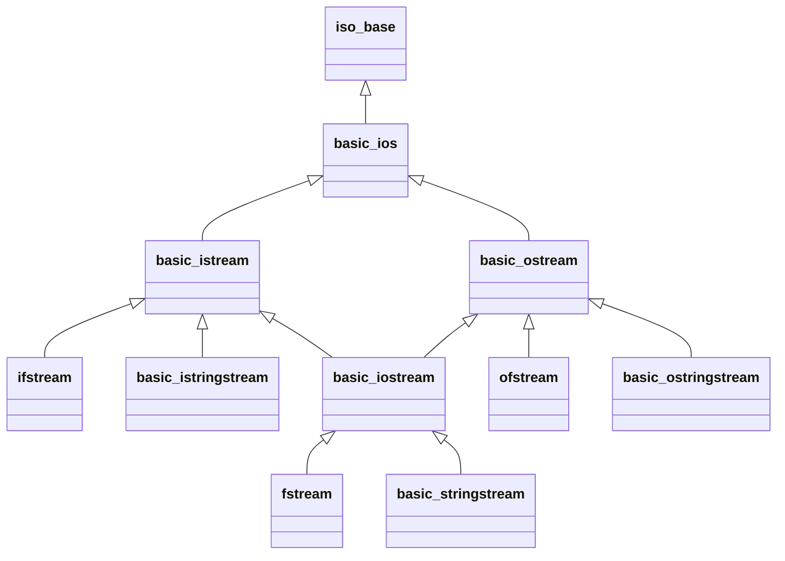

## 基础IO流

- 头文件
	- `<ios>`

### 基础IO流相关函数

#### 清除文件流错误标志

```c++
void std::basic_ios::clear(std::ios_base::iostate state);
```

`std::basic_ios::clear()`：通过设置流状态为`state`的方式，清空流中已经设置的错误标志
- 函数作用域：`std::basic_ios`
- 参数
	- `state`：用于设置为正常的状态
		- 类型：`std::ios_base::iostate`
		- 默认值：`std::ios_base::goodbit`
- 返回：无
- 异常
	- `std::ios_base::failure`：新状态包含一个Exception()掩码中的位

>[!tip]+ 提示：函数调用时机
>- 如果需要反复使用`std::basic_ios`对象
>	- 以及其子类对象
>- 则需要在`std::basic_ios::close()`后
>	- 调用以清空可能产生的错误标志
>	- 防止错误标志堵塞流的运行

