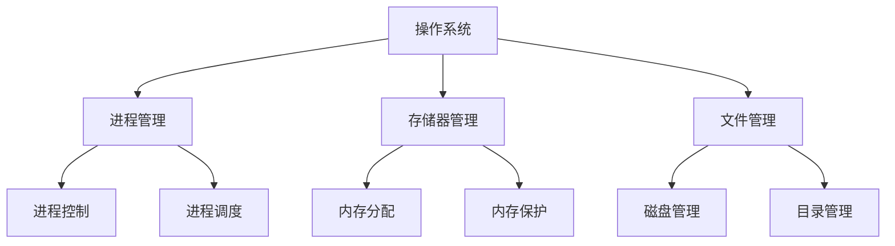

# 操作系统结构

## 计算机系统的层次结构
- 用户
- 应用程序
- 操作系统
  - 非内核功能：Ubuntu、CentOS的开发团队主要实现的就是非内核功能
    - GUI等
  - 内核功能：Linux内核
    - 进程管理
    - 存储器管理
    - 设备管理
    - 时钟管理：利用时钟中断实现计时功能
    - 中断处理
    - 原语：具有原子性的程序，这段程序不可被中断
      - 设备驱动器
      - CPU切换
- 裸机(纯硬件)

## 操作系统的内核

内核：操作系统最基本，最核心的部分
- 与硬件关联较为紧密的模块
  - 时钟管理
  - 中断处理
  - 原语
- 对系统资源进行管理的功能：是对数据结构的操作，不直接涉及硬件的模块
  - 进程管理
  - 存储器管理
  - 设备管理

### 分层结构

分层结构：将操作系统分为若干层，底层（层0）为硬件，顶层（层N）为用户接口
- *单向依赖*：每层只能调用紧邻它的低层的功能和服务

#### 分层结构的优点
  - *便于系统的调试和验证*
    - 第1层可先调试而无须考虑系统的其他部分，因为它只使用了基本硬件
    - 第1层调试完且验证正确之后，就可以调试第2层，如此向上
    - 如果在调试某层时发现错误，因为低层都调试好了，那么错误应在这一层上
  - *易扩充和易维护*：在系统中增加、修改或替换一层中的模块或整层时，只要不改变相应层间的接口，就不会影响其他层。
#### 分层结构的缺点
  - *合理定义各层比较困难*：因为依赖关系固定后，往往就显得不够灵活
  - *效率较差*：操作系统每执行一个功能，通常要自上而下地穿越多层，各层之间都有相应的层间通信机制，这无疑增加了额外的开销，导致系统效率降低。

### 模块化
模块化(模块-接口法)：将操作系统按功能划分为若干具有一定独立性的模块
- 内核组成
  - 主模块：只负责核心功能，如进程调度、内存管理
  - 可加载内核：可以动态加载新模块到内核，无需重新编译整个内核
- 模块：每个模块具有某方面的管理功能，并规定好各模块间的接口，使各模块之间能够通过接口进行通信
- 子模块：还可以进一步将各模块细分，同样也规定好各子模块之间的接口

#### 模块化的优点
-  模块间*逻辑清晰*易于维护，确定模块间接口后即可多模块同时开发
-  支持*动态加载新的内核模块*，增强OS适应性
  - 安装设备驱动程序
  - 安装新的文件系统模块到内核
- 任何模块都可以直接调用其他模块，无需采用消息传递进行通信，效率高

#### 模块化的缺点
- 模块间的*接口定义未必合理、实用*
- 模块间相互依赖，更*难调试和验证*

### 宏内核

宏内核(单内核、大内核)：将系统的主要功能模块都作为一个紧密联系的整体运行在核心态
- 可以为用户程序提供高性能的系统服务
- 因为各管理模块之间共享信息，能有效利用相互之间的有效特性，所以具有无可比拟的性能优势
- 内核举例：Linux、UNIX

#### 宏内核优点

- 性能高：内核内部各种功能都可以直接相互调用

#### 宏内核优点

- 内核庞大功能复杂，难以维护
- 大内中某个功能模块出错，就可能导致整个系统崩溃

### 微内核

微内核：是指将内核中最基本的功能保留在内核，而将那些不需要在核心态执行的功能移到用户态执行
- 降低了内核的设计复杂性
- 移出内核的操作系统代码，根据分层的原则被划分成若干服务程序，它们的执行相互独立，交互则都借助于微内核进行通信。
- 内核举例：Windows NT

#### 微内核的优点

- 内核小功能少、易于维护，内核可靠性高
- 内核外的某个功能模块出错不会导致整个系统崩溃

#### 微内核的缺点
- 性能低：需要频繁的切换用户态/核心态。
- 用户态下的各功能模块不可以直接相互调用，只能通过内核的"消息传递“来间接通信

> [!warning] 注意
> ***变态的过程是有成本的，频繁地变态会降低系统性能***

### 外核

外核：内核负责进程调度、进程通信等功能，外核负责为用户进程分配未经抽象的硬件资源，且由外核负责保证资源使用安全

#### 外核的优点
- 外核可直接给用户进程分配“不虚拟、不抽象”的硬件资源，使用户进程可以更灵活的使用硬件资源
- 减少了虚拟硬件资源的“映射层”，提升效率

#### 外核的缺点

- 降低了系统的一致性
- 使系统变得更复杂