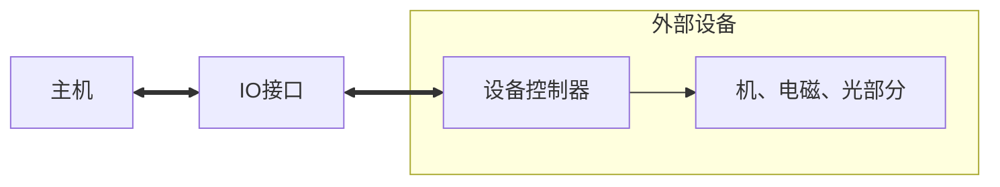

# 概述

## 外部设备分类

- 人机交互设备：人能识别的数据与机器识别的数据进行转换，如键盘、鼠标、打印机、显示器等

- 计算机信息存储设备：用于计算机数据的存储，如磁盘、光盘、磁带

- 机--机通信设备：调制解调器等

# 输入设备

- 键盘：按键→判断哪个键按下→将此键翻译成ASCII码（编码键盘发）

- 鼠标

  - 机械式：金属球、电位器

  - 光电式：光电转换器

- 触摸屏

# 输出设备

- 显示器

  - 字符显示：字符发生器

  - 图形显示：主观图像

  - 图像显示：客观图像

- 打印机

  - 打击式：点阵式（逐字、逐行）

  - 非打击式：激光、喷墨

# 其他

- AD、DA：模拟数字转换器、数字模拟转换器

- 终端：由键盘和显示器组成、完成显示控制与储存、键盘管理及通信

- 汉字处理：汉字输入、汉字存储、汉字输出

# 多媒体技术

- AR、VR：虚拟现实技术
