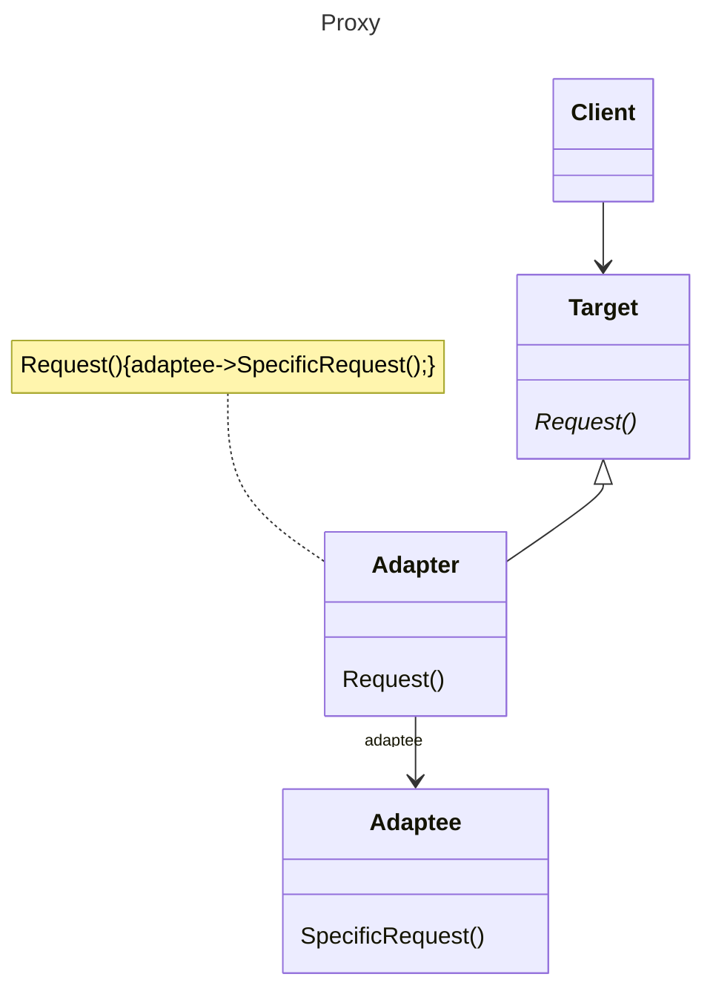

# 动机
在面向对象系统中有一些对象，由于某种原因，（比如说对象创建的开销很大，或者某些操作需要安全控制，或者需要进程外的访问等），直接访问会给使用者或者系统结构带来很多麻烦。
# 定义
为其他对象提供一种代理，以控制（隔离，使用接口）对这个对象的访问。
# 类图



# 实例

```C++
class ISubject {
public:
  virtual void process() = 0;
};

class RealSubject: public ISubject {
public:
  void process() override {/*...*/}
}

//Proxy的设计
class SubjectProxy: public ISubject {
public:
  void process() override {
    //对RealSubject的一种间接访问。
    //......可能很复杂
  }
};

class ClientApp {
  ISubject*subject;
public:
  ClientApp() {
    subject = new SubjectProxy();
  }
  void doTask() {
    //...
    subject->process();
    //...
  }
};
```
