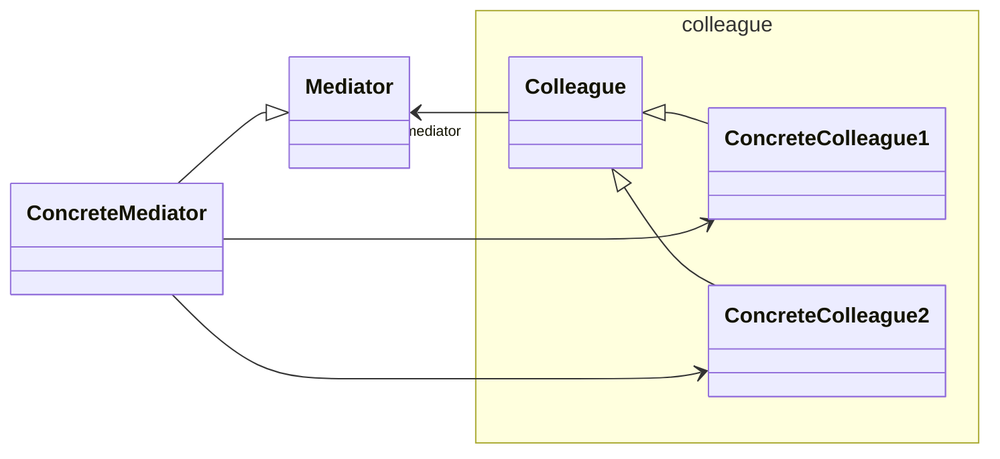

# 动机

在软件构建过程中，经常会出现多个对象互相关联交互的情况，对象之间常常会维持一种复杂的引用关系，如果遇到一些需求的更改，这种直接的引用关系将面临不断的变化。

# 定义

要一个中介对象来封装（封装变化）一系列的对象，交互中介者是个对象，不再需要显示的互相引用（编译时依赖-＞运行时依赖。），从而使其耦合松散（管理变化），而且可以独立的改变他们之间的交互。

# 类图

```mermaid
classDiagram
direction LR

namespace colleague{
  class Colleague
  class ConcreteColleague1
  class ConcreteColleague2
}

Mediator"mediator"<--Colleague
ConcreteMediator --|> Mediator
Colleague<|--ConcreteColleague1
Colleague<|--ConcreteColleague2
ConcreteMediator-->ConcreteColleague1
ConcreteMediator-->ConcreteColleague2
```

# 示例

