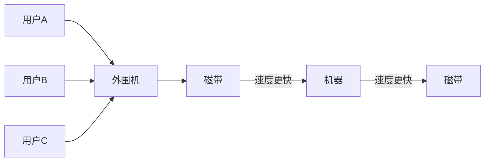

# 操作系统的发展历程
## 手工操作阶段
![[images/Pasted image 20240805204657.png]]

- 主要缺点：用户独占全机，人机速度矛盾导致资源利用率极低

## 批处理阶段

### 单道批处理系统

- 引入*脱机输入/输出技术*，并由*监督程序*负责控制作业的输入、输出
  - 脱机输入/输出技术：通过外围机把程序提前保存到磁带里
  - 监督程序：操作系统的雏形

![[images/Pasted image 20240805205707.png]]

- 主要优点：缓解了人机速度矛盾，资源利用率有所提升
- 主要缺点：内存中仅能运行一道程序，只有该程序结束后才能调入下一道程序。CPU有大量的时间是在等待I/O完成。资源利用率依然很低

### 多道批处理系统
- 每次王内存中读入多道程序，操作系统正式诞生，用于支持多道程序并发运行

![[images/Pasted image 20240805210436.png]]

- 主要优点：多道程序*并发*执行，共享计算机资源。资源利用率大幅度提升，CPU和其他资源更能保持“忙碌”状态，系统吞吐量增大
- 主要缺点：用户响应时间长，*没有人机交互功能*
  - 没有人机交互功能：用户提交作业后就只能等待计算机处理完成，中间不能控制自己的作业执行

## 分时操作系统

分时操作系统：计算机以*时间片*为单位*轮流为各个用户/作业服务*，各个用户可以通过终端与计算机进行交互

- 主要优点：用户请求可以被即时响应，*解决了人机交互问题*。允许多个用户同时使用一台计算机，并且用户对计算机的操作相互独立，感受不到别人的存在
- 主要缺点：*不能优先处理一些紧急任务*。操作系统对各个用户/作业都是完全公平的，循环的为每个用户/作业服务一个时间片，不区分任务的紧急性

## 实时操作系统

实时操作系统：计算机系统接收到外部信号后及时处理，并且*要在严格的时限内处理完事件*。
- 主要特点：及时性、可靠性
- 主要有点：能够优先响应一些紧急任务，某些紧急任务不需要时间片排队

### 硬实时系统

硬实时系统：必须在严格的规定时间内完成处理 

### 软实时系统

软实时系统：允许偶尔违反时间规定