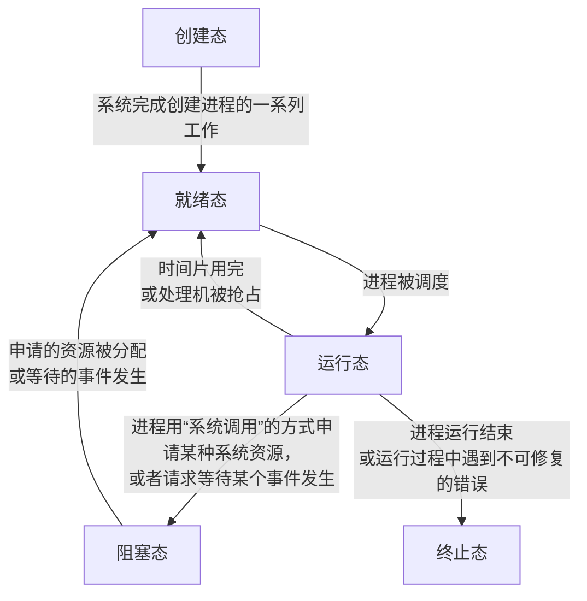

# 进程与线程
## 进程的概念与特征

- 程序：是静态的，是存放在磁盘里的可执行文件
- 进程：是动态的

### 进程的概念

进程：是系统进行*资源分配*和*调度*的独立单位
- 是[[#进程实体|进程实体]]的*运行过程*
- 是正在执行程序的实例。
- 是程序及其数据从磁盘加载到内存后，在CPU上的执行过程
- 是具有独立功能的程序在一个数据集合上运行的过程

#### 进程的作用

- 描述和控制程序的并发执行
  - 实现操作系统的并发性和共享性
- 在多道程序环境下并发执行多个程序
  - 保证程序运行的封闭性
  - 解决间断性不可再现性的特征

#### 进程控制块

进程控制块(PCB， Process Control Block)：描述进程的基本情况和运行状态，进而控制和管理进程
- 为每个并发执行的程序配置一个独立的数据结构
- 用于描述进程的基本情况和运行状态
- 是进程存在的唯一标志

#### 进程实体

进程实体(进程映像)：由*程序段*、相关*数据段*、和*PCB*三个部分构成
- 是静态的
- 用于反应进程在某一时刻的状态

### 进程的特征

#### 动态性

动态性：进程是程序的一次执行过程，是动态地产生、变化和消亡的
- 是进程最基本的特征

#### 并发性

并发性：内存中有多个进程实体，各进程可并发执行

#### 独立性

独立性：进程是能独立运行
- 独立获得资源
- 独立接受调度的基本单位

#### 异步性

异步性：各进程按各自独立的、不可预知的速度向前推进
- 进程同步机制：操作系统用于解决异步问题

#### 结构性

结构性：每个进程都会配置一个PCB
- 结构上看，进程由程序段、数据段、PCB组成

## 进程的组成

### 进程控制块的结构

- 进程描述信息：用于操作系统区分进程
  - 进程ID(PID/Process ID)：进程的*唯一*ID，用于进程管理器区分进程
  - 所属用户ID(UID)
- 资源分配清单：用于实现操作系统对资源的管理
  - 正在使用哪些内存区域
  - 正在调用的I/O设备
  - 正在使用的文件
- 进程控制和管理信息：用于实现操作系统对进程的控制、调度
  - CPU使用时间
  - 磁盘
  - 网络流量
  - 当前进程的状态：就绪态/阻塞态/运行态
- 处理机相关信息：用于实现进程切换
  - 通用寄存器值
  - 地址寄存器值
  - 控制寄存器值
  - 标志寄存器值
  - 状态字：表示进程的当前状态

### 程序段
程序段：指令序列程序的代码

### 数据段

数据段：运行过程中产生的各种数据
- 如：程序中定义的变量

## 进程的状态与转换

### 进程的状态

- 运行态->阻塞态：是进程自身作出的*主动行为*
- 阻塞态->就绪态：不是进程自身能控制的，是一种*被动行为*
- 基本状态：运行态、阻塞态、就绪态

> [!warning] 注意
> - 不能由阻塞态->运行态
> - 不能由就绪态->阻塞态
> - 因为进入阻塞态是进程的主动请求，必然需要进程在运行时才能发出这种请求

#### 创建态

创建态(新建态/New)：进程正在被创建，操作系统为进程分配资源，初始化PCB

#### 就绪态

就绪态(Ready)：进程获得了除CPU外的一切所需资源，一旦获得CPU，便可立即运行

#### 运行态

运行态(Running)：进程正在CPU上运行

#### 阻塞态

阻塞态(等待态/Waiting/Blocked)：进程正在等待某一事件而暂停运行，即使CPU空闲，该进程也不能运行
- 例如：等待某个资源可用（不包括CPU）、等待I/O完成

#### 终止态

终止态(结束态/Terminated)：进程正从系统中消失
- 例如：进程正常结束或其他原因退出运行
- 进程需要结束运行时，系统首先将该进程置为终止态
  - 然后进一步处理资源释放和回收等工作

## 进程的组织

### 链式方式

- 执行指针：指向当前处于运行态的进程
  - 单CPU计算机中，同一时刻只会有一个进程处于运行态
- 就绪队列：指向当前处于就绪态的进程
  - 通常会把优先级高的进程放在队头
- 阻塞队列指针：指向当前处于堵塞态的进程
  - 可根据阻塞原因的不同，设置多个阻塞队列

### 索引方式

索引方式：根据进程状态不同，建立对应的索引表，通过索引指针组织PCB