# CPU调度

## 调度的概念
CPU调度：是对CPU进行分配，从就绪队列中按照一定的算法(公平、高效的原则)选择一个进程，并分配CPU运行，以实现进程并发地执行
- 是多道程序操作系统的基础
- 是操作系统设计的核心问题

### 调度的层次

作业：一个具体的任务，需要启动的程序
 
|                | 任务                                       | 调度发生在      | 发生频 率 | 对进程状态的影响         |
| -------------- | ---------------------------------------- | ---------- | ----- | ---------------- |
| 高级调度 (作业调度) | 按照某种规则 从后备队列中选择合适的作业将其调入内存 并为其创建进程 | 外存(作业)->内存 | 最低    | 无->创建态->就绪态      |
| 中级调度 (内存调度) | 按照某种规则 从挂起队列中选择合适的进程 将其数据调回内存      | 外存(进程)->内存 | 中等    | (阻塞挂起->)挂起态->就绪态 |
| 低级调度           | 按照某种规则 从就绪队列中选择一个进程 为其分配处理机        | 内存->CPU    | 最高    | 就绪态->运行态(进程)     |

#### 高级调度

**高级调度(作业调度)**：按一定的原则从外存的作业后备队列中挑选一个作业调入内存，并创建进程
- *每个作业调入一次，调出一次*
- 作业调入时建立PCB，调出时撤销PCB
- *外存(作业)-->内存*
- *无-->创建态-->就绪态*

#### 中级调度

**中级调度(内存调度)**：——按照某种策略决定将哪个处于*挂起状态*的进程重新调入内存
- 调度*频率度较高*：一个进程可能会被多次调出、调入内存
- *外存(进程)-->内存*
- *(阻塞挂起-->)挂起态-->就绪态*

##### 挂起状态

*挂起状态(挂起态)*：暂时调到外存等待的进程
- 内存不够时，将某些进程的数据调出外存，等内存空闲或者进程需要运行时重新调入内存

*挂起队列*：多个挂起的进程PCB所组成的结构

#### 低级调度

**低级调度(进程调度/处理机调度)**：按照某种策略，从就绪队列中选取一个进程，并分配处理机
- 是操作系统中最基本的一种调度：在一般的操作系统中都必须配置进程调度
- 调度*频率很高*：一般几十毫秒一次
- *内存-->CPU*
- *就绪态-->运行态*

## 调度的实现

### 进程调度的时机
- **需要进行**进程调度与切换俺的情况
  - 当前运行的进程**主动放弃**处理机
    - 进程正常终止
    - 运行过程中发生异常而终止
    - 进程主动请求阻塞
  - 当前进程的进程*被动放弃*处理机
    - 分给进程的时间片用完
    - 有更紧急的事情要处理
    - 有更高优先级的进程进入就绪队列
- **不能进行**进程调度与切换的情况
  - 在**处理中断的过程**中：中断处理过程复杂，与硬件密切相关，很难做到在中断处理过程中进行进程切换
  - 进程在*操作系统内核程序临界区*中
  - 在*原子操作过程*中(原语)：原子操作不可中断
    - 如修改PCB中进程状态标志，并把PCB放到相应队列

> [!tip] 临界资源与临界区
> - **临界资源(互斥资源)**：一个时间段内，只允许一个进程使用的资源
> - **临界区**：访问临界资源的代码段
> - **内核程序临界区**：用来访问某种内核数据结构的代码段
>   - 进程的就绪队列：由各就绪进程的PCB组成

### 进程调度的方式
#### 非剥夺调度方式
**非剥夺调度方式(非抢占方式)**：进程需自行结束或请求暂停，即使有更紧急任务，当前进程也会被强制中断
- 适合于早期的批处理系统
- 优点：实现简单
- 缺点：系统开销小但是无法及时处理紧急任务

#### 剥夺调度方式
**剥夺调度方式(抢占方式)**：若更紧急的进程出现，正在执行的进程会被立即暂停，并让出处理机
- 适合于分时操作系统、实时操作系统
- 优点
  - 可以优先处理更紧急的进程
  - 可实现让各进程按时间片轮流执行的功能(通过时钟中断)

### 进程的切换与过程
#### 进程调度与进程切换的概念

**广义的进程调度**：包含了*选择一个进程*和*进程切换*两个步骤

**狭义的进程调度**：指的是从就绪队列中*选中一个要运行的进程*
- 选中刚被暂停执行的进程：不需要进程切换
- 选中另一个进程：需要进程切换

**进程切换**：是指一个进程让出处理机，由另一个进程占用处理机的过程

#### 进程切换的过程
- 对原来运行进程各种数据的保存
- 对新的进程各种数据的恢复：一般保存在进程控制块中的处理机现场信息
  - 程序计数器
  - 程序状态字
  - 各种数据寄存器
  - ……

> [!warning] 注意
> - **进程切换是有代价的**：*频繁*的进程*调度和切换*，减少了每个进程的执行时间，从而*降低了系统效率*。

### 调度程序

**调度程序(调度器/Scheduler)**：用于调度和分派CPU的组件，决定*调度算法*和*时间片大小*
- 非抢占式调度策略：只有运行进程阻塞或退出才触发调度程序工作
- 抢占方式调度策略：每个时钟中断或k个时钟中断会触发调度程序工作

>[!warning] 注意
>- 操作系统不支持内核级线程：调度程序的处理对象是进程
>- 操作系统支持内核级线程：调度程序的处理对象是内核线

#### 闲逛进程

**闲逛进程(Idle Process)**：当就绪队列中没有就绪进程时，系统所运行的进程
- 优先级最低
- 可以是0地址指令，占用一个完整的指令周期，指令周期末尾例行检查中断
- 能耗低
- PID为0

## 调度的目标

### CPU利用率
**CPU利用率**：指CPU“忙碌”的时间占总时间的比例
$$
\text{{\color{Red}CPU的利用率}}= \frac{\text{CPU有效工作时间}}{\text{CPU有效工作时间}+\text{CPU空闲等待时间}} 
$$

### 系统吞吐量

**系统吞吐量**：单位时间内CPU完成作业的数量

$$
\text{{\color{Red}系统吞吐量}}= \frac{\text{总共完成的作业}}{\text{总共花费了多少时间}} 
$$

### 周转时间
**周转时间**：从*作业被提交给系统开始*，到*作业完成为止*的时间间隔
- 包含四个部分
  - *作业等待*：作业在外存后备队列上等待作业调度(高级调度)的时间
  - *就绪等待*：进程在就绪队列上等待进程调度(低级调度)的时间
  - *执行时间*：进程在CPU上执行的时间
  - *I/O等待*：进程等待I/O操作完成的时间
- 计算方式
  - *周转时间*$${\color{Red}周转时间}=作业完成时间-作业提交时间$$
  - *平均周转时间*：多个作业周转时间的平均值$${\color{Red}平均周转时间}=\frac{各作业周转之和}{作业数}$$
  - *带权周转时间*：作业周转时间与作业实际运行时间的比值$${\color{Red}带权周转时间}=\frac {作业周转时间}{作业实际运行的时间}=\frac {作业完成时间-作业提交时间}{作业实际运行的时间}$$
  - *平均带权周转时间*$${\color{Red}平均带权周转时间}=\frac {各作业带权周转时间之和}{作业数}$$
### 等待时间
**等待时间**：指进程处于等待CPU的时间之和
- **进程的等待时间**：*进程建立后*等待被服务的时间之和
- **作业的等待时间**：包括*建立进程后*的等待时间，和作业*在外存后背队列中*等待的时间
- *调度算法影响作业/进程的等待时间*：作业被CPU和I/O设备服务的时间一般保持不变

- *平均等待时间*

### 响应时间
**响应时间**：指从用户提交请求到首次产生响应所用的时间。

## 调度算法
早期的调度算法：适用于早期的批处理系统的算法
- 主要关心对用户的公平性、平均周转时间、平均等待时间等评价系统整体性能的指标
- 不关心“响应时间”
- 不区分任务的紧急程度
- 交互性很糟糕
- **饥饿状态**：进程/作业长期得不到服务

### 先来先服务(FCFS)
**先来先服务**(FCFS/First Come First Serve)：按照作业/进程到达的先后顺序进行服务
- 作业调度：调度最先到达后备队列的作业
- 进程调度：调度最先到达就绪队列的进程
- 算法特点
  - *非抢占式*
  - *不会导致饥饿*
- 算法优点
  - 公平
  - 算法实现简单
- 算法缺点
  - FCFS算法对长作业有利，对短作业不利：排在长作业/进程后面的短作业需要等待很长时间

### 短作业优先/短进程优先

**短作业/进程优先**(SJ(P)F/Shortest Job(Process) First)：优先调度运行时间预计最短的作业或进程的算法
- 作业调度：从后备队列选取预计运行时间最短的作业执行
- 进程调度：从就绪队列选取预计运行时间最短的进程执行
- 算法特点
  - *非抢占式算法*
  - *会产生饥饿现象*
- 算法优点：“最短的”平均等待时间、平均周转时间
- 算法缺点
  - *不公平*：对短作业有利，对长作业不利
  - *可能存在虚假*：作业/进程的运行时间是由用户提供的，不一定真正实现短作业优先
#### 最短剩余时间优先

**最短剩余时间优先**(抢占式短作业优先算法，SRTN/Shortest Remaining Time Next)
- **新进程加入**：与当前进程相比，**调度时间更短**的进程，长时间进程加入就绪队列
- **当前进程完成**：按照就绪队列进行调度
- 算法特点
  - *抢占式算法*
  - *会产生饥饿现象*

>[!warning]+ 注意
>- **默认性质**：通常指非抢占式短作业优先算法
>- **平均等待与周转时间**：声称最少不准确，应考虑条件限制
>    - 例如："所有进程同时运行"
>- **性能对比**：相对其他算法(如FCFS)，SJF通常有较低的平均等待和周转时间。
>- **选择策略**：若无更好选项，即使表述不严谨，也应选择“SJF最少等待和周转时间”。

### 高响应比优先(HRRN)

**高响应比优先**(HRRN)：要综合考虑作业/进程的等待时间和要求服务的时间
- 算法规则：当前运行的进程主动放弃CPU时进行调度，在每次调度时计算并选择**响应比最高**的作业/进程为其服务
  - **响应比**：$${\color{Red}响应比} = \frac {等待时间+要求服务时间}{要求服务时间}\geq 1$$
- 算法特点
  - *非抢占式算法*
  - *不会产生饥饿*
- 综合考虑了*等待时间*和*运行时间*(要求服务时间)
  - *等待时间相同*：要求服务时间短的优先(SJF的优点)
  - *要求服务时间相同*：等待时间长的优先(FCFS的优点)

### 时间片轮转算法

**时间片轮转算法**：公平轮流的让每个进程在一定时间间隔内都可以得到响应
- 算法规则：按照进程*到达就绪队列的顺序*，*轮流执行*一个*时间片*
  - 当进程未完成时：重新放回就绪队尾排队
  - **只用于进程调度**
- 算法特点
  - *抢占式算法*：由时钟装置发出时钟中断来控制时间
  - *不会导致饥饿*
- 算法优点
  - *公平*
  - *响应快*：适用于分时操作系统；
- 算法缺点
  - *开销较大*：高频率的进程切换会增加系统开销
  - *不区分任务的紧急程度*

>[!tip]+ 提示时间片的大小
> - ***时间片不能太大***：太大的时间片，使得每个进程都可以在一个时间片内就完成，则时间片轮转调度算法退化为先来先服务调度算法，并且**会增大进程响应时间**
> - **时间片不能太小**：进程调度、切换是有时间代价的（保存、恢复运行环境），太小的时间片，**会导致进程切换过于频繁**，系统会花大量的时间来处理进程切换，从而导致实际用于进程执行的时间比例减少
> - **时间片大小的设计**：让切换进程的开销占比不超过1%

### 优先级调度算法

**优先级调度算法**

### 多级反馈队列调度算法

**多级反馈队列调度算法**

### 算法的比较

>[!FAQ]+ 例题
> 各进程到达就绪队列的时间、需要的运行时间如下表所示。
> - 等待时间
> - 平均等待时间
> - 周转时间
> - 平均周转时间
> - 带权周转时间
> - 平均带权周转时间

#### 先来先服务算法

| 进程  | 到达时间 | 运行时间 | 完成时间 | 周转时间    | 带权周转时间    | 等待时间   |
| --- | ---- | ---- | ---- | ------- | --------- | ------ |
| P1  | 0    | 7    | 7    | $7-0=7$ | $7/7=1$     | $7-7=0$  |
| P2  | 2    | 4    | 11   | $11-2=9$  | $9/4=2.25$  | $9-4=5$  |
| P3  | 4    | 1    | 12   | $12-4=8$  | $8/1=8$     | $8-1=7$  |
| P4  | 5    | 4    | 16   | $16-5=11$ | $11/4=2.75$ | $11-4=7$ |

- 调度顺序：P1->P2->P3->P4
- 平均周转时间=(7+9+8+11)/4=8.75
- 平均周转时间=(1+2.25+8+2.75)/4=3.5
- 平均等待时间(0+5+7+7)/4=4.75

#### 非抢占式短作业优先算法

| 进程  | 到达时间 | 运行时间 | 完成时间 | 周转时间      | 带权周转时间      | 等待时间     |
| --- | ---- | ---- | ---- | --------- | ----------- | -------- |
| P1  | 0    | 7    | 7    | $7-0=7$   | $7/7=1$     | $7-7=0$  |
| P3  | 4    | 1    | 8    | $8-4=4$   | $4/1=4$     | $4-1=3$  |
| P2  | 2    | 4    | 12   | $12-2=10$ | $10/4=2.5$  | $10-4=6$ |
| P4  | 5    | 4    | 16   | $16-5=11$ | $11/4=2.75$ | $11-4=7$ |
- 调度顺序：P1→P3→P2→P4
- 平均周转时间=(7+4+10+11)/4=8
- 平均带权周转时间=(1+4+2.5+2.75)/4=2.56
- 平均等待时间=(0+3+6+7)/4=4

#### 抢占式短作业优先算法

```mermaid
---
displayMode: compact
---
gantt
    title 抢占式短作业优先算法
    dateFormat s
    axisFormat %SS
    section P1
    P1 :active, des1a, 0, 2s
    P1 :active, des1b, after des4, 5s
    section P2
    P2 :active, des2a, after des1a, 3s
    P2 :active, des2b, after des3, 1s
    section P3
    P3 :active, des3, after des2a, 1s
    section P4
    P4 :active, des4, after des2b, 4s
```

| 进程  | 到达时间 | 运行时间 | 完成时间 | 周转时间 | 带权周转时间 | 等待时间 |
| --- | ---- | ---- | ---- | ---- | ------ | ---- |
| P1  | 0    | 7    | 16   | 16   | 2.28   | 9    |
| P2  | 2    | 4    | 7    | 5    | 1.25   | 1    |
| P3  | 4    | 1    | 6    | 1    | 1      | 0    |
| P4  | 5    | 4    | 11   | 6    | 1.5    | 2    |
- 调度顺序：P1(7-2=5)->P2(4-2=2)->P3(1-1=0)->P2(2-2=0)->P4(4-4=0)->P1(5-5=0)
- 平均周转时间=(16+5+1+6)/4=7
- 平均带权周转时间=(2.28+1.25+1+1.5)/4=1.50
- 平均等待时间=(9+1+0+2)/4=3

#### 高响应比优先

| 进程  | 到达时间 | 运行时间 | 完成时间 | 周转时间 | 带权周转时间 | 等待时间 |
| --- | ---- | ---- | ---- | ---- | ------ | ---- |
| P1  | 0    | 7    | 7    | 7    |        |      |
| P2  | 2    | 4    |      |      |        |      |
| P3  | 4    | 1    |      |      |        |      |
| P4  | 5    | 4    |      |      |        |      |
- 调度顺序
  1. 时刻0：*P1(1)*
  2. 时刻7：P2((5+4)/4=2.25)、*P3((3+1)/1=4)*、P4((2+4)/4=1.5)
  3. 时刻8：*P2((6+4)/4=2.5)*、P4((3+4)/4=1.75)
  4. 时刻12：*P4*
#### 多种算法的比较

| 算法          | 平均周转时间 | 平均带权周转时间 | 平均等待时间 |
| :---------- | :----- | :------- | :----- |
| 先来先服务算法     | 8.75   | 3.5      | 4.75   |
| 非抢占式短作业优先算法 | 8      | 2.56     | 4      |
| 抢占式短作业优先算法  | 7      | 1.5      | 3      |

#### 时间片轮转算法

##### 时间片大小为2

| 进程  | 到达时间 | 运行时间 |
| --- | ---- | ---- |
| P1  | 0    | 5    |
| P2  | 2    | 4    |
| P3  | 4    | 1    |
| P4  | 5    | 6    |

```mermaid
---
displayMode: compact
---
gantt
    title 时间片轮转算法
    dateFormat s
    axisFormat %SS
    section P1
    P1 :active, des1a, 0, 2s
    P1 :active, des1b, after des2a, 2s
    P1 :active, des1c, after des4a, 1s
    section P2
    P2 :active, des2a, after des1a, 2s
    P2 :active, des2b, after des3, 2s
    section P3
    P3 :active, des3, after des1b, 1s
    section P4
    P4 :active, des4a, after des2b, 2s
    P4 :active, des4b, after des1c, 2s
    P4 :active, des4c, after des4b, 2s
```

>[!warning]+ 注意*新进程到达时间*和*当前进程被轮转*时的队列插入冲突
> 默认情况：***新到达的进程先进入就绪队列***

- 进程调度
  - 0时刻`[P1(5)]`：P1运行
  - 2时刻`[P2(4), P1(3)]`：P1时间片用完，P2运行
  - 4时刻`[P1(3), P3(1), P2(2)]`：P2时间片用完，P3和P1加入队列
  - 5时刻`[P3(1), P2(2), P4(6)]`：P4到达，P1继续运行
  - 6时刻`[P3(1), P2(2), P4(6), P1(1)]`：P1时间片用完，P2运行
  - 7时刻`[P2(2), P4(6), P1(1)]`：P3运行完毕，P2继续运行
  - 9时刻`[P4(6), P1(1)]`：P2运行完毕，P4运行
  - 11时刻`[P1(1), P4(4)]`：P4时间片用完，P1运行
  - 12时刻`[P4(4)]`：P1运行完毕，P4运行
  - 14时刻`[]`：P4继续运行
  - 16时刻：所有进程运行结束

##### 时间片大小为5

```mermaid
---
displayMode: compact
---
gantt
    title 时间片轮转算法
    dateFormat s
    axisFormat %SS
    section P1
    P1 :active, des1, 0, 5s
    section P2
    P1 :active, des2, after des1, 4s
    section P3
    P1 :active, des3, after des2, 2s
    section P4
    P4 :active, des4a, after des3, 4s
    P4 :active, des4b, after des4a, 1s
```

- 进程调度
  - 0时刻`[P1(5)]`：P1(5)运行
  - 2时刻`[P2(4)]`：P2到达，P1时间片未结束
  - 4时刻`[P2(4), P3(1)]`：P3到达，P1时间片未结束
  - 5时刻`[P2(4), P3(1)，P4(6)]`：P4到达，P1运行结束，P2上处理机
  - 9时刻`[P3(1)，P4(6)]`：P2运行结束，P3上处理机
  - 10时刻`[P4(6)]`：P3运行结束，P4上处理机
  - 15时刻`[]`：P4时间片用完，继续执行
  - 16时刻`[]`：P4运行结束，所有进程完成

