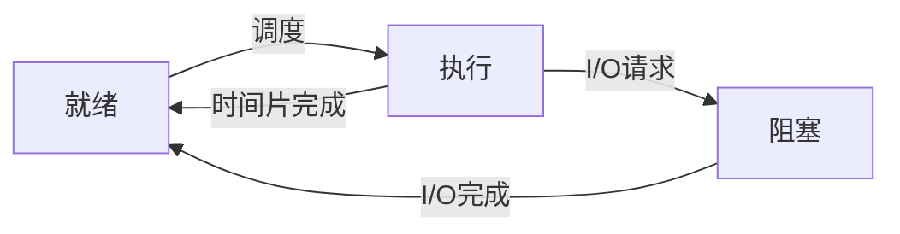

# 操作系统的概述

## 进程与程序

- 程序：是*保存在外存中*的*静态*文件
- 进程：是*有生命周期*的*动态*程序

- 程序与进程的关系：一个程序可以对应多个进程

## 操作系统的作用

- 控制计算机的硬件和软件资源
	- 控制面板：设置软硬件资源
	- 设备管理器：管理软硬件资源
- 屏蔽软硬件细节，提高用户的工作利用率
- 提高系统资源的*利用率* ~~运行速度~~

## 操作系统的特性

### 并发性

并发性：*多个*程序*同时*(同一时间段、同一时间间隔)在系统中运行

### 共享性

共享性：操作系统内的*资源*(软件、硬件、数据)可以*被多个并发执行的进程*所使用

### 虚拟性

虚拟性：通过某种技术，把*一个物理实体*变成*若干个逻辑*上的对应

### 异步性

异步性：在*多个*程序并发运行的环境，每个程序的执行、暂停、推进速度和完成*时间都是不确定*的

## 操作系统的功能

### 处理机管理

处理机管理(CPU管理、处理器管理)
- 处理中断事件
- 处理机调度
	- 作业调度
	- 内存调度
	- 进程调度

### 存储管理

存储管理：管理内存储器资源
- 内存分配回收
- 地址转换
- 内存的共享和保护
- 内存的逻辑扩充

### 设备管理

设备管理：为用户使用各设备提供统一接口

### 文件管理

文件管理：所有的程序和数据都是以*文件形式*存放在计算机的*外存储器*上，操作系统对文件*按名*存取

- 文件的读写保护
- 目录管理
- 文件的命名

### 作业管理

作业管理：用户在*一次事务*处理过程中要求计算机*所有工作*的总和
- *进程*是操作系统进行调度的基本单位
- *线程*是*CPU调度*的基本单位
	- 是*进程*的组成单位
- *扇区*是操作系统对*外存读写*的基本单位
- *文件*是操作系统对*信息管理*的基本单位

## 操作系统的分类

### 根据对作业的处理方式

#### 批处理操作系统

- 批处理：用户将一批作业提交给后不在干预
	- 由操作系统控制自动运行
	- *不具有交互性*
- 单道批处理操作系统：*一次一个*任务
- 多道批处理操作系统(多任务操作系统)：*多个*程序*宏观上并行*，*微观上串行*

#### 分时操作系统

- 分时操作系统：一台主机链接若干终端，采用时间片轮转方式处理服务请求
	- 多路性
	- 交互性
	- 独占性
	- 及时性
- 系统举例
	- Windows
	- Unix
	- MacOS

#### 实时操作系统

实时操作系统：在严格的时间规定内完成对事件的处理
- 及时性
- 可靠性

### 根据体系结构和使用环境

#### 嵌入式操作系统

嵌入式操作系统：运行在嵌入式系统环境中
- 专用性
- 针对性
- 稳定性
- 实时高效
- 内存占用小

#### 个人计算机操作系统

系统举例
- DOS
- WinXP
- Win7
- Win10

#### 网络操作系统

网络操作系统：基于计算机网络系统
- 系统举例
	- Windows Server
	- Unix
	- Linux
	- NetWare

#### 分布式操作系统

分布式操作系统：由若干台无主从关系的处理机组成的系统，可以管理分散在多个地理位置上的计算机资源，可以并行运行同一个程序

### 根据所支持的用户数和任务数

#### 单用户单任务系统

DOS

#### 单用户多任务系统

WinXP

#### 多用户多任务系统

- Win7
- Win10

### 根据用户界面

#### 命令行界面操作系统

DOS

#### 图形用户界面操作系统

Windows

## 常用操作系统的分类

### Windows操作系统

Windows：个人电脑操作系统的垄断地位

### UNIX操作系统

UNIX：多用户多任务、分时操作系统，可用于网络服务器

### Linux操作系统

Linux：开源的、多用户、多任务，支持多线程和多CPU的分时操作系统

### MacOS操作系统

MacOS：苹果专用操作系统，基于UNIX，是首个在商用领域成功运用的计算机图形用户界面的操作系统

### 智能手机操作系统

- Android：基于Linux，用于移动设备
- iOS
- WindowsPhone8
- HarmonyOS

### 国产操作系统

- 红旗Linux
- 统信UOS
- 银河麒麟KylinOS

---

下列软件中属于应用软件的是
- 鸿蒙操作系统
- 微信
- 支付宝
- linux

通过windwos10操作系统开始菜单中的关机按钮的扩展菜单，无法实现以下的那个功能

- 关机
- 重新启动
- 休眠
- 更改当前用户密码

在Windows10中

关于Windows10的窗口，描述错误的是
- 主要的窗口包括应用程序窗口和文档窗口等
- 窗口的名称显示在标题栏
- 可以同时打开多个窗口，但只有一个窗口是活动的
- 窗口的位置与大小都是固定的

在Windows10操作系统中，关闭应用程序方式正确的有 C
- 按Ctrl+F4
- 按Ctrl+Esc
- 按Alt+F4
- 按shift+F4

下列关于window10的描述中，错误的是 D
- Windows10是一个多任务操作系统，允许多个程序同时运行
- 在某一时刻只能有一个窗口处于活动状态
- 非活动窗口在后台运行
- 非活动窗口可以接收用户的键盘和鼠标输入等操作

可以完成窗口切换的是 Alt+Tab 和 单击要切换窗口的任何可见部位 单机任务栏上要切换的应用程序按钮

- 窗口是应用程序运行后的工作区
- 同时打开很多程序可以重叠
- 窗口的位置可以移动，但大小不能改变
- 窗口的位置和大小都

- 不可以在屏幕上意动
- 可以缩小成任务栏上的一个图标
- 大小可以调整

利用 win1 搜索功能查找文件时，说法正确的是 C
- 要求搜索的文件是文本文件
- 根据日期查找时，必须输入文件的最后修改日期
- 根据文件名查找时，至少需要输入文件名的一部分或通配符
- 用户设置为隐藏的文件，只要符合查找条件，在任何情况下都将被找出

关于对话框

拖动标题栏可以移动对话框
都可以改变大小
可以最小化完成任务栏图标
可以双击标题栏完成窗口的最大化和还原的操作

当对话框大理石，主程序倍进制，关闭该对话课后才能处理主窗口，这种对话框称为 模式对话框

通过按下键盘的 *PrintScreen*按键可以将屏幕所有内容复制到剪切板

剪贴板的操作包括 *复制 剪切 粘贴*

在 win10 操作系统中，与剪贴板无关的操作是*删除*

在 win10 中，若在某一文档中连续进行了多次剪切操作，关闭该文档后，剪切板存放的是 *最后一次剪切的内容*

快捷方式是到本计算机或网络上任何可访问的链接，快捷方式可放置在本计算机的任何位置
