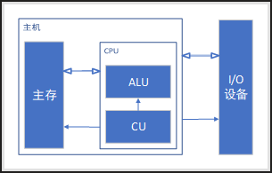

# 前言

存储程序型计算机

EDVAC
- 1949年
- 第一台程序式计算机

# 冯诺依曼计算机的特点

- 计算器有五大部分组成
- 指令和数据以同等地位存于存储器，可按地址寻访。
- 指令和数据用二进制表示
- 指令由操作码和地址码组成
- 具有存储程序
- 以运算器为中心

## 冯诺依曼计算机硬件结构
- 运算器 ALU：算数运算逻辑运算
- 控制器 CU：指挥程序的运行
- 存储器：存放数据和程序
    - 主存
    - 辅存
- 输入设备：将信息转换成机器能识别的形式
- 输出设备：将结果转换成人们熟悉的形式

# 计算机硬件框图

## 以运算器为中心的计算机硬件框图


存在以下问题

- 运算器为中心，导致运算器成为系统瓶颈

- 不具有层次化特征，系统部件耦合度过高

## 以存储器为中心的计算机硬件框图


## 现代计算机硬件框图




# 计算机的工作步骤

1. 判断能否使用计算来解决

2. 建立数学模型

3. 确定计算方法

4. 编制解题程序

    - 程序：运算的 ***全部步骤***

    - 指令：每 ***一个步骤***

## 编程举例

```Plain Text
取x 	至运算器中 
乘以x 	在运算器中 
乘以a 	在运算器中 
存ax^2 	在存储器中 
取b 	至运算器中 
乘以x 	在运算器中 
加ax^2 	在运算器中 
加c 	在运算器中 
```

```Plain Text
取x 至运算器中
乘以a 在运算器中 
加b 在运算器中 
乘以x 在运算器中 
加c 在运算器中 
```

## 指令格式举例

> 取值[]
移动->
累加器ACC
注：乘法时可能会因为超出位数溢出

|指令|格式|
|-|-|
|取数α|[α]->ACC|
|存数β|[ACC]->β|
|加γ|[ACC]+[γ]->ACC|
|乘δ|[ACC]×[δ]->ACC|
|打印θ|[θ]->打印设备|
|停机||

## 计算ax^2+bx+c 程序清单

|指令和数据存于主存单元的地址|指令||注释|
|-|-|-|-|
||操作码|地址码||
|0|000001|0000001000|取数x至ACC|
|1|000100|0000001001|加b得ax+b,存于ACC中|
|2|000011|0010001010|乘x得 (ax+b)存于ACC中|
|3|000100|0000001000|加c得ax2+bx+c,存于ACC|
|4|000011|0000001011|将ax2 + bx +c存于主存单元|
|5|000010|0000001100|打印|
|6|000101|0000001100|停机|
|7|000110|||
|8|x||原始数据x|
|9|a||原始数据a|
|10|b||原始数据b|
|11|c||原始数据c|
|12|||存放结果|

# 计算机的基本组成

## 存储器的基本组成


### 功能

保存数据和指令

### 结构

- MAR(Memory Address register)：存储器地址寄存器，反应存储单元的个数，$存储单元个数 = 2^{MAR位数}$
- MDR(memory data register)：存储器数据寄存器，反应存储字长，存储字长 = MDR位数
- 存储体：由存储单元组成
    - 存储单元：由存储元件组成，用于存储一串二进制码，每个存储单元赋予一个地址
    - 存储字：存储单元中二进制代码的组合
    - 存储字长：存储单元中二进制代码的数量

### 查找方式
按地址寻访

## 运算器的基本组成


### 功能

通过算逻运算单元完成运算

### 结构

累加器类型运算器结构

- 累加器ACC(Accumulator)
- 乘商寄存器MQ(Multiplier-Quotient Register)
- 通用寄存器X
- 算逻运算单元ALU(Arithmetic Logic Unit)

### 基本运算流程

#### 

- ACC存放**被加数**与**和**
- X存放**加数**
- 运算的流程

```Plain Text
被加数->ACC;
[M]->X;
[ACC]+[X]->ACC;
```

#### 

- ACC保存**被减数**与**差**

- X保存**减数**

- 运算的流程

```Plain Text
被减数->ACC;
[M]->X;
[ACC]-[X]->ACC;
```

#### 

- ACC存放**乘积高位**与**乘数**

- MQ存放**乘积低位**

- X存放**被乘数**

- 运算流程

```Plain Text
被乘数->ACC;
[M]->MQ;
[ACC]->X;
0->ACC;
[X]×[MQ]->ACC||MQ;//MQ是运算的高位
```

#### 

- ACC存放**被除数**和**余数**

- MQ存放**商**

- X存放**除数**

- 运算流程

```Plain Text
被除数->ACC;
[M]->X;
[ACC]÷[X]->MQ;//余数在ACC中
```

## 控制器的基本组成


### 功能

解释指令
保证指令按序执行

### 结构

- PC：存放当前域执行指令的地址，具有计数功能[pc]+1->pc
- IR：存发当前欲执行的指令
- CU

### 控制流程

取指令
分析指令
执行指令

# 主机完成一条指令的过程


## 取数指令

- 取指令
    1. pc将保存的指令地址发送给MAR
    2. MAR激活存储体地址
    3. 存储体将地址所保存的指令数据返回MDR
    4. 取MDR指令数据到IR中

- 分析指令
    1. 将IR中保存的数据中的操作码部分传递给CU
    2. 将IR中保存的数据中的地址码部分传递给MAR

- 执行指令
    1. MAR激活存储体对应地址码的数据，返回至MDR
    2. 将MDR中的数据传递给ACC

## 存数指令

- 取指令
    1. pc将保存的指令地址发送给MAR
    2. MAR获取存储体对应地址的数据
    3. 存储体将对应数据返回至MDR
    4. 取MDR指令至IR中

- 分析指令
    1. 将IR中保存的数据中的操作码部分传递给CU
    2. 将IR中保存的数据中的地址码部分传递给MAR

- 执行指令
    1. ACC将数据传递给MDR
    2. 将IR指令数据中的地址码部分的存储单元开辟出来
    3. 将MDR中的数据写入存储体开辟出来的位置

## 程序运行过程

以ax^2+bx+c举例

1. 将程序通过输入设备送至计算机
2. 取数a
    3. 程序首地址 -> PC
    4. 启动程序运行
    5. 取指令 PC -> MAR -> M -> MDR -> IR , (PC + 1) -> PC
    6. 分析指令 OP(IR) -> CU
    7. OP是指令部分
    8. 执行指令 Ad(IR) -> MAR -> M -> MDR -> ACC
    9. Ad是地址码部分
    10. MAR/MDR类似于接口寄存器
11. 乘以x
12. 加b
13. 乘以x
14. 加c
15. 打印结果
16. 停机

