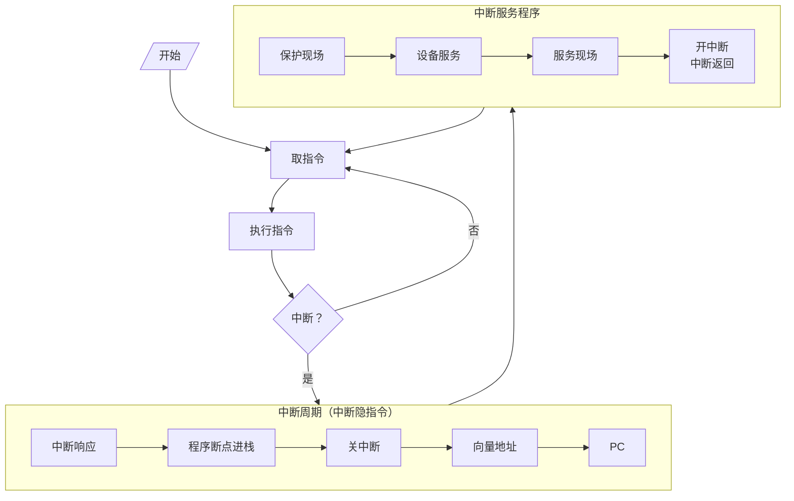
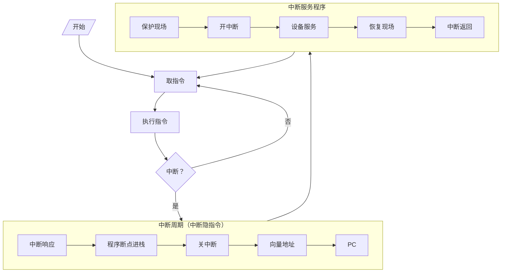

# 中断的概念

中断：CPU在执行程序的过程中，如果发生意外事件或者特殊事件，CPU要中断当前程序的处理或运行，而处理事件程序，结束时间程序后恢复到原程序断点处继续执行原程序。

# IO中断的产生

中断源：能产生中断信号的设备

以打印机为例：CPU与打印机部分并行运行

# 程序中断方式接口电路

## 配置中断请求触发器和中断屏蔽触发器

- 中断请求触发器(INTR)：有请求信号为1
- 中断屏蔽触发器(MASK)：屏蔽信号为1
- 完成触发器(D)：

## 排队器

排队器：当同时有多个中断源产生中断信号，检测优先级最高的中断源，高电平只有一位

- 硬件：在cpu内或接口电路中（链式排队器）

  - 设备$1^\#$、$2^\#$、$3^\#$、$4^\#$优先级按照降序排列

  - $INTR_i=1$有请求，即$\overline{INTR_i}$

- 软件：详见第八章

## 中断向量地址形成部件

中断向量地址形成部件：用于锁定产生中断信号的中断源的位置

中断向量：中断服务程序的入口地址

- 硬件向量法：由硬件产生向量地址，再由向量地址找到入口地址
  - 类似设备编码器
- 由软件产生：详见第八章

- 向量地址：12H、13H、14H
- 入口地址：200、300、400
# 程序中断方式接口电路的基本组成

# IO中断处理过程

## CPU响应中断的条件和时间

### 条件

允许中断触发器EINT=1

用开中断指令将EINT置1

用关中断指令将EINT置0或硬件自动复位

### 时间

- 当D=1（随机）且MASK=0时

- **在每条指令执行阶段的结束前**

- CPU发中断查询信号（将INTR值1）

## IO中断处理过程

以输入为例

- CPU通过地址线发出设备地址
- 设备选择电路与地址进行比价，向所选设备发出SEL（设备选择）信号
- CPU发出启动或控制命令
- 接口对命令进行译码
- 译码结果与SEL同时有效时，设置触发器D为0，触发器B为1
- 触发器B启动设备
- 设备工作结束，将数据保存至DBR（数据缓冲寄存器）中
- 设置触发器D为1，触发器B为0
- MASK（中断屏蔽器）未屏蔽，输出为1
- MASK与触发器D为1，经过与非和非运算后为1，发送至INTR（中断请求触发器）
- CPU在每条指令执行结束后会发出中断查询信号，将INTR设置为1
- INTR发出中断请求信号，并激活本级排队器
- 排队器将排队数据（只有1位为1）发送至设备编码器
- CPU发出INTA（中断响应）信号激活设备编码器
- 设备编码器将向量地址发送至CPU
- CPU找到中断程序入口地址并启动中断程序，取走DBR中的数据

# 中断服务程序流程

## 中断程序的流程

### 保护现场

- 程序断点的保护：中断隐指令（详细在第9章）

- 寄存器内容的保存：进栈指令

### 中断服务

- 对不同的IO设备具有不同内容的设备服务

### 恢复现场

将保存的数据恢复

### 中断返回

中断返回指令

## 单重中断和多重中断

单重中断：不允许中断现行的中断服务程序

多重中断：允许级别更高的中断源中断现行的中断程序

> 类似协程工作原理

## 单重中断和多重中断的服务程序流程

## 主程序和服务程序抢占CPU示意图

宏观上CPU和IO并行工作

微观上CPU中断现行程序为IO服务
