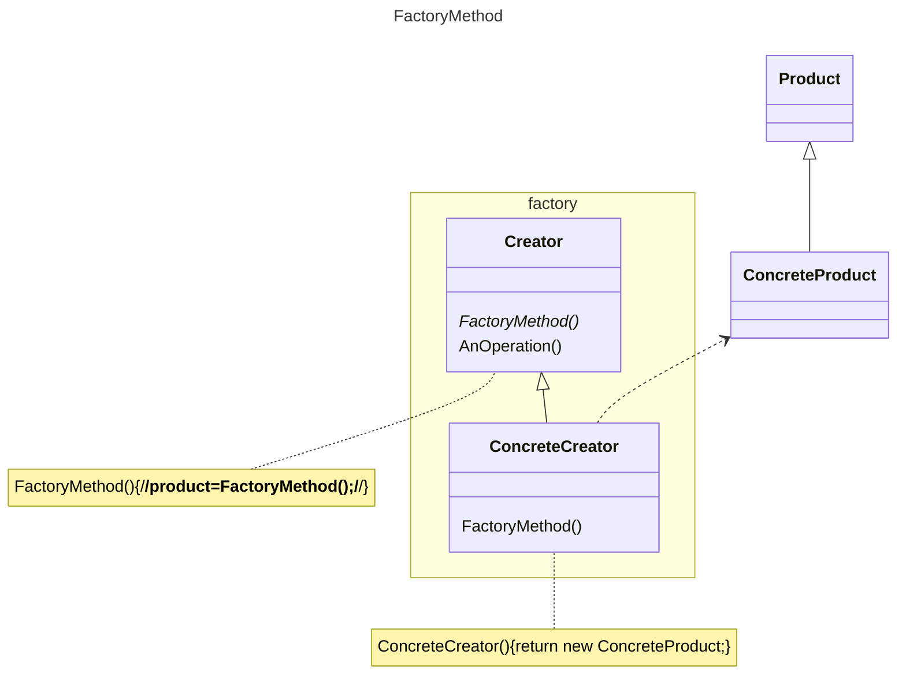

# 动机
在软件系统中，经常面临着创建对象的操作；由于需求的变化，需要创建的对象的具体类型经常变化。
# 定义
定义一个用于创建对象的接口，让子类决定实例化哪一个类。Factory Method使得一个类的实例化延迟（用虚函数解耦）到子类。
注：用于管理对象、创建对象、释放对象的操作
# 类图

# 示例
```C++
//拆分器
class ISplitter {
public:
	virtual void split() = 0;
	virtual ~ISplitter() {}
};
//工厂基类
class SplitterFactory {
public:
	virtual ISplitter* createSplitter() = 0;
	virtual ~ISplitterFactory() {}
};
//二进制文件拆分器
class BinaryFileSplitter: public ISplitter {};
//二进制拆分器工厂
class BinarySplitterFactory: public SplitterFactory {
public:
	Splitter* createSplitter()override {
		return new BinaryFileSplitter()
	}
};
class TxtFileSplitter: public ISplitter {};
class TxtSplitterFactory: public SplitterFactory {
public:
	Splitter* createSplitter()override {
		return new TxtFileSplitter()
	}
};
class PictureFileSplitter: public ISplitter {};
class PictureSplitterFactory: public SplitterFactory {
public:
	Splitter* createSplitter()override {
		return new PictureFileSplitter()
	}
};
class VideoFileSplitter: public ISplitter {};
class VideoSplitterFactory: public SplitterFactory {
public:
	Splitter* createSplitter()override {
		return new VideoSplitterFactory()
	}
};
class MainForm: public Form
{
	SplitterFactory*factory;
public:
	MainForm(SplitterFactory\* factory): factory(factory) {}
	void button1Chick() {
		string filePath = textFilePath->getText();
		int number = atoi(textFileNumber->getText().c_str());
		ISplitter* splitter =
		    factory->createSplitter();
		splitter->split();
	}
};
```
