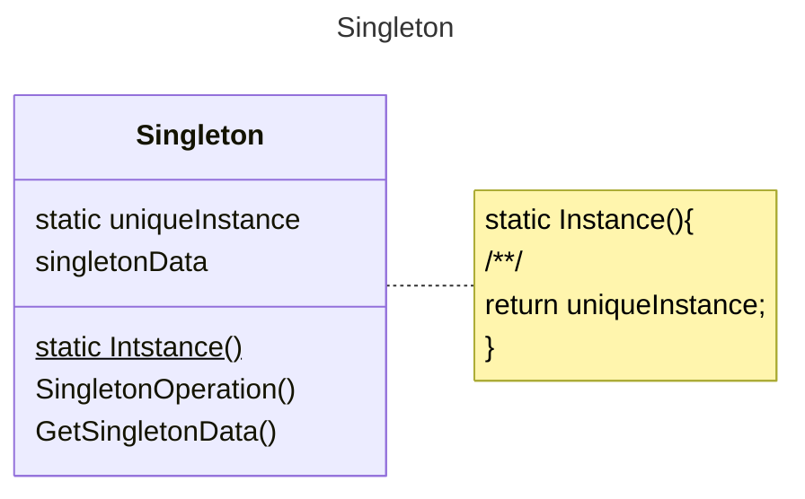

# 动机
在软件系统中，经常有一些特殊的类，必须保证它们在系统中只存在一个实例，才能保证它们的逻辑正确性、以及良好的效率。
# 定义
确保一个类只有一个实例，并提供全局访问点。
# 类图

# 示例
```C++
class Singleton {
private:
	Singleton();
	~Singleton();
public:
	static Singleton* getInstance();
	static Singleton* m_instance;
};
Singleton* Singleton::m_instance = nullptr;
//线程非安全
Singleton* Singleton::getInstance() {
	if (m_instance == nullptr) {
		m_instance = new Singleton();
	}
	return m_instance;
}
// 线程安全，但锁的代价过高
Singleton* Singleton::getInstance() {
	Lock lock;
	if (m_instance == nullptr) {
		m_instance = new Singleton();
	}
	return m_instance;
}
双检查锁，但由于内存读写reorder不安全，不可用
Singleton* Singleton::getInstance() {
	if (m_instance == nullptr) {
		Lock lock;
		if (m_instance == nullptr) {
			m_instance = new Singleton();
		}
	}
	return m_instance;
}
使用原子模板std::atomic来保证高效线程安全问题
#include <atomic>
#include <mutex>
class Singleton {
private:
	Singleton();
	~Singleton();
public:
	static Singleton* getInstance();
	static std::atomic<Singleton*> m_instance;
	static std::mutex m_mutex;
};

std::atomic<Singleton*> Singleton::m_instance = nullptr;
std::mutex Singleton::m_mutex = {};

Singleton* Singleton::getInstance() {
	Singleton* tmp = m_instance.load(std::memory_order_relaxed);
	std::atomic_thread_fence(std::memory_order_acquire);//获取内存fence
	if (tmp == nullptr) {
		std::lock_guard<std::mutex> lock(m_mutex);
		tmp = m_instance.load(std::memory_order_relaxed);
		if (tmp == nullptr)
		{
			tmp = new Singleton;
			std::atomic_thread_fence(std::memory_order_release);//释放内存fence
			m_instance.store(tmp, std::memory_order_relaxed);
		}
	}
	return tmp;
}
```
