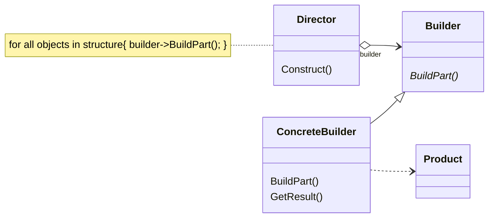

# 动机
在软件系统中，有时候面临着一个复杂对象的创建工作，其通常由各个部分的子对象常用一定的算法构成；由于需求的变化，这个复杂对象的各个部分经常面临着剧烈的变化，但是将它们组合在一起的算法却相对稳定。
# 定义
将一个复杂对象的构建与其表示相分离，使得同样的构建过程（稳定）可以创建不同的表示（变化）。
# 类图



# 示例

```C++
class House {/**/};

class HouseBuilder {
protected:
  House* pHouse;
public:
  House* getResult() {return pHouse;  }
  virtual ~HouseBuilder() {}
protected:
  virtual void buildPart1() = 0;
  virtual void buildPart2() = 0;
  virtual bool buildPart3() = 0;
  virtual void buildPart4() = 0;
  virtual void buildPart5() = 0;
};
class StoneHouse : public House {};
class StoneHouseBuilder: public HouseBuilder {
protected:
  // 通过 House 继承
  virtual void buildPart1() override {/*...*/}
  virtual void buildPart2() override {/*...*/}
  virtual bool buildPart3() override {
    //...
    return false;
  }
  virtual void buildPart4() override {/*...*/}
  virtual void buildPart5() override {/*...*/}
};

class HouseDirector {
public:
  HouseBuilder* pHouseBuild
  HouseDirector(HouseBuilder* pHouseBuilder): pHouseBuild(pHouseBuilder) {}
  House* construct() {
    pHouseBuild->buildPart1();
    for (size_t i = 0; i < 4; i++) {
      pHouseBuild->buildPart2();
    }
    bool flag = pHouseBuild->buildPart3();
    if (flag) {
      pHouseBuild->buildPart4();
    }
    pHouseBuild->buildPart5();
    return pHouseBuild->getResult();
  }
};
int main() {
  House*pHouse = new StoneHouse();
  pHouse->init();
}
```
