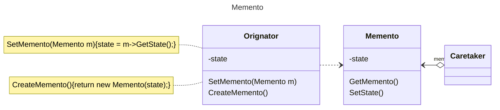

# 动机

在软件构建过程中，某些对象的状态在转换过程中，可能由于某种需要，要求程序能够回溯到对象之前处于某个点时的状态。如果使用一些公有接口来让其他对象得到对象的状态，便会暴露对象的细节实现。

# 定义

在不破坏封装性的前提下，捕获一个对象的内部状态，并在该对象之外保存这个状态。这样以后就可以将该对象恢复到原先保存的状态。

# 类图



# 示例

```C++
class Memento
{
  string m_state;
//…
public:
  Memento(const string&s): m_state(s) {}
  string getState() {
    Memento m{m_state1};
    return m;
  }
  void setState(const string&s) {state = s;}
};
class Originator
{
  string m_state;
//…
public:
  Originator() {}
  Memeto createMomento() {
    Memento m{m_state};
    return m;
  }
  void setMomento(const Memeto& m) {m_state = m.getState();}
};
int main() {
  Originator originator;
  Memento mem = originator.createMomento();
  originator.setMomento(mem);
}
```
