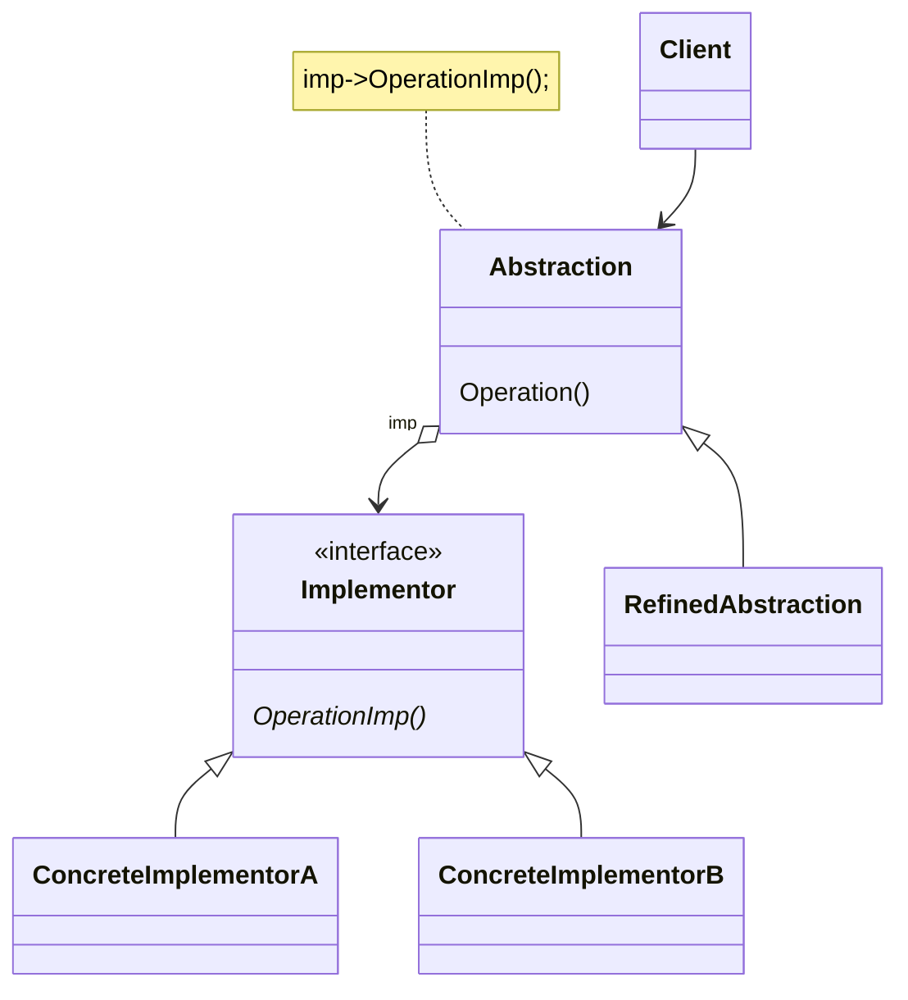

# 动机
由于某些类型的固有的实现逻辑，使得它们具有两个变化的维度，乃至多个维度的变化。
# 定义
桥接模式（Bridge Pattern）定义了如何将抽象和实现分离，以便两者可以独立地变化。桥接模式通常使用组合关系而不是继承关系来完成此任务。
# 类图



# 示例

```C++
class MessagerImpl {
public:
  //============================
  virtual ~MessagerImpl() = default;
  //============================
  virtual void playSound() = 0;
  virtual void drawShape() = 0;
  virtual void writeText() = 0;
  virtual void connect() = 0;
};
//平台实现
class MessagerImpl {
public:
  //============================
  virtual ~MessagerImpl() = default;
  //============================
  virtual void playSound() = 0;
  virtual void drawShape() = 0;
  virtual void writeText() = 0;
  virtual void connect() = 0;
};

class PCMassagerImpl : public MessagerImpl {
public:
  void playSound() override  {/**/}
  void drawShape() override  {/**/}
  void writeText() override  {/**/}
  void connect() override  {/**/}
};

class MobileMassagerImpl : public MessagerImpl {
public:
  void playSound() override  {/**/}
  void drawShape() override  {/**/}
  void writeText() override {/**/}
  void connect() override {/**/}
};

//业务版本
class Messager {
protected:
  MessagerImpl* massagerImpl;
public:
  //============================
  Messager(MessagerImpl* impl) : massagerImpl(impl) {}
  virtual ~Messager() = default;
  //============================

  virtual void login(std::string userName, std::string password) = 0;
  virtual void sendMessage(std::string message) = 0;
  virtual void sendPicture(Image image) = 0;

};

//业务版本

class MassagerLite : public Messager {
public:
  MassagerLite(MessagerImpl* massager) : Messager(massager) {}
  void login(std::string userName, std::string password) override {
    /**/
    massagerImpl->connect();
  }

  void sendMessage(std::string message) override {
    //...
    massagerImpl->writeText();
  }

  void sendPicture(Image image) override {
    //...
    massagerImpl->drawShape();
  }

};

class MassagerPerfect : public Messager {
public:
  MassagerPerfect(MessagerImpl* massager) : Messager(massager) {}
  void login(std::string userName, std::string password) override {
    massagerImpl->playSound();
    massagerImpl->connect();
  }

  void sendMessage(std::string message) override {
    massagerImpl->playSound();
    massagerImpl->writeText();
  }

  void sendPicture(Image image) override {
    massagerImpl->playSound();
    massagerImpl->drawShape();
  }
};

void Process() {
  //运行时装配
  MessagerImpl* mImpl = new PCMassagerImpl();
  Messager* messager= new MassagerLite(mImpl);
  delete mImpl, delete messager;
}