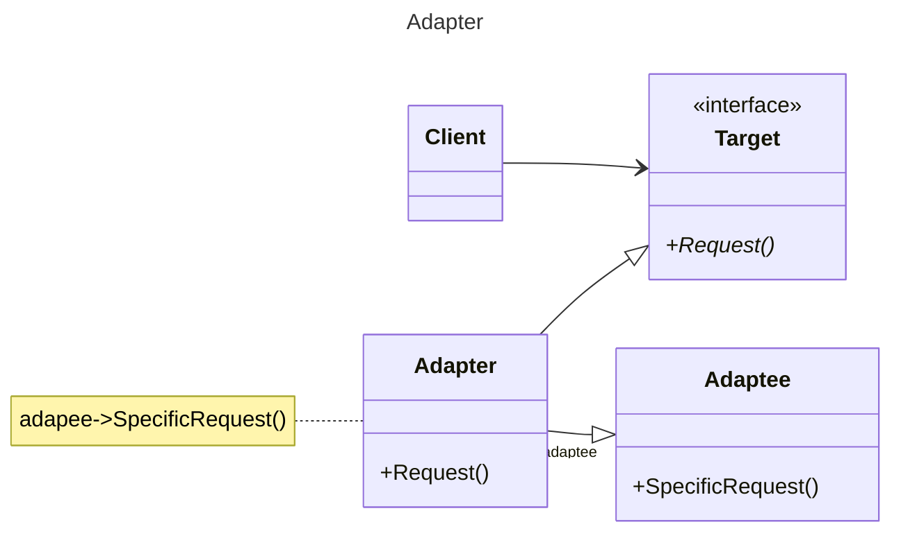

# 动机

由于应用环境的变化，常常需要将一些现成的对象放在新的环境中应用，但是新环境要求的接口是现存对象所不满足的。

# 定义

将一个类的接口转换成客户希望的另一个接口。Adapter模式使得原本由于接口不兼容而不能一起工作的那些类可以一起工作。

# 类图



# 示例

```C++
//目标接口 新接口
class ITarget {
public:
  virtual void process() = 0;
};

//遗留接口 老接口
class IAdaptee {
public:
  virtual void foo(int data) = 0;
  virtual int bar() = 0;
};
class OldClass: public IAdaptee {
//...
};
//对象适配器
class Adapter: public ITarget {
protected:
  IAdaptee* pAdaptee;
public:
  Adapter(IAdaptee* pAdaptee) {
    this->pAdaptee = pAdaptee;
  }
  virtual void process() {
    int data = pAdaptee->bar();
    pAdaptee->foo(data);
    // 类适配器，利用多继承。
    // 不灵活，只有坏处没有好处。
  }
};

int main() {
  IAdaptee* pOldClass = new OldClass();
  ITarget*pAdapter = new Adapter(pOldClass);
  pAdapter->process();
}
```
