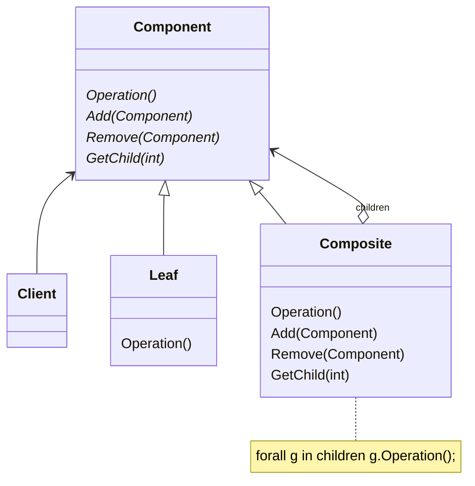

# 动机

在软件的某些情况下，客户代码过多地依赖于对象容器复杂的内部实现结构，对象容器内部实现结构（而非抽象接口）的变化将引起客户代码的频繁变化，带来了代码的维护性、扩展性等弊端。

# 定义

将对象组合成树形结构以表示“部分 -整体”的层次结构。Composite使得用户对单个对象和组合对象的使用具有一致性（稳定）。

# 类图



# 示例

```C++
class Component {
public:
  virtual void process() = 0;
  virtual ~Component() {}
};
class Composite: public Component {
  string sName;
  list<Component*>lspElements;
public:
  Composite(const string & s): sName(s) {}
  void add(Component* pElement) {
    lsElements.push_back(pElement);
  }
  void remove(Component* pElement) {
    lsElements.remove(pElement);
  }
  void process() {
    //1.process current node
    //2.process leaf node
    for (auto &e : lspElements) {
      e->process();
    }
  }
};
class Leaf : public Component {
  string sName;
public:
  void process () {
    //process current node
  }
};

```
