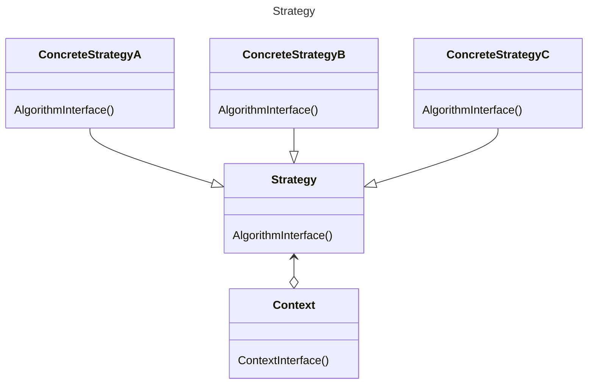

# 环境

在软件构建过程中，某些对象使用的算法可能多种多样，经常改变，如果将这些算法都编码到对象中，将会使对象变得异常复杂；而且有时候支持不使用的算法也是一个性能负担。

# 定义

定义一系列算法，把它们一个个封装起来，并且使它们可互相替换（变化）。该模式使得算法可独立于使用它的客户程序（稳定）而变化（扩展，子类化）

# 类图


# 示例

```C++
class TaxStrategy{
public:
  virtual double calculate(const Context&context)=0;
  virtual ~TaxStrategy(){}
};

class CNTax:public TaxStrategy{
public:
  double calculate(const Context& context) override {/**/}
};

class USTax:public TaxStrategy{
public:
  double calculate(const Context& context) override {/**/}

};

class DETax:public TaxStrategy{
public:
  double calculate(const Context& context) override {/**/}
};

class SalesOrder{
  TaxStrategy* strategy;
public:
  SalesOrder(StrategyFactory* strategyFactory){
    strategy = strategyFactory->create();
  }
  ~SalesOrder(){delete strategy;}

  double calculateTax(){
    //...
    Context context{};
    double val = strategy->calculate(context);
    //...
  }
};
```
