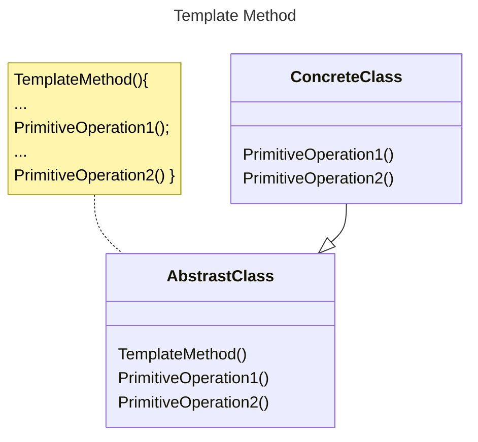

# 环境

在软件构建过程中，对某一项任务，他常常有稳定的整体操作结构，但各个子步骤却又有很多改变的的需求，或者由于固有的原因（比如框架与应用之间的关系）而无法和任务的整体结构同时实现。

# 定义

在一个方法中定义一个算法的骨架（稳定），而将一些步骤延迟（变化）到子类中。模板方法使得子类可以在不改变算法结构（复用）的情况下，重新定义（override重写）算法中的某些步骤。

# 类图



# 示例

```C++
//程序库开发人员

class Library{
protected:
  void step1() {/**/}
  void step3() {/**/}
  void step5() {/**/}

  virtual bool step2() = 0; //变化
  virtual void step4() = 0; //变化

public:
  virtual ~Library(){}

  //稳定 template method
  void run() {
    //程序流程上提
    step1();
    if (step2()){
      step3();
    }
    for (int i = 0; i < 4; ++i){
      step4();
    }
    step5();
    }
};

//应用程序开发人员

class Application: public Library{
protected:
  virtual bool step2()override {/**/}
  virtual void step4()override {/**/}
};

int main(int argc, char const *argv[]){
  Library* lib = new Application{};
  lib->run();
  delete lib;
  return 0;
}

```
